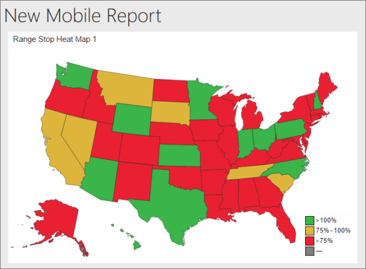

# Maps in Reporting Services mobile reports
Les cartes sont un excellent moyen de visualiser des données géographiques. [!INCLUDE[SS_MobileReptPub_Long](../../includes/ss-mobilereptpub-long.md)] offre trois types de visualisation de carte, et des cartes intégrées pour les continents ainsi qu’un certain nombre de pays. Vous pouvez également [télécharger et utiliser des cartes personnalisées](../../reporting-services/mobile-reports/custom-maps-in-reporting-services-mobile-reports.md).   
  
## Types de cartes  
  
Les rapports mobiles SQL Server offrent trois types de cartes, utiles dans différents cas.  
  
  
  
**Cartes thermiques à dégradé** Le champ de la propriété Valeurs s’affiche en nuances d’une seule couleur, en remplissant chaque région d’une carte. Vous pouvez définir si les valeurs les plus élevées ou les plus faibles sont les plus sombres dans la zone **Sens des valeurs** .  
  
**Carte à bulles** La propriété Valeurs détermine le rayon d'une visualisation de bulle affichée sur la région associée. Vous pouvez définir si toutes les bulles sont identiques ou de couleurs différentes.   
  
Les**Cartes thermiques des arrêts de plage** indiquent une valeur par rapport à une cible. La propriété **Cibles** détermine l’écart entre un champ Comparaison et le champ Valeurs. L’écart résultant détermine la couleur qui remplit la région associée sur la carte, du vert au rouge en passant par le jaune. Vous pouvez définir si les valeurs les plus élevées ou les plus faibles sont vertes dans la zone **Sens des valeurs** .  
  
## Sélection du type de carte et de la région  
  
1. Dans l’onglet **Disposition**, sélectionnez un type de carte, déplacez-le sur l’aire de conception et donnez-lui la taille de votre choix.  
  
2. Dans la vue **Disposition** > volet **Propriétés visuelles** > **Carte**, sélectionnez la région de mappage spécifique dont vous avez besoin.  
  
     
  
3. Pour les cartes thermiques à dégradé et d’arrêts de plage, définissez si les valeurs les plus élevées ou les plus faibles sont les meilleures dans la zone **Sens des valeurs** sous **Propriétés visuelles**.  
  
7. Pour les cartes à bulles, sous **Propriétés visuelles** , définissez **Utiliser des couleurs différentes** sur **ON** ou **OFF** pour que les bulles soient de la même couleur ou qu’elles aient des couleurs différentes.  
  
## Sélection des données cartographiques  
Lorsque vous ajoutez une carte à votre rapport, [!INCLUDE[SS_MobileReptPub_Short](../../includes/ss-mobilereptpub-short.md)] la remplit avec des données géographiques simulées.  
  
  
  
Pour afficher des données réelles sur votre carte, vous devez définir des valeurs pour au moins deux des propriétés de données de la carte :   
* La propriété **Clés** associe les données à des régions spécifiques de la carte, des États pour les États-Unis ou des pays en Afrique, par exemple.  
* La propriété **Valeurs** est un champ numérique dans la même table que le champ de clés sélectionné. Ces valeurs sont représentées différemment selon la carte. La **Carte Dégradé** utilise ces valeurs pour colorer chaque région avec des nuances différentes en se basant sur une plage de valeurs. Le **Carte à bulles** base la taille de bulle de chaque région sur la propriété Valeur.   
* Pour les cartes thermiques des arrêts de plage, vous devez également définir la propriété **Cibles** .  
  
### Définition des propriétés des données de carte  
  
1. Sélectionnez l’onglet **Données** dans le coin supérieur gauche.  
  
2. Sélectionnez **ajouter des données**, puis **Excel Local** ou **serveur SSRS**.  
  
   > **Conseil**: Vérifiez que les [données sont dans un format compatible pour les rapports mobiles](../../reporting-services/mobile-reports/prepare-data-for-reporting-services-mobile-reports.md).  
  
3. Sélectionnez les feuilles de calcul souhaitées et sélectionnez **importer**.  
   Vos données s’affichent dans le [!INCLUDE[SS_MobileReptPub_Short](../../includes/ss-mobilereptpub-short.md)].  
  
4. Dans cette vue **Données** > volet **Propriétés des données** > sous **Clés**, dans la zone de gauche, sélectionnez la table contenant les données de carte, et dans la zone de droite, sélectionnez le champ de clé qui correspond aux régions de votre carte.  
  
5. Sous **Valeurs**, la même table se trouve déjà dans la zone de gauche. Sélectionnez le champ numérique dont vous souhaitez afficher les valeurs sur la carte.   
  
6. S'il s'agit une carte thermique des arrêts de plage, la même table se trouve dans la zone de gauche sous la zone **Cibles** . Dans la zone de droite, sélectionnez le champ numérique dont vous souhaitez que les valeurs deviennent la cible.   
  
     
  
7. Sélectionnez **Aperçu** dans le coin supérieur gauche.  
  
     
     
8. Sélectionnez l’icône **Enregistrer** dans le coin supérieur gauche et **Enregistrer localement** sur votre ordinateur, ou **Enregistrer sur le serveur**.  
  
### Voir aussi  
-  [Custom maps in Reporting Services mobile reports](../../reporting-services/mobile-reports/custom-maps-in-reporting-services-mobile-reports.md)  
- [Créer et publier des rapports mobiles avec l’Éditeur de rapports mobiles SQL Server](../../reporting-services/mobile-reports/create-mobile-reports-with-sql-server-mobile-report-publisher.md)  
  
  

