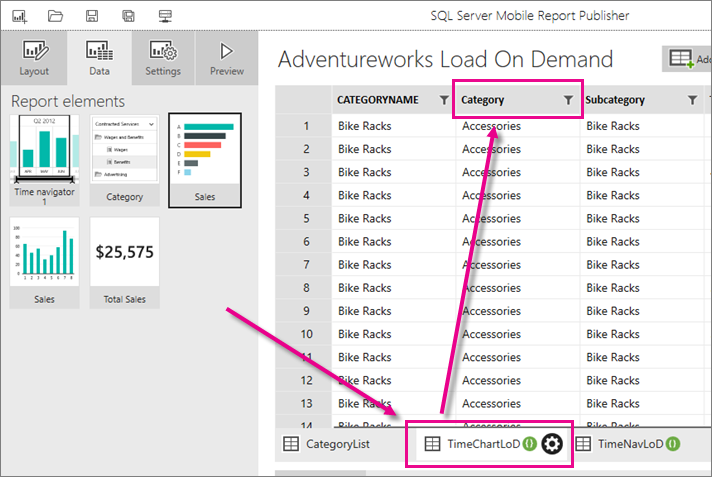
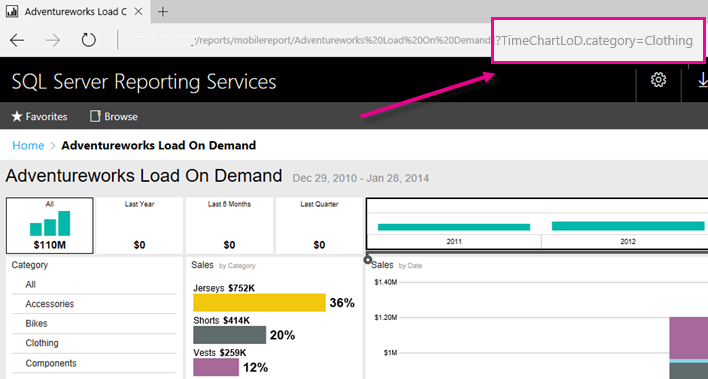

# Ouvrir un rapport mobile avec les paramètres de chaîne de requête spécifique | Reporting Services
Si vous avez un rapport mobile [!INCLUDE[ssRSnoversion_md](../../includes/ssrsnoversion-md.md)] avec des paramètres et une source de données [!INCLUDE[ssNoVersion_md](../../includes/ssnoversion-md.md)] ou [!INCLUDE[ssASnoversion_md](../../includes/ssasnoversion-md.md)] , vous pouvez inclure des paramètres de chaîne de requête dans l’URL du rapport afin qu’il s’ouvre automatiquement avec les valeurs que vous avez spécifiées. 
1.  Créez un [rapport mobiles avec des paramètres](../../reporting-services/mobile-reports/add-parameters-to-a-mobile-report-reporting-services.md).

2. Ouvrez le rapport dans l’Éditeur de rapports mobiles et sélectionnez l’onglet Données. 

2. Recherchez le nom de l’ensemble de données sur l’onglet dans la partie inférieure du tableau, et le nom de champ souhaité. 
    
    
    
2.  La syntaxe de l’URL dépend de votre source de données. 

     **Pour une source de données SQL Server Analysis Services**: générez une URL avec un paramètre de chaîne de requête dans ce format :

    `http://<servername>/reports/<report-folder-name>/<report-name>?<dataset-name>.<field-name>=<parameter-value>`

    Par exemple :
    
    `http://sampleserver/reports/adventureworks-reports/adventureworks-load-on-demand?TimeChartLoD.category=Clothing` 
    
     **Pour une source de données SQL Server**: le paramètre de chaîne de requête est presque identique, mais contient le symbole @ devant le nom du champ :

    `http://<servername>/reports/<report-folder-name>/<report-name>?<dataset-name>.@<field-name>=<parameter-value>`

    Par exemple :
    
      `http://sampleserver/reports/adventureworks-reports/adventureworks-load-on-demand?TimeChartLoD.@category=Clothing` 

    
3.  Cette URL ouvre le rapport sur le serveur, automatiquement filtrée sur la valeur de paramètre spécifiée.

    

### Voir aussi

[Ajouter des paramètres à un rapport mobile](../../reporting-services/mobile-reports/add-parameters-to-a-mobile-report-reporting-services.md)

