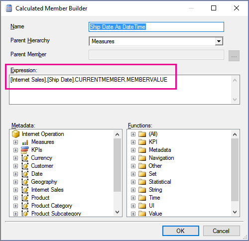
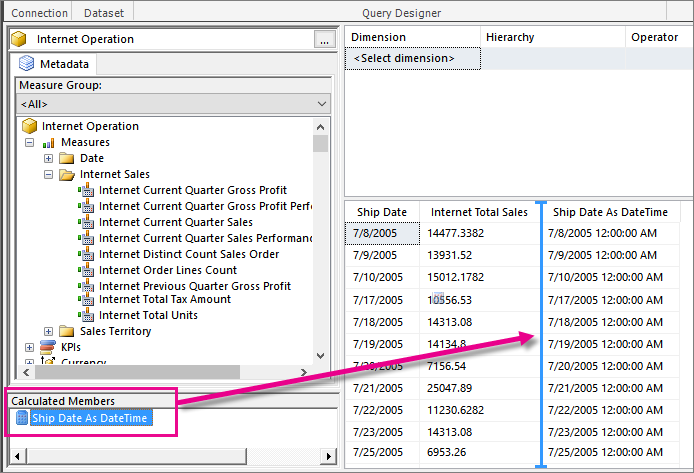

# Conserver la mise en forme de la date pour Analysis Services dans les rapports mobiles
Ajoutez une mesure à un dataset partagé dans le Générateur de rapports pour que les dates des sources de données [!INCLUDE[ssASnoversion_md](../../includes/ssasnoversion-md.md)] conservent leur type de données dans l’ [!INCLUDE[SS_MobileReptPub_Long](../../includes/ss-mobilereptpub-short.md)].

Le type de retour par défaut pour les requêtes [!INCLUDE[ssASnoversion_md](../../includes/ssasnoversion-md.md)] est une chaîne.  Quand vous générez un dataset dans le Générateur de rapports [!INCLUDE[ssRSnoversion_md](../../includes/ssrsnoversion-md.md)] , le type de chaîne est respecté et enregistré sur le serveur. 

Par contre, quand le convertisseur de table JSON traite le dataset, il lit la valeur de la colonne comme une chaîne et affiche des chaînes.  Par la suite, quand l’ [!INCLUDE[SS_MobileReptPub_Long](../../includes/ss-mobilereptpub-long.md)] extrait la table, il ne voit aussi que des chaînes.

Pour contourner ce problème, ajoutez un membre calculé quand vous créez un dataset partagé dans le Générateur de rapports. Cela fonctionne avec les modèles [!INCLUDE[ssASnoversion_md](../../includes/ssasnoversion-md.md)] multidimensionnels et tabulaires.

## Créer une mesure pour conserver le type de données d’un champ de date

1. Créez une mesure pour contenir la valeur du champ de date en question, puis dans le champ expression, choisissez le niveau ou la hiérarchie de la date et ajoutez **.CurrentMember.MemberValue**. Par exemple :
 
   [Internet Sales].[Ship Date].CurrentMember.MemberValue
   
   
   
2. Vous pouvez à présent ajouter ce membre calculé à l’ensemble de colonnes. Pour cela, faites-le glisser à partir de la liste Membres calculés en bas à gauche et déplacez-le dans la grille de colonnes de droite.  

    
   
### Voir aussi

-  [Données de rapports mobiles Reporting Services](../../reporting-services/mobile-reports/data-for-reporting-services-mobile-reports.md)
-  [Prepare data for Reporting Services mobile reports](../../reporting-services/mobile-reports/prepare-data-for-reporting-services-mobile-reports.md)
