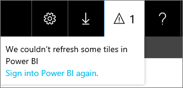

# Mes paramètres pour l’intégration de Power BI (portail web)

[!INCLUDE[ssrs-appliesto-sql2016-xpreview](../includes/ssrs-appliesto-sql2016-xpreview.md)]

Grâce à la page **Mes paramètres** du [!INCLUDE[ssRSnoversion](../includes/ssrsnoversion-md.md)] [!INCLUDE[ssRSWebPortal](../includes/ssrswebportal.md)] , les utilisateurs individuels peuvent gérer leur connexion à [!INCLUDE[sspowerbi](../includes/sspowerbi-md.md)]. Lorsque vous parcourez les étapes permettant d’épingler un élément de rapport, vous serez automatiquement invité à vous connecter.  Toutefois, vous pouvez utiliser la page **Mes paramètres** pour vous connecter manuellement ou vous déconnecter.  Si l’option de menu **Mes paramètres** n’est pas visible, cela signifie que le serveur de rapports n’est pas intégré dans  [!INCLUDE[sspowerbi](../includes/sspowerbi-md.md)].  Pour plus d’informations, consultez [Intégration du serveur de rapports Power BI &#40;Gestionnaire de configuration&#41;](../reporting-services/install-windows/power-bi-report-server-integration-configuration-manager.md).  
  
  
  
## Pourquoi se connecter ?  
 Lorsque vous vous connectez, vous établissez une relation entre votre compte d’utilisateur [!INCLUDE[ssRSnoversion](../includes/ssrsnoversion-md.md)] et votre compte [!INCLUDE[sspowerbi](../includes/sspowerbi-md.md)] .  La connexion crée un jeton de sécurité, qui est valable pendant 90 jours. Si le jeton expire et que des éléments sont épinglés à Power BI, une notification apparaît.  
   
     
   
Pour que les vignettes des tableaux de bord [!INCLUDE[sspowerbi](../includes/sspowerbi-md.md)] soient actualisées, vous devez vous reconnecter via **Mes paramètres**.  
  
  
  
Une fois que vous êtes connecté, un jeton de sécurité est créé.  La mise à jour des vignettes de votre tableau de bord se lance sur leurs calendriers configurés précédemment.  

## Étapes suivantes

[Intégration de Power BI Report Server](../reporting-services/install-windows/power-bi-report-server-integration-configuration-manager.md)   
[Épingler des éléments Reporting Services aux tableaux de bord Power BI](../reporting-services/pin-reporting-services-items-to-power-bi-dashboards.md)   
[Tableaux de bord dans Power BI](https://powerbi.microsoft.com/documentation/powerbi-service-dashboards/)  
[Portail Web](../reporting-services/web-portal-ssrs-native-mode.md)  

D’autres questions ? [Essayez de poser le forum Reporting Services](http://go.microsoft.com/fwlink/?LinkId=620231)
