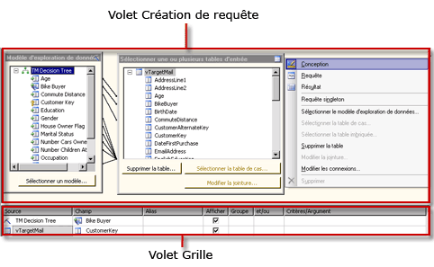
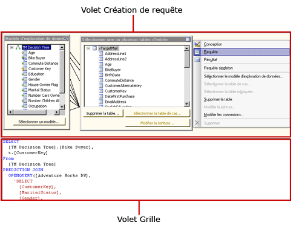
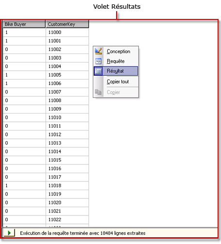

# Interface utilisateur du Concepteur de requêtes DMX Analysis Services
  [!INCLUDE[ssRSnoversion](../../includes/ssrsnoversion-md.md)] fournit des concepteurs de requêtes graphiques pour la création de requêtes DMX (Data Mining Expressions) et MDX (Multidimensional Expression) pour une source de données [!INCLUDE[ssASnoversion](../../includes/ssasnoversion-md.md)] . Cette rubrique offre une description du Concepteur de requêtes DMX. Pour plus d’informations sur le concepteur de requêtes MDX, consultez [Interface utilisateur du Concepteur de requêtes MDX Analysis Services](../../reporting-services/report-data/analysis-services-mdx-query-designer-user-interface.md).  
  
 Le Concepteur de requêtes graphique DMX comporte trois modes : Création, Requête et Résultat. Pour passer d'un mode à l'autre, cliquez avec le bouton droit dans le volet Concepteur de requêtes et sélectionnez le mode souhaité. Chaque mode fournit un volet Métadonnées à partir duquel vous pouvez faire glisser des membres de cubes sélectionnés pour créer une requête DMX qui extrait des données pour un dataset lors du traitement du rapport.  
  
## Barres d'outils du Concepteur de requêtes graphique DMX  
 La barre d'outils du Concepteur de requêtes fournit des boutons vous aidant à concevoir des requêtes DMX à l'aide de l'interface graphique. Le tableau suivant décrit ces boutons et leurs fonctions.  
  
|Bouton|Description|  
|------------|-----------------|  
|**Modifier en tant que texte**|Désactivé pour ce type de source de données.|  
|**Importer**|Importe une requête existante à partir d'un fichier de définition de rapport (.rdl) sur le système de fichiers. Pour plus d’informations, consultez [Datasets incorporés dans le rapport et datasets partagés &#40;Générateur de rapports et SSRS&#41;](../../reporting-services/report-data/report-embedded-datasets-and-shared-datasets-report-builder-and-ssrs.md).|  
||Bascule vers le mode Concepteur de requêtes MDX.|  
||Bascule vers le mode Concepteur de requêtes DMX.|  
||Actualise les métadonnées à partir de la source de données.|  
||Supprime de la requête la colonne sélectionnée dans le volet Données.|  
||Affiche la boîte de dialogue **Paramètres de la requête** . Si vous affectez une valeur par défaut à une variable, un paramètre de rapport correspondant est créé lorsque vous basculez vers la vue Mise en page dans le Concepteur de rapports.|  
||Prépare la requête.|  
||Bascule entre le mode Création et le mode Requête. Pour passer d’une vue de résultat à l’autre, cliquez avec le bouton droit dans le volet Création et choisissez **Résultat**.|  
  
## Concepteur de requêtes graphique DMX en mode Création  
 Lorsque vous modifiez un dataset qui utilise une source de données [!INCLUDE[ssASnoversion](../../includes/ssasnoversion-md.md)] qui n'a aucun cube valide, mais dispose de modèles d'exploration de données valides, le concepteur de requêtes graphique s'ouvre en mode Création. La figure suivante présente les différents volets du mode Création.  
  
   
  
 Le tableau ci-dessous décrit la fonction de chaque volet.  
  
|Volet|Fonction|  
|----------|--------------|  
|Volet Concepteur de requêtes|Utilisez la boîte de dialogue **Modèle d’exploration de données** et **Sélectionner une ou plusieurs tables d’entrée** pour créer la requête DMX.|  
|Volet Grille|Pour chaque ligne de la grille, utilisez la liste déroulante **Source** pour sélectionner une fonction ou une expression, puis choisissez les champs, les groupes, les critères ou les arguments à utiliser dans votre requête DMX. Pour afficher le texte de la requête DMX résultant de vos sélections, cliquez sur le bouton **Mode Création** dans la barre d’outils.|  
  
 Pour exécuter la requête DMX et afficher les résultats dans le volet Résultat, cliquez avec le bouton droit dans le volet Concepteur de requêtes et sélectionnez **Résultat**.  
  
## Concepteur de requêtes graphique DMX en mode Requête  
 Pour passer en mode Requête dans le concepteur de requêtes graphique, cliquez sur le bouton **Mode Création** dans la barre d’outils ou cliquez avec le bouton droit dans la zone de conception, puis choisissez **Requête** dans le menu contextuel. Utilisez ce mode pour taper du texte DMX directement dans le volet Requête.  
  
 La figure suivante présente les différents volets du mode Requête.  
  
   
  
 Le tableau ci-dessous décrit la fonction de chaque volet.  
  
|Volet|Fonction|  
|----------|--------------|  
|Volet Concepteur de requêtes|Utilisez la boîte de dialogue **Modèle d’exploration de données** et **Sélectionner une ou plusieurs tables d’entrée** pour créer la requête DMX.|  
|Volet Requête|Affiche ou modifie le texte de la requête DMX directement dans le volet. Les modifications apportées au texte de la requête DMX ne sont pas conservées si vous passez de nouveau en mode **Création** .|  
  
 Pour exécuter la requête DMX et afficher les résultats dans le volet Résultat, cliquez avec le bouton droit dans le volet Concepteur de requêtes et sélectionnez **Résultat**.  
  
## Concepteur de requêtes graphique DMX en mode Résultat  
 Pour afficher le mode Résultat, cliquez avec le bouton droit dans l’aire de conception de requête, puis choisissez **Résultat** dans le menu contextuel. Lorsque vous basculez vers le mode Résultat, la requête DMX s'exécute automatiquement.  
  
 La figure suivante présente le Concepteur de requêtes en mode Résultat.  
  
   
  
 Pour repasser en mode Création ou en mode Requête, cliquez avec le bouton droit dans le volet Résultat et sélectionnez **Conception** ou **Requête**.  
  
## Voir aussi  
 [Définir des paramètres dans le Concepteur de requêtes MDX pour Analysis Services &#40;Générateur de rapports et SSRS&#41;](../../reporting-services/report-data/define-parameters-in-the-mdx-query-designer-for-analysis-services.md)   
 [Créer un dataset partagé ou incorporé &#40;Générateur de rapports et SSRS&#41;](../../reporting-services/report-data/create-a-shared-dataset-or-embedded-dataset-report-builder-and-ssrs.md)   
 [Type de connexion Analysis Services pour DMX &#40;SSRS&#41;](../../reporting-services/report-data/analysis-services-connection-type-for-dmx-ssrs.md)   
 [Récupérer des données d’un modèle d’exploration de données &#40;DMX&#41; &#40;SSRS&#41;](../../reporting-services/report-data/retrieve-data-from-a-data-mining-model-dmx-ssrs.md)   
 [Fichier de configuration RSReportDesigner](../../reporting-services/report-server/rsreportdesigner-configuration-file.md)   
 [Type de connexion Analysis Services pour MDX (SSRS)](../../reporting-services/report-data/analysis-services-connection-type-for-mdx-ssrs.md)   
 [Type de connexion Analysis Services pour DMX &#40;SSRS&#41;](../../reporting-services/report-data/analysis-services-connection-type-for-dmx-ssrs.md)  
  
  
