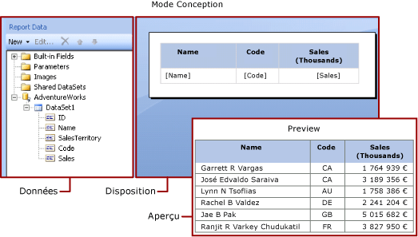
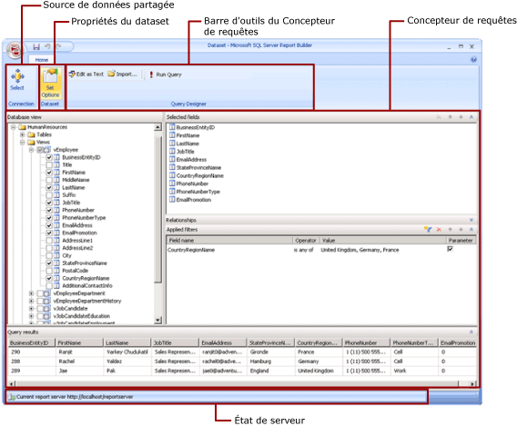

# Jeux de données du rapport (SSRS)
  Pour ajouter des données à un rapport, vous devez créer des datasets. Chaque dataset représente le jeu de résultats émanant de l'exécution d'une commande de requête sur une source de données. Les colonnes du jeu de résultats représentent la collection de champs. Les lignes du jeu de résultats constituent les données. Un dataset ne contient pas les données proprement dites. Il contient les informations nécessaires à la récupération d'un jeu de données spécifique à partir d'une source de données.  
  
 Il existe deux types de datasets : incorporés et partagés. Un dataset incorporé est défini dans un rapport et utilisé uniquement par ce rapport. Un dataset partagé est défini sur le serveur de rapports ou le site SharePoint, et peut être utilisé par plusieurs rapports. Dans le Générateur de rapports, vous pouvez créer des datasets partagés en mode de dataset partagé ou des datasets incorporés en mode Concepteur de rapports. Dans le Concepteur de rapports de [!INCLUDE[ssBIDevStudioFull](../../includes/ssbidevstudiofull-md.md)], vous pouvez créer des datasets partagés dans le cadre d'un projet ou des datasets incorporés dans le cadre d'un rapport.  
  
-   **Datasets incorporés.** Contrairement aux applications telles que [!INCLUDE[msCoName](../../includes/msconame-md.md)] Office Excel où vous utilisez des données directement dans une feuille de calcul, dans le Générateur de rapports ou le Concepteur de rapports, vous utilisez des métadonnées qui représentent les données qui sont récupérées lors du traitement du rapport. Pour créer un dataset incorporé, sélectionnez la source de données et spécifiez une requête. Après avoir créé le dataset, utilisez le volet Données du rapport pour afficher la collection de champs. Vous pouvez afficher les données d'un dataset dans une région de données telle qu'une table ou un graphique. Dans chaque région de données, vous avez la possibilité de regrouper, filtrer et trier les données afin de les organiser. Après avoir conçu la disposition du rapport, vous exécutez le rapport pour afficher les données réelles.  
  
     Dans la figure suivante, le volet Données du rapport affiche une source de données nommée [!INCLUDE[ssSampleDBUserInputNonLocal](../../includes/sssampledbuserinputnonlocal-md.md)], un dataset nommé DataSet1 et cinq champs dans la collection de champs du dataset. Le volet Disposition affiche une table dont la ligne supérieure comporte des en-têtes de colonnes et la ligne inférieure des cellules de table qui contiennent du texte. Le texte de l'espace réservé [Name] correspond aux métadonnées du champ Name. Lors de l'exécution du rapport, le texte de l'espace réservé est remplacé par les valeurs de données réelles. La table s'étend autant que nécessaire pour afficher toutes les données.  
  
       
  
-   **Datasets partagés.** Créez un dataset partagé lorsque vous souhaitez utiliser un dataset dans plusieurs rapports. Pour créer et enregistrer un dataset partagé sur un serveur de rapports ou le site SharePoint, utilisez le Générateur de rapports en mode de création de dataset partagé. Pour créer un dataset partagé en tant qu'élément d'un projet pouvant être déployé sur un serveur ou un site, utilisez le Concepteur de rapports.  
  
     L'illustration suivante montre le mode de création de dataset partagé dans le Générateur de rapports. Vous sélectionnez ou modifiez la connexion de données, les propriétés de dataset, la requête et les filtres, marquez éventuellement des filtres comme paramètres et affichez les résultats de la requête. Vous enregistrez ensuite les modifications sur le serveur ou le site.  
  
       
  
 Pour plus d’informations, consultez [Datasets incorporés et partagés &#40;Générateur de rapports et SSRS&#41;](../../reporting-services/report-data/embedded-and-shared-datasets-report-builder-and-ssrs.md) et [Connexions de données ou sources de données incorporées et partagées &#40;Générateur de rapports et SSRS&#41;](http://msdn.microsoft.com/library/f417782c-b85a-4c4d-8a40-839176daba56).  
  
 Vous pouvez également ajouter des datasets à un rapport en ajoutant des parties de rapports qui contiennent les datasets dont elles dépendent. [!INCLUDE[ssRBrptparts](../../includes/ssrbrptparts-md.md)]  
  
 Pour savoir comment créer un rapport qui affiche les données d’une [!INCLUDE[ssNoVersion](../../includes/ssnoversion-md.md)] de base de données, consultez [didacticiel : création d’un rapport de base &#40; Le Générateur de rapports &#41; ](../../reporting-services/tutorial-creating-a-basic-table-report-report-builder.md). Pour générer un rapport qui inclue ses propres données, consultez [Didacticiel : créer un rapport de graphique rapide en mode hors connexion &#40;Générateur de rapports&#41;](../../reporting-services/report-builder/tutorial-create-a-quick-chart-report-offline-report-builder.md).  
  
> [!NOTE]  
>  [!INCLUDE[ssRBRDDup](../../includes/ssrbrddup-md.md)]  
  
##   Ajout de données de rapport  
 Dans le Générateur de rapports, vous pouvez ajouter des données de rapport comme suit :  
  
-   Ajoutez des parties de rapports d'un serveur de rapports à votre rapport. Chaque partie de rapport est autonome et inclut des datasets dépendants. Les datasets sont prédéfinis.  
  
-   Utilisez les Assistants Table, Matrice, Graphique et Carte À l'aide des assistants, vous pouvez sélectionner des sources de données partagées et des datasets partagés, ou créer de nouveaux datasets et passer à la conception du rapport.  
  
-   Ajoutez des datasets partagés à partir d'un serveur de rapports. Les datasets partagés sont prédéfinis et indiquent les données à utiliser à partir d'une source de données prédéfinie. Lorsque vous ajoutez un dataset partagé à votre rapport, vous ajoutez une référence de dataset qui pointe vers la définition de dataset partagé.  
  
 Dans le Générateur de rapports ou le Concepteur de rapports, vous pouvez ajouter des données comme suit :  
  
-   Ajouter des datasets incorporés basés sur des sources de données partagées.  
  
-   Ajouter des datasets incorporés basés sur des sources de données incorporées.  
  
> [!NOTE]  
>  Sur un serveur de rapports, les éléments partagés sont sécurisés individuellement ou en héritant des autorisations du dossier où ils sont publiés. Pour permettre à d'autres utilisateurs d'accéder aux datasets partagés que vous enregistrez, vous devez comprendre la façon dont les autorisations sont accordées. Pour plus d’informations, consultez [sécurité &#40; Le Générateur de rapports &#41; ](../../reporting-services/report-builder/security-report-builder.md) ou [éléments de Dataset partagé sécurisé](../../reporting-services/security/secure-shared-dataset-items.md).  
  
 Après avoir ajouté des données à un rapport, vous pouvez organiser celles-ci sur la page de rapport avec les régions de données, modifier les parties de rapports et partager ces modifications avec d'autres, puis permettre aux utilisateurs de limiter ou trier les données affichées dans le rapport. Pour plus d'informations, consultez les rubriques connexes suivantes :  
  
-   [Tables, matrices et listes &#40;Générateur de rapports et SSRS&#41;](../../reporting-services/report-design/tables-matrices-and-lists-report-builder-and-ssrs.md)  
  
-   [Graphiques &#40; Le Générateur de rapports et SSRS &#41;](../../reporting-services/report-design/charts-report-builder-and-ssrs.md)  
  
-   [Graphiques sparkline et barres de données &#40; Le Générateur de rapports et SSRS &#41;](../../reporting-services/report-design/sparklines-and-data-bars-report-builder-and-ssrs.md)  
  
-   [Indicateurs &#40;Générateur de rapports et SSRS&#41;](../../reporting-services/report-design/indicators-report-builder-and-ssrs.md)  
  
-   [Paramètres de rapport &#40;Générateur de rapports et Concepteur de rapports&#41;](../../reporting-services/report-design/report-parameters-report-builder-and-report-designer.md)  
  
-   [Publication de parties de rapports &#40;Générateur de rapports et SSRS&#41;](../../reporting-services/report-design/report-parts-report-builder-and-ssrs.md)  
  
-   [Filtrer, regrouper et trier des données &#40;Générateur de rapports et SSRS&#41;](../../reporting-services/report-design/filter-group-and-sort-data-report-builder-and-ssrs.md)  
  
  
##   Ajout de données avec des parties de rapports  
 Les parties de rapports contiennent les datasets dont elles dépendent. Ces datasets reposent sur les sources de données partagées qui sont disponibles sur le serveur de rapports. Dans le Générateur de rapports, lorsque vous ajoutez une partie de rapport à votre rapport, les datasets dépendants sont ajoutés à votre rapport, comme si vous les aviez ajoutés manuellement. Par exemple, un graphique prédéfini contient un dataset. Pour afficher les données, affichez un aperçu du rapport.  
  
> [!NOTE]  
>  [!INCLUDE[ssRBrptparts](../../includes/ssrbrptparts-md.md)]  
  
 Les parties de rapports, sources de données partagées et datasets partagés sont définis à l'avance et enregistrés sur un serveur de rapports. Pour y accéder, vous devez ouvrir le Générateur de rapports en mode serveur en vous connectant au serveur de rapports. Vous pouvez les utiliser pour créer vos propres versions si vous avez les autorisations d'accès en écriture sur le serveur de rapports.  
  
-   Pour plus d’informations, consultez [Publication de parties de rapports &#40;Générateur de rapports et SSRS&#41;](../../reporting-services/report-design/report-parts-report-builder-and-ssrs.md) et [Parties de rapports dans le Concepteur de rapports &#40;SSRS&#41;](../../reporting-services/report-design/report-parts-in-report-designer-ssrs.md).  
  
  
##   Requêtes et concepteurs de requêtes  
 Pour spécifier les données qui vous intéressent à partir d'une source de données, générez une commande de requête. Chaque type de source de données fournit un *concepteur de requêtes* associé pour vous aider à générer la requête. Le concepteur de requêtes peut être graphique ou textuel. Dans un concepteur de requêtes graphique, vous affichez des métadonnées qui représentent les données sur la source de données externe et générez de façon interactive une requête en faisant glisser des champs ou des entités vers l'aire de conception de la requête. Dans un concepteur de requêtes textuel, vous écrivez ou importez des requêtes dans la syntaxe de requête prise en charge par la source de données externe.  
  
 Dans le concepteur de requêtes, vous pouvez exécuter la requête pour afficher des exemples de données et valider la syntaxe de commande de requête. Les noms des colonnes dans le jeu de résultats deviennent les noms des champs affichés dans le volet Données du rapport. Le jeu de résultats doit être un jeu de lignes et de colonnes unique où le même nombre de valeurs existe pour chaque ligne de données. Plusieurs jeux de résultats d'une même requête ne sont pas pris en charge. Les hiérarchies déséquilibrées, qui n'ont pas un nombre constant de colonnes et peuvent produire un nombre différent de valeurs de données pour chaque ligne, ne sont pas prises en charge.  
  
 Pour exécuter une requête, vous devez disposer d'informations d'identification au moment de la conception. Pour plus d’informations, consultez [spécifier les informations d’identification dans le Générateur de rapports](http://msdn.microsoft.com/library/7412ce68-aece-41c0-8c37-76a0e54b6b53) et [des connexions de données, Sources de données et les chaînes de connexion &#40; Le Générateur de rapports et SSRS &#41; ](../../reporting-services/report-data/data-connections-data-sources-and-connection-strings-report-builder-and-ssrs.md).  
  
 La communication entre une extension de données et la source de données externe est gérée par les fournisseurs de données. La prise en charge de la syntaxe de commande de requête, des paramètres de requête et des types de données pour les valeurs dans le jeu de résultats est déterminée par chaque fournisseur de données. Pour plus d’informations, consultez la rubrique correspondant au type spécifique d’extension de données et [Concepteurs de requêtes&#40;Générateur de rapports&#41;](http://msdn.microsoft.com/library/553f0d4e-8b1d-4148-9321-8b41a1e8e1b9).  
  
  
##   Rubriques de procédures  
 [Ajouter et vérifier une connexion de données &#40;Générateur de rapports et SSRS&#41;](../../reporting-services/report-data/add-and-verify-a-data-connection-report-builder-and-ssrs.md)  
  
 [Créer un dataset partagé ou incorporé &#40;Générateur de rapports et SSRS&#41;](../../reporting-services/report-data/create-a-shared-dataset-or-embedded-dataset-report-builder-and-ssrs.md)  
  
 [Ajouter, modifier ou actualiser des champs dans le volet des données de rapport &#40;Générateur de rapports et SSRS&#41;](../../reporting-services/report-data/add-edit-refresh-fields-in-the-report-data-pane-report-builder-and-ssrs.md)  
  
 [Générer une requête dans le concepteur de requêtes relationnelles &#40;Générateur de rapports et SSRS&#41;](../../reporting-services/report-data/build-a-query-in-the-relational-query-designer-report-builder-and-ssrs.md)  
  
 [Afficher des datasets masqués pour les valeurs de paramètres des données multidimensionnelles &#40;Générateur de rapports et SSRS&#41;](../../reporting-services/report-data/show-hidden-datasets-for-parameter-values-multidimensional-data.md)  
  
 [Ajouter un filtre à un dataset &#40;Générateur de rapports et SSRS&#41;](../../reporting-services/report-data/add-a-filter-to-a-dataset-report-builder-and-ssrs.md)  
  
 [Définir un message d’absence de données pour une région de données &#40;Générateur de rapports et SSRS&#41;](../../reporting-services/report-data/set-a-no-data-message-for-a-data-region-report-builder-and-ssrs.md)  
  
 [Associer un paramètre de requête à un paramètre de rapport &#40;Générateur de rapports et SSRS&#41;](../../reporting-services/report-data/associate-a-query-parameter-with-a-report-parameter-report-builder-and-ssrs.md)  
  
 [Définir des paramètres dans le Concepteur de requêtes MDX pour Analysis Services &#40;Générateur de rapports et SSRS&#41;](../../reporting-services/report-data/define-parameters-in-the-mdx-query-designer-for-analysis-services.md)  
  
  
##   Dans cette section  
 [Parties de rapports et datasets dans le Générateur de rapports](../../reporting-services/report-data/report-parts-and-datasets-in-report-builder.md)  
  
 [Connexions de données, sources de données et chaînes de connexion dans le Générateur de rapports](http://msdn.microsoft.com/library/7e103637-4371-43d7-821c-d269c2cc1b34)  
  
 [Spécifier des informations d’identification dans le Générateur de rapports](http://msdn.microsoft.com/library/7412ce68-aece-41c0-8c37-76a0e54b6b53)  
  
 [Datasets incorporés dans les rapports et datasets partagés &#40;Générateur de rapports et SSRS&#41;](../../reporting-services/report-data/report-embedded-datasets-and-shared-datasets-report-builder-and-ssrs.md)  
  
 [Collection de champs de dataset &#40;Générateur de rapports et SSRS&#41;](../../reporting-services/report-data/dataset-fields-collection-report-builder-and-ssrs.md)  
  
  
## Voir aussi  
 [Mode Conception de rapport &#40;Générateur de rapports&#41;](../../reporting-services/report-builder/report-design-view-report-builder.md)   
 [Rapports création Concepts &#40; Le Générateur de rapports et SSRS &#41;](../../reporting-services/report-design/report-authoring-concepts-report-builder-and-ssrs.md)  
  
  
