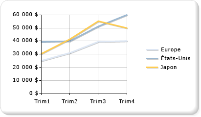

# Graphiques en courbes (Générateur de rapports et SSRS)
  Un graphique en courbes affiche une série sous la forme d'un ensemble de points reliés par une ligne. Les graphiques en courbes sont utilisés pour représenter de grands volumes de données qui se produisent sur une période de temps continue. Pour plus d’informations sur l’ajout de données à un graphique en courbes, consultez [Graphiques &#40;Générateur de rapports et SSRS&#41;](../../reporting-services/report-design/charts-report-builder-and-ssrs.md).  
  
 L'illustration suivante montre un graphique en courbes qui contient trois séries.  
  
   
  
> [!NOTE]  
>  [!INCLUDE[ssRBRDDup](../../includes/ssrbrddup-md.md)]  
  
## Variantes  
  
-   **Courbes lissées**. Graphique en courbes qui utilise une ligne courbée au lieu d'une ligne normale.  
  
-   **Courbes en escalier**. Graphique en courbes qui utilise une ligne en escalier au lieu d'une ligne normale. La ligne en escalier connecte les points à l'aide d'une ligne qui ressemble aux barreaux d'une échelle ou aux marches d'un escalier.  
  
-   **Graphiques sparkline**. Variations du graphique en courbes qui affichent uniquement la série dans la cellule d'une table ou matrice. Pour plus d’informations, consultez [Graphiques sparkline et barres de données &#40;Générateur de rapports et SSRS&#41;](../../reporting-services/report-design/sparklines-and-data-bars-report-builder-and-ssrs.md).  
  
## Considérations relatives aux données pour les graphiques en courbes  
  
-   Pour améliorer l'impact visuel du graphique en courbes par défaut, pensez à modifier la largeur de la bordure de la série à 3 et à ajouter un décalage de l'ombre de 1. Cela créera un graphique en courbes plus grasses. Vous devrez rétablir ces propriétés à leurs valeurs d'origine si vous changez de type de graphique.  
  
-   Si votre dataset comprend des valeurs vides, le graphique en courbes ajoutera des points vides, sous forme de lignes d'espace réservé, afin de maintenir la continuité sur le graphique. Si vous souhaitez ne pas voir ces lignes, affichez votre dataset avec un type de graphique non contigu tel qu'un graphique à barres ou un histogramme.  
  
-   Un graphique en courbes requiert au moins deux points pour dessiner une ligne.  Si votre dataset ne contient qu'un point de données, le graphique en courbes s'affichera sous la forme d'un marqueur de point de données unique.  
  
-   Une série dessinée sous la forme d'une ligne ne prendra pas beaucoup d'espace dans une zone de graphique.  C'est pourquoi, les graphiques en courbes sont souvent associés à d'autres types de graphiques, tels que les histogrammes. Cependant, vous ne pouvez pas associer un graphique en courbes avec un graphique à barres, en secteurs ou à base de formes.  
  
## Voir aussi  
 [Graphiques à barres &#40;Générateur de rapports et SSRS&#41;](../../reporting-services/report-design/bar-charts-report-builder-and-ssrs.md)   
 [Histogrammes &#40;Générateur de rapports et SSRS&#41;](../../reporting-services/report-design/column-charts-report-builder-and-ssrs.md)   
 [Graphiques &#40;Générateur de rapports et SSRS&#41;](../../reporting-services/report-design/charts-report-builder-and-ssrs.md)   
 [Types de graphiques &#40;Générateur de rapports et SSRS&#41;](../../reporting-services/report-design/chart-types-report-builder-and-ssrs.md)   
 [Graphiques en aires &#40;Générateur de rapports et SSRS&#41;](../../reporting-services/report-design/area-charts-report-builder-and-ssrs.md)   
 [Points de données vides et Null dans les graphiques &#40;Générateur de rapports et SSRS&#41;](../../reporting-services/report-design/empty-and-null-data-points-in-charts-report-builder-and-ssrs.md)   
 [Graphiques &#40;Générateur de rapports et SSRS&#41;](../../reporting-services/report-design/charts-report-builder-and-ssrs.md)  
  
  
