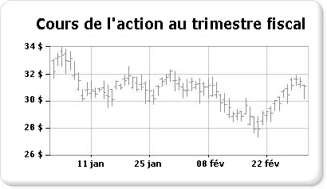

# Graphiques boursiers (Générateur de rapports et SSRS)

  Un graphique boursier est conçu spécialement pour les données financières ou scientifiques qui utilisent jusqu'à quatre valeurs par point de données. Ces valeurs sont alignées avec les valeurs maximales, minimales, d'ouverture et de clôture utilisées pour tracer des données boursières financières. Ce type de graphique affiche les valeurs d'ouverture et de clôture à l'aide de marqueurs, en règle générale des lignes ou des triangles. Dans l'exemple suivant, les valeurs d'ouverture sont indiquées par les marqueurs sur la gauche, et les valeurs de clôture sont indiquées par les marqueurs sur la droite.  
  
   
  
 Un exemple de graphique boursier est disponible en tant qu’un exemple de rapport Générateur de rapports. Pour plus d’informations sur le téléchargement de cet exemple de rapport et d’autres, consultez [exemples Générateur de rapports et du Concepteur de rapports](http://go.microsoft.com/fwlink/?LinkId=198283).  
  
> [!NOTE]  
>  [!INCLUDE[ssRBRDDup](../../includes/ssrbrddup-md.md)]  
  
## Variantes  
  
-   **Bougies**. Le graphique en bougies est un type spécial de graphique boursier, où des zones sont utilisées pour afficher la plage entre les valeurs d'ouverture et de clôture. Comme le graphique boursier, le graphique en bougies peut afficher jusqu'à quatre valeurs par point de données.  
  
## Considérations relatives aux données pour les graphiques boursiers  
  
-   Lors de la présentation de nombreux points de données boursiers, tels que la tendance du cours de l'action annuelle, il est difficile de distinguer chaque valeur d'ouverture, de clôture, maximale et minimale pour chaque point de données. Dans ce scénario, pensez à utiliser un graphique en courbes au lieu d'un graphique boursier.  
  
-   Lorsque les étiquettes d'axe sont générées, l'étiquetage commence à zéro.  En règle générale, les cours de l'action ne fluctuent pas de la même façon que d'autres datasets. C'est pourquoi, vous pouvez empêcher le démarrage des étiquettes d'axe à zéro, afin d'obtenir une meilleure vue de vos données. Pour ce faire, définissez **IncludeZero** à **false** dans la boîte de dialogue **Propriétés de l'axe** ou dans la fenêtre Propriétés. Pour plus d’informations sur la façon dont le graphique génère les étiquettes de l’axe, consultez [Mise en forme des étiquettes des axes sur un graphique &#40;Générateur de rapports et SSRS&#41;](../../reporting-services/report-design/formatting-axis-labels-on-a-chart-report-builder-and-ssrs.md).  
  
-   [!INCLUDE[ssRSnoversion](../../includes/ssrsnoversion-md.md)] fournit de nombreuses formules calculées à utiliser avec des graphiques boursiers, notamment un indicateur de prix, un indicateur de force relative, MACD, etc.  

## Étapes suivantes

[Graphiques d’étendue](../../reporting-services/report-design/range-charts-report-builder-and-ssrs.md)   
[Graphiques](../../reporting-services/report-design/charts-report-builder-and-ssrs.md)   
[Mise en forme d’un graphique](../../reporting-services/report-design/formatting-a-chart-report-builder-and-ssrs.md)   
[Boîte de dialogue de propriétés axe, Options de l’axe](http://msdn.microsoft.com/library/b276e210-7a12-48ae-971b-7dabae51df11)  

D’autres questions ? [Essayez de poser le forum Reporting Services](http://go.microsoft.com/fwlink/?LinkId=620231)
