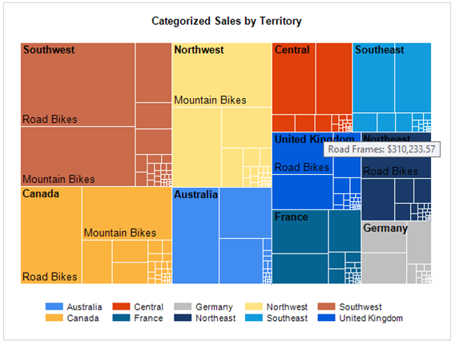
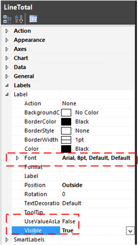

# <a name="treemap-and-sunburst-charts-in-reporting-services"></a>Graphiques TreeMap et en rayons de soleil dans Reporting Services
[!INCLUDE[feedback_stackoverflow_msdn_connect_md](../../includes/feedback-stackoverflow-msdn-connect-md.md)]

Le serveur SQL Server [!INCLUDE[ssRSnoversion](../../includes/ssrsnoversion-md.md)] treemap et en rayons de soleil les visualisations sont parfaites pour représenter visuellement des données hiérarchiques. Cet article est une vue d’ensemble de l’ajout d’un graphique en treemap ou en rayons de soleil à un [!INCLUDE[ssRSnoversion](../../includes/ssrsnoversion-md.md)] rapport. Il inclut également un exemple de requête AdventureWorks pour vous aider à démarrer.  
  
##  <a name="bkmk_treemap_chart"></a>Graphique de TreeMap  

Un graphique en treemap divise la zone de graphique en rectangles qui représentent les différents niveaux et les tailles relatives de la hiérarchie de données. Le mappage ressemble à arbre, avec un tronc, des branches et des ramifications de plus en plus petites. Chaque rectangle est subdivisé en rectangles plus petits qui représentent le niveau suivant dans la hiérarchie. Les rectangles de niveau supérieur treemap sont disposés avec le plus grand rectangle dans le coin supérieur gauche du graphique et le plus petit dans l’angle inférieur droit.  À l’intérieur d’un rectangle, le niveau suivant dans la hiérarchie est également organisé en rectangles allant de l’angle supérieur gauche à l’angle inférieur droit.  

Par exemple, dans l’image suivante de l’exemple treemap, le territoire « Southwest » est le plus grand, et « Germany » est le plus petit. Dans le territoire« Southwest », les « Road Bikes » sont plus importants que les « Mountain Bikes ».  
 
  
  
### <a name="to-insert-a-treemap-chart-and-set-up-the-sample-adventureworks-data"></a>Pour insérer un graphique treemap et installer les exemples de données AdventureWorks  
   
> [!NOTE]
> Avant d’ajouter un graphique à votre rapport, créez une source de données et le jeu de données.  Pour plus d’exemples de données et un exemple de requête, consultez [de données exemple AdventureWorks](#bkmk_sample_data).  
  
1.  Cliquez sur l’aire de conception, puis sélectionnez **insérer** > **graphique**. Sélectionnez le **Treemap** icône.

      
   
2.  Repositionnez et redimensionnez le graphique. Pour utiliser avec les exemples de données, un graphique de 5 pouces de large est un bon début.  
  
3.  Ajoutez les champs suivants à partir de l’échantillon de données :  
  
    * **Valeurs**: LineTotal
    * **Groupes de catégories** (dans l’ordre suivant) :
        1. Nom de catégorie
        2. SubcategoryName
    * **Groupes de séries**: TerritoryName  

    
  
4.  Pour optimiser la taille de page pour la forme générale d’un treemap, définir la position de la légende en bas.  
  
5.  Pour ajouter des info-bulles qui affichent la sous-catégorie et le total de ligne, cliquez sur **LineTotal**, puis sélectionnez **propriétés de la série**.  
  
       
  
     Définir le **info-bulle** valeur à la propriété suivante :  
  
    ```  
    =Fields!SubcategoryName.Value &": " &Format(Sum(Fields!LineTotal.Value),"C")  
    ```  
  
    Pour plus d’informations, consultez [afficher des info-bulles sur une série &#40; Le Générateur de rapports et SSRS &#41; ](../../reporting-services/report-design/show-tooltips-on-a-series-report-builder-and-ssrs.md).  
  
6.  Modifier le titre du graphique par défaut à **classés de ventes par secteur**.  
  
7.  Le nombre de valeurs d’étiquette qui s’affichent est affecté par la taille de la police, la taille de la zone de graphique et la taille des différents rectangles. Pour afficher d’autres étiquettes, définissez la **police de l’étiquette** propriété du **LineTotal** à **10 pt** à partir de la valeur par défaut de **8pt**.  
  
  
##  <a name="bkmk_sunburst_chart"></a>Graphique à rayon  
 
Dans un graphique en rayons de soleil, la hiérarchie est représentée par une série de cercles. Le plus haut niveau de la hiérarchie est dans le centre et des niveaux inférieurs de la hiérarchie sont à l’extérieur du centre.  Le niveau le plus bas de la hiérarchie est l’anneau extérieur.  
  
  
  
### <a name="to-insert-a-sunburst-chart-and-set-up-the-sample-adventureworks-data"></a>Pour insérer un graphique en rayons de soleil et de configurer les exemples de données AdventureWorks  
> [!NOTE] 
> Avant d’ajouter un graphique à votre rapport, créez une source de données et le jeu de données. Pour plus d’exemples de données et un exemple de requête, consultez [de données exemple AdventureWorks](#bkmk_sample_data).  
  
1.  Cliquez sur l’aire de conception, puis sélectionnez **insérer** > **graphique**. Sélectionnez le **en rayons de soleil** icône.
     
       
  
2.  Repositionnez et redimensionnez le graphique. Pour utiliser avec les exemples de données, un graphique de 5 pouces de large est un bon début.  
  
3.  Ajoutez les champs suivants à partir de l’échantillon de données :  

    * **Valeurs**: LineTotal
    * **Groupes de catégories** (dans l’ordre suivant) :
        1. Nom de catégorie
        2. SubcategoryName
        3. SalesReasonName
    * **Groupes de séries**: TerritoryName  

    
  
4.  Pour optimiser la taille de page pour la forme générale d’un graphique en rayons de soleil, positionnez la légende vers le bas.  
  
5.  Modifier le titre du graphique par défaut à **classés ventes par territoire, avec motif de vente**.  
  
6. Pour ajouter les valeurs des groupes de catégorie pour les rayons comme étiquettes, définissez les propriétés de l’étiquette **Visible = true** et **UseValueAsLabel = false**.<br /><br /> Les valeurs d’étiquette qui s’affichent sont affectées par la taille de la police, la taille de la zone de graphique et la taille des différents rectangles.  Pour afficher d’autres étiquettes, définissez la **police de l’étiquette** propriété du **LineTotal** à **10 pt** à partir de la valeur par défaut de **8pt**.

    
  
7.  Si vous voulez utiliser une autre plage de couleurs, modifiez la propriété **Palette** du graphique.  
    
       
  
  
##  <a name="bkmk_sample_data"></a>Exemples de données AdventureWorks  
 Cette section comprend un exemple de requête et les étapes de base pour la création d’une source de données et le jeu de données dans [!INCLUDE[ssRBnoversion](../../includes/ssrbnoversion-md.md)]. Si votre rapport contient déjà une source de données et le jeu de données, vous pouvez ignorer cette section.  
  
 La requête retourne des données de détail de vente AdventureWorks par secteur de vente, catégorie de produit, sous-catégorie de produit et motif de vente.  
  
1.  **Obtenir les données**.  
  
     La requête de cette section est basée sur la base de données AdventureWorks, qui est disponible pour téléchargement à partir de GitHub : [sauvegarde de base de données complète AdventureWorks 2016](https://github.com/Microsoft/sql-server-samples/releases).  
  
  
2.  **Créer une source de données**.  
  
    1.  Sous **les données de rapport**, avec le bouton droit **des Sources de données**, puis sélectionnez **ajouter une source de données**.  
  
    2.  Cliquez sur **Utiliser une connexion incorporée dans mon rapport**.  
  
    3.  Pour le type de connexion, sélectionnez **Microsoft SQL Server**.  
  
    4.  Entrez la chaîne de connexion à votre serveur et de la base de données. Exemple :  
  
        ```  
        Data Source=[server name];Initial Catalog=AdventureWorks2016  
        ```  
  
    5.  Pour vérifier la connexion, sélectionnez le **tester la connexion** , puis **OK**.  
  
     Pour plus d’informations sur la création d’une source de données, consultez [ajouter et vérifier une connexion de données &#40; Le Générateur de rapports et SSRS &#41; ](../../reporting-services/report-data/add-and-verify-a-data-connection-report-builder-and-ssrs.md).  
  
3.  **Créer un jeu de données**.  
  
    1. Sous **les données de rapport**, avec le bouton droit **Datasets**, puis sélectionnez **ajouter dataset**.  
  
    2. Cliquez sur **Utiliser un dataset incorporé dans mon rapport**.  
  
    3. Sélectionnez la source de données que vous avez créé.  
  
    4. Sélectionnez le **texte** requête de type, puis copiez et collez la requête suivante dans le **requête** zone de texte :  
  
        ```  
        SELECT    Sales.SalesOrderHeader.SalesOrderID, Sales.SalesOrderHeader.OrderDate, Sales.SalesOrderDetail.SalesOrderDetailID, Sales.SalesOrderDetail.ProductID, Sales.SalesOrderDetail.LineTotal,   
                                 Sales.SalesOrderDetail.UnitPrice, Sales.SalesOrderDetail.OrderQty, Production.Product.Name, Production.Product.ProductNumber, Sales.SalesTerritory.TerritoryID, lower(Sales.SalesTerritory.Name) AS TerritoryName,   
                                 Production.ProductSubcategory.Name AS SubcategoryName, Production.ProductCategory.Name AS CategoryName, Sales.SalesReason.SalesReasonID, Sales.SalesReason.Name AS SalesReasonName  
        FROM            Sales.SalesOrderDetail INNER JOIN  
                                 Sales.SalesOrderHeader ON Sales.SalesOrderDetail.SalesOrderID = Sales.SalesOrderHeader.SalesOrderID INNER JOIN  
                                 Production.Product ON Sales.SalesOrderDetail.ProductID = Production.Product.ProductID INNER JOIN  
                                 Sales.SalesTerritory ON Sales.SalesOrderHeader.TerritoryID = Sales.SalesTerritory.TerritoryID AND Sales.SalesOrderHeader.TerritoryID = Sales.SalesTerritory.TerritoryID AND   
                                 Sales.SalesOrderHeader.TerritoryID = Sales.SalesTerritory.TerritoryID INNER JOIN  
                                 Production.ProductSubcategory ON Production.Product.ProductSubcategoryID = Production.ProductSubcategory.ProductSubcategoryID AND   
                                 Production.Product.ProductSubcategoryID = Production.ProductSubcategory.ProductSubcategoryID AND   
                                 Production.Product.ProductSubcategoryID = Production.ProductSubcategory.ProductSubcategoryID INNER JOIN  
                                 Production.ProductCategory ON Production.ProductSubcategory.ProductCategoryID = Production.ProductCategory.ProductCategoryID AND   
                                 Production.ProductSubcategory.ProductCategoryID = Production.ProductCategory.ProductCategoryID AND   
                                 Production.ProductSubcategory.ProductCategoryID = Production.ProductCategory.ProductCategoryID INNER JOIN  
                                 Sales.SalesOrderHeaderSalesReason ON Sales.SalesOrderHeader.SalesOrderID = Sales.SalesOrderHeaderSalesReason.SalesOrderID AND   
                                 Sales.SalesOrderHeader.SalesOrderID = Sales.SalesOrderHeaderSalesReason.SalesOrderID AND Sales.SalesOrderHeader.SalesOrderID = Sales.SalesOrderHeaderSalesReason.SalesOrderID AND   
                                 Sales.SalesOrderHeader.SalesOrderID = Sales.SalesOrderHeaderSalesReason.SalesOrderID INNER JOIN  
                                 Sales.SalesReason ON Sales.SalesOrderHeaderSalesReason.SalesReasonID = Sales.SalesReason.SalesReasonID AND   
                                 Sales.SalesOrderHeaderSalesReason.SalesReasonID = Sales.SalesReason.SalesReasonID AND Sales.SalesOrderHeaderSalesReason.SalesReasonID = Sales.SalesReason.SalesReasonID AND   
                                 Sales.SalesOrderHeaderSalesReason.SalesReasonID = Sales.SalesReason.SalesReasonID  
        ```  
  
    5. Sélectionnez **OK**.  
  
     Pour plus d’informations sur la création d’un jeu de données, consultez [créer un dataset partagé ou dataset incorporé &#40; Le Générateur de rapports et SSRS &#41; ](../../reporting-services/report-data/create-a-shared-dataset-or-embedded-dataset-report-builder-and-ssrs.md).  
  
  
## <a name="see-also"></a>Voir aussi  
* [Partagé de mode de création de jeu de données &#40; Le Générateur de rapports &#41;](../../reporting-services/report-builder/shared-dataset-design-view-report-builder.md)   
* [Afficher les info-bulles sur une série &#40; Le Générateur de rapports et SSRS &#41;](../../reporting-services/report-design/show-tooltips-on-a-series-report-builder-and-ssrs.md)
* [Didacticiel : Treemaps dans Power BI](https://support.powerbi.com/knowledgebase/articles/556200-tutorial-treemaps-in-power-bi)
* [Graphique de compartimentage : applications de visualisation de données de Microsoft Research pour Office](http://research.microsoft.com/en-us/projects/msrdatavis/treemap.aspx)  
<br>  
[!INCLUDE[feedback_stackoverflow_msdn_connect_md](../../includes/feedback-stackoverflow-msdn-connect-md.md)]


