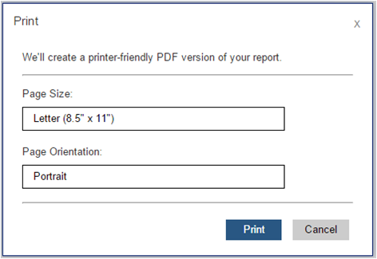
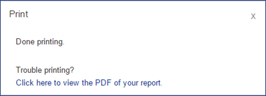
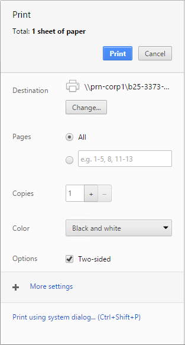
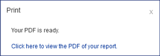
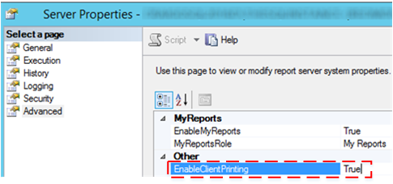

# <a name="enable-and-disable-client-side-printing-for-reporting-services"></a>Activer et désactiver l'impression côté client pour Reporting Services

  Le bouton d’impression dans la barre d’outils de la visionneuse de rapports utilise le format PDF pour l’impression côté client de rapports [!INCLUDE[ssRSnoversion](../../includes/ssrsnoversion-md.md)] affichés dans un navigateur. La nouvelle expérience d'impression à distance utilise l'extension de rendu PDF fournie avec [!INCLUDE[ssRSnoversion](../../includes/ssrsnoversion-md.md)]pour afficher le rapport au format PDF. Vous pouvez télécharger le rapport au format .PDF ou, si vous disposez d'une application pour l'affichage de fichiers PDF, le bouton d'impression affiche une boîte de dialogue d'impression comprenant les éléments courants de configuration de page, notamment la taille et l'orientation de la page et un aperçu du fichier .PDF. Bien que l'impression côté client soit activée par défaut, vous pouvez désactiver cette fonctionnalité pour l'empêcher d'être utilisée.  
  
 Les versions précédentes de [!INCLUDE[ssRSnoversion](../../includes/ssrsnoversion-md.md)] utilisaient un contrôle ActiveX qui nécessitait un téléchargement sur l'ordinateur client à partir du serveur de rapports. Si vous mettez à niveau votre serveur de rapports vers SQL Server 2016 le contrôle d’impression n’est pas supprimé à partir du serveur de rapports ou les ordinateurs clients.  

##  <a name="bkmk_clientside_printexpereince"></a> L'expérience d'impression  
 Lorsque vous cliquez sur le bouton  dans la barre d’outils rapport Observateur, l’expérience varie en fonction de ce que. Applications d’affichage PDF sont installées sur l’ordinateur client et ce que navigateur que vous utilisez.   Vous pouvez télécharger le fichier PDF ou configurer les options d'impression à partir d'une boîte de dialogue, ou les deux, en fonction de l'ordinateur client.  
  
   
  
|||  
|-|-|  
|La première boîte de dialogue, identique pour tous les navigateurs, vous permet de modifier les propriétés de disposition de base, par exemple l'orientation. Lorsque vous cliquez sur **Imprimer**, l'expérience sera légèrement différente selon le navigateur que vous utilisez.||  
|Dans Chrome, une boîte de dialogue d’impression détaillée s'ouvre dans le navigateur.   Vous pouvez modifier la configuration d'impression, imprimer et ouvrir la boîte de dialogue d'impression du système d'exploitation.| |  
|Si vous disposez d’une application de lecture de PDF, le bouton d'impression ouvrira une fenêtre d'aperçu du fichier PDF et vous pourrez enregistrer ou imprimer.||  
|Si vous ne disposez pas d’une application de lecture de PDF, deux expériences utilisateur coexistent :<br /><br /> Le rapport sera affiché automatiquement et utilisera le processus de téléchargement de votre navigateur pour télécharger le fichier PDF.   **Remarque :** plus le rapport est compliqué, plus le délai est long entre le moment où vous cliquez sur **Imprimer** et celui où s’affiche la notification de téléchargement de votre navigateur. Vous pouvez également forcer à nouveau le téléchargement en cliquant sur **Cliquez ici pour afficher le fichier PDF de votre rapport.**.<br /><br /> Forcez le téléchargement PDF en cliquant sur **Cliquez ici pour afficher le fichier PDF de votre rapport.**.||  
  
##  <a name="bkmk_troubleshoot_clientsideprinting"></a> Résolution des problèmes d'impression côté client  
 Si le bouton d'impression de la barre d'outils de la visionneuse de rapports est désactivé, vérifiez les éléments suivants :  
  
-   L’impression côté client est désactivée pour le serveur de rapports dans [!INCLUDE[ssManStudio](../../includes/ssmanstudio-md.md)]. Pour en savoir plus, consultez la section  [Activer et désactiver l’impression côté client](#bkmk_enable) dans cette rubrique.  
  
-   L’extension de rendu PDF [!INCLUDE[ssRSCurrent](../../includes/ssrscurrent-md.md)] est désactivée. Vérifiez la section `<Extension Name="PDF"` du fichier **rsreportserver.config** .  
  
-   Vous affichez le rapport en mode de compatibilité, qui utilise l'ancien moteur de rendu HTML4 [!INCLUDE[ssRSCurrent](../../includes/ssrscurrent-md.md)] . L'expérience d'impression PDF nécessite le moteur de rendu HTML 5.  Cliquez sur le bouton **Essayer l’aperçu** dans la barre d'outils.  
  
       
  
##  <a name="bkmk_enable"></a> Activer et désactiver l'impression côté client  
 Les administrateurs du serveur de rapports ont la possibilité de désactiver la fonctionnalité d'impression à distance en affectant la valeur **false** à la propriété système **EnableClientPrinting**du serveur de rapports. Cela entraîne la désactivation de l'impression côté client pour tous les rapports gérés par ce serveur. Par défaut, **EnableClientPrinting** a la valeur **true**. Vous pouvez désactiver l'impression côté client de différentes façons :  
  
-   Pour un **serveur de rapports en mode natif**:  
  
    1.  Lancez [!INCLUDE[ssManStudio](../../includes/ssmanstudio-md.md)] avec des privilèges d'administrateur.  
  
    2.  Connectez-vous à une instance de serveur de rapports dans [!INCLUDE[ssManStudio](../../includes/ssmanstudio-md.md)].  
  
    3.  Cliquez avec le bouton droit sur le nœud du serveur de rapports et sélectionnez **Propriétés**. Si l'option **Propriétés** est désactivée, vérifiez que vous avez lancé [!INCLUDE[ssManStudio](../../includes/ssmanstudio-md.md)] avec des privilèges d'administrateur.  
  
    4.  Cliquez sur **Avancé**.  
  
    5.  Sélectionnez **EnableClientPrinting**.  
  
    6.  Choisissez True ou False, puis cliquez sur **OK**.  
  
           
  
-   Pour un **serveur de rapports en mode SharePoint**:  
  
    1.  Dans l'Administration centrale de SharePoint, cliquez sur **Gestion des applications**.  
  
    2.  Cliquez sur **Gérer les applications de service**.  
  
    3.  Cliquez sur le nom de votre application de service [!INCLUDE[ssRSnoversion](../../includes/ssrsnoversion-md.md)] et cliquez sur **Gérer** dans le ruban SharePoint.  
  
    4.  Cliquez sur **Paramètres système**.  
  
    5.  Sélectionnez **Activer l'impression cliente**. L'option **Activer l'impression cliente** se trouve en bas de la page.  
  
    6.  Cliquez sur **OK**.  
  
-   Écrivez un script ou un code qui attribue à la propriété système du serveur de rapports **EnableClientPrinting** la valeur **false.**  
  
 L'exemple de script suivant illustre une approche possible en matière de désactivation de l'impression côté client. Compilez et exécutez le code [!INCLUDE[msCoName](../../includes/msconame-md.md)] [!INCLUDE[vbprvb](../../includes/vbprvb-md.md)] suivant afin d'affecter à la propriété **EnableClientPrinting** la valeur **False**. Une fois le code exécuté, redémarrez les services Internet (IIS).  
  
### <a name="sample-script"></a>Exemple de script  
  
```  
Imports System  
Imports System.Web.Services.Protocols  
Class Sample  
   Public Shared Sub Main()  
Dim rs As New ReportingService()  
      rs.Credentials = System.Net.CredentialCache.DefaultCredentials  
        Dim props(0) As [Property]  
        Dim setProp As New [Property]  
        setProp.Name = "EnableClientPrinting"  
        setProp.Value = “False”   
        props(0) = setProp  
        Try  
            rs.SetSystemProperties(props)  
        Catch ex As System.Web.Services.Protocols.SoapException  
            Console.Write(ex.Detail.InnerXml)  
        Catch e as Exception  
            Console.Write(e.Message)  
        End Try  
    End Sub 'Main  
End Class 'Sample  
```

D’autres questions ? [Essayez de poser le forum Reporting Services](http://go.microsoft.com/fwlink/?LinkId=620231)

