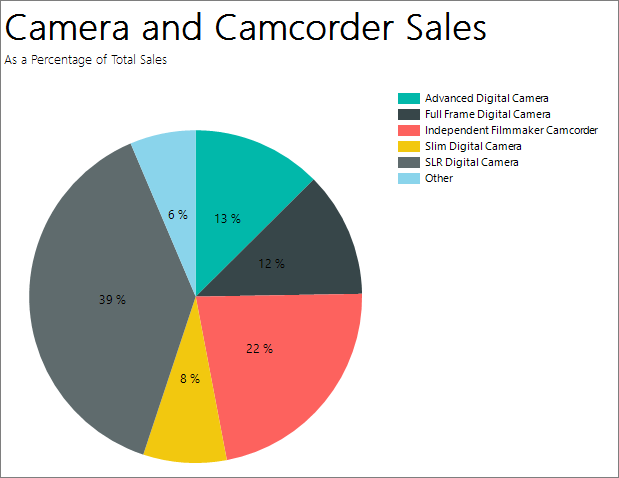
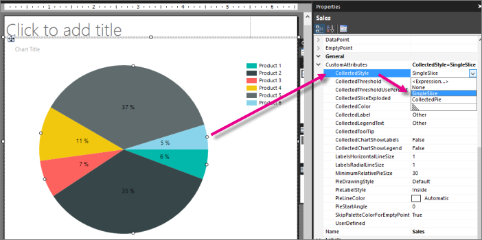
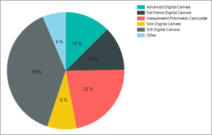

# <a name="tutorial-add-a-pie-chart-to-your-report-report-builder"></a>Didacticiel : ajouter un graphique à secteurs à un rapport (Générateur de rapports)
Dans ce didacticiel, vous créez un graphique à secteurs dans un rapport paginé Reporting Services. Vous ajoutez des pourcentages et combinez de petits secteurs en un seul secteur.

Les graphiques à secteurs et en anneau affichent des données sous la forme d’une proportion de la totalité. Ils n’ont pas d’axe. Quand vous ajoutez un champ numérique à un graphique à secteurs, le graphique calcule le pourcentage de chaque valeur par rapport au total.  

Cette illustration montre le graphique à secteurs que vous allez créer. 
 

  
Lorsqu'un graphique à secteurs comporte trop de points de données, vos étiquettes de points de données peuvent devenir illisibles. Dans ce cas, envisagez de combiner plusieurs petits secteurs en un secteur plus grand. Les graphiques à secteurs gagnent en lisibilité quand vos données sont agrégées en quelques points de données.  
 
> [!NOTE]  
> Dans ce didacticiel, les étapes de l'Assistant sont consolidées en deux procédures. Pour obtenir des instructions pas à pas sur l’accès à un serveur de rapports, l’ajout d’une source de données et l’ajout d’un dataset, consultez le premier didacticiel de cette série : [Didacticiel : création d’un rapport de tableau de base &#40;Générateur de rapports&#41;](../reporting-services/tutorial-creating-a-basic-table-report-report-builder.md).  
  
Durée estimée pour effectuer le didacticiel : 10 minutes.  
  
## <a name="requirements"></a>Spécifications  
Pour plus d’informations sur les spécifications, consultez [Éléments requis pour les didacticiels &#40;Générateur de rapports&#41;](../reporting-services/prerequisites-for-tutorials-report-builder.md).  
  
## <a name="Chart"></a>1. Créer un graphique à secteurs à partir de l'Assistant Graphique  
Dans cette section, vous utilisez l’Assistant Graphique pour créer un dataset incorporé, choisissez une source de données partagée et créez un graphique à secteurs.  

  
1.  [Démarrez le Générateur de rapports](../reporting-services/report-builder/start-report-builder.md) depuis votre ordinateur, depuis le portail web [!INCLUDE[ssRSnoversion_md](../includes/ssrsnoversion-md.md)] ou en mode intégré SharePoint.  
  
    La boîte de dialogue **Nouveau rapport ou dataset** s’ouvre.  
  
    Si vous ne voyez pas la boîte de dialogue **Nouveau rapport ou Dataset**, dans le menu **Fichier**, choisissez **Nouveau**.  
  
2.  Dans le volet gauche, assurez-vous que **Nouveau rapport** est sélectionné.  
  
3.  Dans le volet droit, cliquez sur **Assistant Graphique**.  
  
4.  Dans la page **Choisir un dataset** , cliquez sur **Créer un dataset**, puis sur **Suivant**.  
  
5.  Dans la page **Choisir une connexion à une source de données** , sélectionnez une source de données existante ou naviguez jusqu’au serveur de rapports, sélectionnez une source de données, puis cliquez sur **Suivant**. Vous devrez peut-être entrer un nom d'utilisateur et un mot de passe.  
  
    > [!NOTE]  
    > La source de données que vous choisissez n'a pas d'importance, tant que vous disposez des autorisations appropriées. Vous n'allez pas récupérer de données à partir de la source de données. Pour plus d’informations, consultez [Autres manières d’obtenir une connexion de données &#40;Générateur de rapports&#41;](../reporting-services/alternative-ways-to-get-a-data-connection-report-builder.md).  
  
6.  Dans la page **Créer une requête** , cliquez sur **Modifier en tant que texte**.  
  
7.  Collez la requête suivante dans le volet de requête :  

    > [!NOTE]  
    > Dans ce didacticiel, la requête contient les valeurs de données ; il n’est donc pas nécessaire de disposer d’une source de données externe. Cela rend la requête longue. Dans un environnement métier, une requête ne contient pas les données. Ceci est nécessaire à des fins de formation uniquement.  
  
    ```  
    SELECT 'Advanced Digital Camera' AS Product, CAST(254995.21 AS money) AS Sales  
    UNION SELECT 'Slim Digital Camera' AS Product, CAST(164499.04 AS money) AS Sales  
    UNION SELECT 'SLR Digital Camera' AS Product, CAST(782176.79 AS money) AS Sales  
    UNION SELECT 'Lens Adapter' AS Product, CAST(36333.08 AS money) AS Sales  
    UNION SELECT 'Macro Zoom Lens' AS Product, CAST(40199.3 AS money) AS Sales  
    UNION SELECT 'USB Cable' AS Product, CAST(53245.5 AS money) AS Sales  
    UNION SELECT 'Independent Filmmaker Camcorder' AS Product, CAST(452288.0 AS money) AS Sales  
    UNION SELECT 'Full Frame Digital Camera' AS Product, CAST(247250.85 AS money) AS Sales  
    ```  
  
8.  (Facultatif) Cliquez sur le bouton Exécuter (**!**) pour voir les données sur lesquelles votre graphique sera basé.  
  
9. Cliquez sur **Suivant**.  
  
## <a name="ChartType"></a>2. Choisir le type de graphique  
Vous avez le choix entre plusieurs types de graphiques prédéfinis.  

  
1.  Dans la page **Choisir un type de graphique** , cliquez sur **Secteurs**, puis sur **Suivant**. La page **Organiser les champs du graphique** s’affiche.  
  
    Dans la page **Organiser les champs du graphique** , faites glisser le champ Product vers le volet **Catégories** . Les catégories définissent le nombre de secteurs du graphique à secteurs. Dans cet exemple, il y a huit secteurs, un pour chaque produit.  
  
2.  Faites glisser le champ Sales vers le volet **Valeurs** . Le champ Sales représente le montant des ventes réalisées pour la sous-catégorie. Le volet **Valeurs** affiche `[Sum(Sales)]` , car le graphique affiche l’agrégat pour chaque produit.  
  
3.  Cliquez sur **Suivant** pour afficher un aperçu.  
  
5.  Cliquez sur **Terminer**.  
  
    Le graphique est ajouté à l'aire de conception. Pour que vous ayez une idée de l’aspect du graphique à secteurs, vous simplement Product 1, Product 2, etc., à la place des valeurs réelles.  
    
    
  
6.  Cliquez sur le graphique pour afficher ses poignées. Faites glisser le coin inférieur droit du graphique pour l’agrandir. Notez que l’aire de conception du rapport augmente également pour s’adapter à la taille du graphique.  
  
7.  Cliquez sur **Exécuter** pour afficher un aperçu du rapport.  
  
Le rapport affiche le graphique à secteurs avec huit secteurs, un pour chaque produit. À présent, vous voyez les produits réels, et la taille de chaque secteur représente les ventes du produit concerné. Trois des secteurs sont assez fins.  


  
## <a name="Percentages"></a>3. Afficher des pourcentages dans chaque secteur  
Sur chaque secteur du graphique, vous pouvez afficher le pourcentage de ce secteur par rapport à l'ensemble.  

  
1.  Basculez en mode création de rapport.  
  
2.  Cliquez avec le bouton droit sur le graphique à secteurs, puis cliquez sur **Afficher les étiquettes de données**. Les étiquettes de données s'affichent sur le graphique.  
  
3.  Cliquez avec le bouton droit sur une étiquette, puis cliquez sur **Propriétés de l’étiquette de la série**.  
  
4.  Dans la zone **Données de l’étiquette** , sélectionnez **#PERCENT**.  
    
5.  (Facultatif) Pour spécifier le nombre de décimales l’étiquette affiche, dans le **étiqueter des données** zone après **#PERCENT**, type **{Pn}** où  *n*  est le nombre de décimales à afficher. Par exemple, pour ne pas afficher de décimale, tapez **#PERCENT{P0}**.  

6.  Pour afficher les valeurs sous forme de pourcentages, la propriété UseValueAsLabel doit avoir la valeur false. Si vous êtes invité à définir cette valeur dans la boîte de dialogue **Confirmer l’action** , cliquez sur **Oui**.  
  
    > [!NOTE]  
    > L’option**Format de nombre** de la boîte de dialogue **Propriétés de l’étiquette de la série** n’a aucun effet quand vous mettez en forme des pourcentages. Elle met uniquement en forme les étiquettes sous forme de pourcentages, mais ne calcule pas le pourcentage représenté par chaque secteur du graphique à secteurs.  
  
6.  [!INCLUDE[clickOK](../includes/clickok-md.md)]  
  
7.  Cliquez sur **Exécuter** pour afficher un aperçu du rapport.  
  
Le rapport affiche le pourcentage de chaque secteur par rapport à l'ensemble.  


  
## <a name="CombineSlices"></a>4. Combiner de petits secteurs en un secteur  
Trois des secteurs du graphique à secteurs sont assez petits. Vous pouvez combiner plusieurs petits secteurs en un secteur « Autre » plus grand qui représente l’ensemble des trois secteurs.  

1.  Basculez en mode création de rapport.  
  
2.  Si le volet Propriétés n’est pas visible, sous l’onglet **Affichage**, dans le groupe **Afficher/Masquer**, sélectionnez **Propriétés**.  
  
3.  Dans l'aire de conception, cliquez sur un secteur du graphique. Les propriétés de la série sont affichées dans le volet Propriétés.  
  
4.  Dans la section **Général** , développez le nœud **CustomAttributes** .  
  
5.  Définissez la propriété **CollectedStyle** sur **SingleSlice**.  

    
 
6.  Vérifiez que la propriété **CollectedThreshold** a la valeur 5.  
  
7.  Vérifiez que la propriété **CollectedThresholdUsePercent** a la valeur **True**.  
  
8.  Sous l’onglet **Dossier de base** , cliquez sur **Exécuter** pour afficher l’aperçu du rapport.  
  
Dans la légende, vous pouvez désormais voir la catégorie « Autre ». Le nouveau secteur regroupe tous les secteurs de moins de 5 % dans un seul secteur qui représente 6 % de l'ensemble.  


 
## <a name="DrawingEffect"></a>5. Faire démarrer les valeurs de graphique à secteurs à partir du haut 

Par défaut dans les graphiques à secteurs, la première valeur du dataset démarre à 90 degrés à partir du haut du graphique à secteurs. Vous pouvez le constater dans le graphique à secteurs des sections précédentes.

Dans cette section, nous allons faire démarrer la première valeur à partir du haut.

1.  Basculez en mode création de rapport.  

2. Sélectionnez le graphique à secteurs lui-même.

3. Dans le volet Propriétés, sous **Attributs personnalisés**, remplacez la valeur de PieStartAngle définie sur **0** par **270**.

4. Cliquez sur **Exécuter** pour afficher un aperçu du rapport.

À présent, les secteurs du graphique apparaissent dans l’ordre alphabétique à partir du haut et se terminent par le secteur « Autre ».


  
## <a name="Title"></a>6. Ajouter un titre de rapport  
  
Le graphique à secteurs étant la seule visualisation dans le rapport, il n’a pas besoin d’avoir son propre titre. Le titre du rapport suffit.
  
1.  Dans le graphique, sélectionnez la zone Titre du graphique et appuyez sur Suppr.

2. Dans l’aire de conception, cliquez sur **Cliquez pour ajouter un titre**.  
  
2.  Tapez **Ventes d’appareils photo et de caméscopes**, appuyez sur Entrée, puis tapez **En pourcentage du total des ventes**, afin d’obtenir ce qui suit :  
  
    **Ventes d’appareils photo et de caméscopes**  
  
    **En pourcentage du total des ventes**  
  
3.  Sélectionnez **Ventes d’appareils photo et de caméscopes** puis, sous l’onglet **Accueil**, dans la section **Police**, cliquez sur **Gras**.  
  
4.  Sélectionnez **En pourcentage du total des ventes** puis, sous l’onglet **Accueil**, dans la section **Police**, affectez la valeur **10** à la taille de la police.  
  
5.  (Facultatif) Vous devrez peut-être agrandir la zone de texte Titre pour contenir les deux lignes de texte.  
  
    Ce titre s'affiche alors dans la partie supérieure du rapport. En l’absence d’en-tête de page défini, les éléments situés au-dessus du corps du rapport font office d’en-tête de rapport.  
  
6.  Cliquez sur **Exécuter** pour afficher un aperçu du rapport.  
  
## <a name="Save"></a>7. Enregistrer le rapport  
  
### <a name="to-save-the-report"></a>Pour enregistrer le rapport  
  
1.  Basculez en mode création de rapport.  
  
2.  Dans le menu **Fichier** , cliquez sur **Enregistrer**.  
  
3.  Dans **Nom**, tapez **Graphique à secteurs des ventes**.  
  
4.  Cliquez sur **Enregistrer**.  
  
Votre rapport est enregistré sur le serveur de rapports.  
  
## <a name="next-steps"></a>Étapes suivantes  
Vous avez terminé le didacticiel d'ajout d'un graphique à secteurs à votre rapport. Pour en savoir plus sur les graphiques, consultez [Graphiques &#40;Générateur de rapports et SSRS&#41;](../reporting-services/report-design/charts-report-builder-and-ssrs.md) et [Graphiques sparkline et barres de données &#40;Générateur de rapports et SSRS&#41;](../reporting-services/report-design/sparklines-and-data-bars-report-builder-and-ssrs.md).  
  
## <a name="see-also"></a>Voir aussi  
[Didacticiels du Générateur de rapports](../reporting-services/report-builder-tutorials.md)  
[Générateur de rapports dans SQL Server 2016](../reporting-services/report-builder/report-builder-in-sql-server-2016.md)  
  


