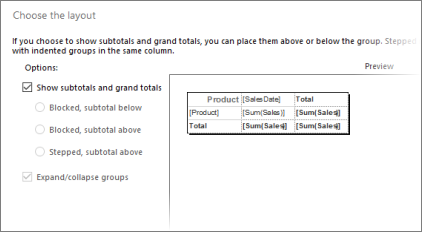
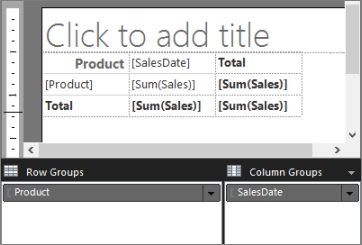
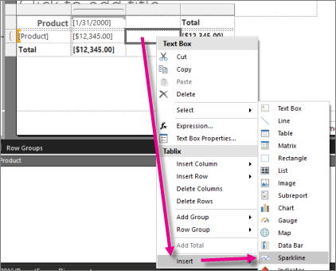

# <a name="tutorial-add-a-sparkline-to-your-report-report-builder"></a>Didacticiel : ajouter un graphique sparkline à un rapport (Générateur de rapports)

Dans ce didacticiel du [!INCLUDE[ssRBnoversion_md](../includes/ssrbnoversion-md.md)], vous créez une table de base avec un graphique sparkline dans un rapport paginé [!INCLUDE[ssRSnoversion_md](../includes/ssrsnoversion-md.md)] .   
  
Les graphiques sparkline et les barres de données sont des graphiques simples de petite taille qui communiquent beaucoup d’informations dans un petit espace, souvent dans des tableaux et matrices de rapports [!INCLUDE[ssRSnoversion_md](../includes/ssrsnoversion-md.md)] . L’illustration suivante montre un rapport similaire à celui que vous allez créer.  
  
  
     
Durée estimée pour effectuer ce didacticiel : 30 minutes.  
  
## <a name="requirements"></a>Spécifications  
Pour plus d’informations sur les spécifications, consultez [Éléments requis pour les didacticiels &#40;Générateur de rapports&#41;](../reporting-services/prerequisites-for-tutorials-report-builder.md).  
  
## <a name="CreateTable"></a>1. Créer un rapport avec un tableau  
  
1.  [Démarrez le Générateur de rapports](../reporting-services/report-builder/start-report-builder.md) depuis votre ordinateur, depuis le portail web [!INCLUDE[ssRSnoversion_md](../includes/ssrsnoversion-md.md)] ou en mode intégré SharePoint.  
  
    La boîte de dialogue **Nouveau rapport ou dataset** s’ouvre.  
  
    Si vous ne voyez pas la boîte de dialogue **Nouveau rapport ou Dataset**, dans le menu **Fichier**, choisissez **Nouveau**.  
  
2.  Dans le volet gauche, assurez-vous que **Nouveau rapport** est sélectionné.  
  
3.  Dans le volet droit, cliquez sur **Assistant Tableau ou matrice**.  
  
4.  Dans la page **Choisir un dataset** , sélectionnez **Créer un dataset** > **Suivant**. La page **Choisir une connexion à une source de données** s’ouvre.  
  
    > [!NOTE]  
    > Ce didacticiel n’a pas besoin des données spécifiques ; Il suffit d’une connexion à une base de données SQL Server. Si une connexion est répertoriée sous **Connexions à la source de données**, vous pouvez la sélectionner et passer à l’étape 10. Pour plus d’informations, consultez [Autres manières d’obtenir une connexion de données &#40;Générateur de rapports&#41;](../reporting-services/alternative-ways-to-get-a-data-connection-report-builder.md).  
  
5.  Cliquez sur **Nouveau**. La boîte de dialogue **Propriétés de la source de données** s'ouvre.  
  
6.  Dans **Nom**, tapez **Ventes de produits**comme nom de la source de données.  
  
7.  Dans **Sélectionner un type de connexion**, assurez-vous que **Microsoft SQL Server** est sélectionné.  
  
8.  Dans **Chaîne de connexion**, tapez le texte suivant :  
  
    `Data Source\=<servername>`  
  
    L’expression `<servername>`, par exemple Rapport001, spécifie un ordinateur sur lequel une instance du moteur de base de données SQL Server est installée. Dans la mesure où les données du rapport ne sont pas extraites d'une base de données SQL Server, vous n'avez pas besoin d'inclure le nom d'une base de données. La base de données par défaut sur le serveur spécifié est utilisée pour analyser la requête.  
  
9. Cliquez sur **Informations d'identification**. Entrez les informations d'identification nécessaires pour accéder à la source de données externe.  
  
10. [!INCLUDE[clickOK](../includes/clickok-md.md)]  
  
    Vous revenez à la page **Choisir une connexion à une source de données** .  
  
11. Pour vérifier vous pouvez vous connecter à la source de données, cliquez sur **Tester la connexion**.  
  
    Le message « La connexion a été correctement créée » s'affiche.  
  
12. [!INCLUDE[clickOK](../includes/clickok-md.md)]  
  
13. Cliquez sur **Suivant**.  
  
## <a name="Query"></a>2. Créer une requête et une disposition de tableau dans l’Assistant Tableau  
Dans un rapport, vous pouvez utiliser un dataset partagé qui comprend une requête prédéfinie, ou vous pouvez créer un dataset incorporé utilisable uniquement dans votre rapport. Dans ce didacticiel, vous allez créer un dataset incorporé.  
  
> [!NOTE]  
> Dans ce didacticiel, la requête contient les valeurs de données, afin qu'il ne soit pas nécessaire de disposer d'une source de données externe. Cela rend la requête assez longue. Dans un environnement métier, une requête ne contient pas les données. Ceci est nécessaire à des fins de formation uniquement.  
  
### <a name="to-create-a-query-and-table-layout-in-the-table-wizard"></a>Pour créer une requête et une disposition de tableau dans l’Assistant Tableau 
  
1.  Dans la page **Créer une requête** , le concepteur de requêtes relationnelles est ouvert. Pour ce didacticiel, vous utiliserez le Concepteur de requêtes textuel.  
  
2.  Cliquez sur **Modifier en tant que texte**. Le Concepteur de requêtes textuel affiche un volet de requête et un volet de résultats.  
  
3.  Collez la requête [!INCLUDE[tsql](../includes/tsql-md.md)] ci-après dans la zone **Requête** .  
  
    ```  
    SELECT CAST('2015-01-04' AS date) as SalesDate, 'Accessories' as Subcategory,   
       'Carrying Case' as Product, CAST(16996.60 AS money) AS Sales, 68 as Quantity  
    UNION SELECT CAST('2015-01-05' AS date) as SalesDate, 'Accessories' as Subcategory,  
       'Carrying Case' as Product, CAST(1350.00 AS money) AS Sales, 18 as Quantity  
    UNION SELECT CAST('2015-01-10' AS date) as SalesDate, 'Accessories' as Subcategory,  
       'Carrying Case' as Product, CAST(1147.50 AS money) AS Sales, 17 as Quantity  
    UNION SELECT CAST('2015-01-04' AS date) as SalesDate, 'Accessories' as Subcategory,  
       'Budget Movie-Maker' as Product, CAST(1056.00 AS money) AS Sales, 44 as Quantity  
    UNION SELECT CAST('2015-01-05' AS date) as SalesDate,  'Accessories' as Subcategory,  
       'Slim Digital' as Product, CAST(1380.00 AS money) AS Sales, 18 as Quantity  
    UNION SELECT CAST('2015-01-05' AS date) as SalesDate,'Accessories' as Subcategory,    
       'Budget Movie-Maker' as Product, CAST(780.00 AS money) AS Sales, 26 as Quantity  
    UNION SELECT CAST('2015-01-07' AS date) as SalesDate, 'Accessories' as Subcategory,   
       'Budget Movie-Maker' as Product, CAST(3798.00 AS money) AS Sales, 9 as Quantity  
    UNION SELECT CAST('2015-01-08' AS date) as SalesDate, 'Camcorders' as Subcategory,   
       'Budget Movie-Maker' as Product, CAST(10400.00 AS money) AS Sales, 13 as Quantity  
    UNION SELECT CAST('2015-01-09' AS date) as SalesDate, 'Camcorders' as Subcategory,   
       'Budget Movie-Maker' as Product, CAST(3000.00 AS money) AS Sales, 60 as Quantity  
    UNION SELECT CAST('2015-01-10' AS date) as SalesDate,  'Digital' as Subcategory,   
       'Budget Movie-Maker' as Product, CAST(7234.50 AS money) AS Sales, 39 as Quantity  
    UNION SELECT CAST('2015-01-06' AS date) as SalesDate,  'Digital' as Subcategory,   
       'Carrying Case' as Product, CAST(10836.00 AS money) AS Sales, 84 as Quantity  
    UNION SELECT CAST('2015-01-07' AS date) as SalesDate,  'Digital' as Subcategory,   
       'Slim Digital' as Product, CAST(2550.00 AS money) AS Sales, 17 as Quantity  
    UNION SELECT CAST('2015-01-04' AS date) as SalesDate, 'Digital' as Subcategory,   
       'Slim Digital' as Product, CAST(8357.80 AS money) AS Sales, 44 as Quantity  
    UNION SELECT CAST('2015-01-08' AS date) as SalesDate, 'Digital SLR' as Subcategory,   
       'Slim Digital' as Product, CAST(18530.00 AS money) AS Sales, 34 as Quantity  
    UNION SELECT CAST('2015-01-06' AS date) as SalesDate, 'Digital SLR' as Subcategory,   
       'Slim Digital' as Product, CAST(26576.00 AS money) AS Sales, 88 as Quantity  
    ```  
  
4.  Dans la barre d’outils du Concepteur de requêtes, cliquez sur Exécuter (**!**).  
  
    La requête s’exécute et affiche le jeu de résultats pour les champs **SalesDate**, **Subcategory**, **Product**, **Sales**et **Quantity**.  
  
5.  Cliquez sur **Suivant**.  
  
6.  Dans la page **Organiser les champs** , faites glisser **Sales** vers **Valeurs**.  
  
    **Sales** est agrégé par la fonction Sum. La valeur est [Sum(Sales)].  
  
7.  Faites glisser **Product** vers **Groupes de lignes**.  
  
8.  Faites glisser **SalesDate** vers **Groupes de colonnes**.  

    
  
9. Cliquez sur **Suivant**.  
  
10. Dans la page **Choisir la disposition** , sous **Options**, vérifiez que **Afficher les sous-totaux et les totaux généraux** est sélectionné.  
  
    Le volet Aperçu de l'Assistant affiche un tableau avec trois lignes. Lorsque vous exécutez le rapport, chaque ligne est affichée de la manière suivante :  
  
    *  La première ligne apparaît une fois pour le tableau afin d'afficher les en-têtes de colonnes.  
  
    *  La deuxième ligne est répétée une fois pour chaque produit et affiche le nom du produit, le total par jour et le total de ligne.  
  
    *  La troisième ligne apparaît une fois pour le tableau afin d'afficher les totaux généraux.  
    
    
  
11. Cliquez sur **Suivant**.  
  
12. Cliquez sur **Terminer**.  
  
14. Le tableau est ajouté à l'aire de conception. Il comporte trois colonnes et trois lignes.  
  
    Recherchez le volet de regroupement. S’il n’est pas visible, dans le menu **Affichage** , cliquez sur **Regroupement**. Le volet Groupes de lignes affiche un groupe de lignes : **Product**. Le volet Groupes de colonnes affiche un groupe de colonnes : **SalesDate**. Les données de détail sont toutes les données récupérées par la requête de dataset.  
    
    
  
15. Cliquez sur **Exécuter** pour afficher un aperçu du rapport.  

### <a name="FormatCurrency"></a>2a. Mettre en forme les données en tant que devises  
Par défaut, les données de synthèse du champ **Sales** affichent un nombre général. Appliquez une mise en forme pour afficher ce nombre dans un format monétaire. Activez/désactivez **Styles des espaces réservés** pour afficher les zones de texte mises en forme et le texte de l’espace réservé en tant qu’exemples de valeurs.  
  
1.  Cliquez sur **Conception** pour basculer en mode Conception.  
  
2.  Cliquez sur la cellule de la deuxième ligne (sous la ligne des en-têtes de colonnes) de la colonne **SalesDate** . Maintenez la touche Ctrl enfoncée et sélectionnez toutes les cellules qui contiennent `[Sum(Sales)]`. 

     
  
3.  Sous l’onglet **Accueil** > groupe **Nombre**, cliquez sur **Devise**. Les cellules changent pour afficher le format de devise.  

    
  
    Si votre paramètre régional est Anglais (États-Unis), le texte d’exemple par défaut est [**$12,345.00**]. Si vous ne voyez pas s’afficher d’exemple de valeur monétaire, dans le groupe **Nombres** , cliquez sur **Styles des espaces réservés** > **Valeurs d’aperçu**.  
    
    
   
### <a name="FormatDates"></a>2b. (Facultatif) Mettre en forme les données en tant que dates  
Par défaut, le champ **SalesDate** affiche les informations de date et d’heure. Vous pouvez le mettre en forme de sorte qu'il n'affiche que la date.  
  
1.  Cliquez sur la cellule qui contient `[SalesDate]`.  
  
3.  Sous l’onglet **Accueil**, dans le groupe **Nombre**, cliquez sur **Date**.  
  
    La cellule affiche la date d’exemple **[1/31/2000]**.
     
4.  Cliquez sur **Exécuter** pour afficher un aperçu du rapport.  
  
Les valeurs **SalesDate** s’affichent dans le format de date par défaut, tandis que les valeurs de synthèse pour **Sales** s’affichent en tant que devises.   
  
## <a name="Sparkline"></a>3. Ajouter un graphique sparkline    
  
1.  Cliquez sur **Conception** pour repasser en mode Conception.  
  
2.  Sélectionnez la colonne Total de votre tableau.  
  
3.  Cliquez avec le bouton droit, pointez sur **Insérer une colonne**, puis cliquez sur **Gauche**.  

    
  
4.  Dans la nouvelle colonne, cliquez avec le bouton droit sur la cellule dans la ligne `[Product]`, puis choisissez **Insérer** > **Graphique Sparkline**.  

    
  
5.  Dans la boîte de dialogue **Sélectionner un type de graphique sparkline** , vérifiez que le premier graphique sparkline de la ligne **Colonne** est sélectionné, puis cliquez sur **OK**.  
  
6.  Cliquez sur le graphique sparkline pour afficher le volet Données du graphique.  
  
7.  Cliquez sur le signe plus (+) dans la zone Valeurs, puis cliquez sur **Sales**. 

     
  
    Les valeurs du champ **Sales** sont maintenant les valeurs du graphique sparkline.  
  
8.  Cliquez sur le signe plus (+) dans la zone Groupes d’abscisses, puis sur **SalesDate**.  
  
9. Cliquez sur **Exécuter** pour afficher un aperçu du rapport.  
  
    Notez que les barres des graphiques sparkline ne sont pas alignées les unes par rapport aux autres. Il n'y a que quatre barres dans la seconde ligne de données, ce qui fait qu'elles sont plus larges que les barres de la première ligne, qui en a six. Vous ne pouvez pas comparer les valeurs de chaque produit par jour. Elles doivent être alignées.  
  
    En outre, pour chaque ligne, la barre la plus grande correspond à la hauteur de la ligne. Ceci est également trompeur, car les valeurs les plus élevées de chaque ligne ne sont pas égales : la valeur la plus élevée pour Budget Movie-Maker est 10 400 $, contre 26 576 $ pour Slim Digital (plus du double). Or les barres les plus grandes pour ces deux lignes ont pratiquement la même hauteur. Tous les graphiques sparkline doivent utiliser la même échelle.  
  
     
  
## <a name="AlignSparklines"></a>4. Aligner les graphiques sparkline verticalement et horizontalement  
Les graphiques sparkline sont difficiles à lire s’ils n’utilisent pas tous les mêmes mesures. Les axes horizontal et vertical doivent chacun correspondre au reste.  
   
1.  Cliquez sur **Conception** pour repasser en mode Conception.  
  
2.  Cliquez avec le bouton droit sur le graphique sparkline, puis cliquez sur **Propriétés de l’axe vertical**.  
  
3.  Cochez la case **Aligner les axes dans** . Tablix1 est la seule option disponible dans la liste.  
  
     Elle permet de définir la hauteur des barres de chaque graphique sparkline par rapport aux autres. 
  
4.  Cliquez sur **OK**.  
  
5.  Cliquez avec le bouton droit sur le graphique sparkline, puis cliquez sur **Propriétés de l’axe horizontal**.  
  
6.  Cochez la case **Aligner les axes dans** . Tablix1 est la seule option disponible dans la liste. 
  
    Elle permet de définir la largeur des barres de chaque graphique sparkline par rapport aux autres. Si certains graphiques sparkline possèdent moins de barres que d'autres, ils présenteront alors des espaces vides pour les données manquantes.  
  
7.  Cliquez sur **OK**.  
  
8.  Cliquez sur **Exécuter** pour afficher un nouvel aperçu du rapport.  
  
À présent, toutes les barres de chaque graphique sparkline sont alignées sur les barres des autres graphiques sparkline et les hauteurs sont relatives.  
  

  
## <a name="Width"></a>7. (Facultatif) Modifier la largeur des colonnes  
Par défaut, chaque cellule d'un tableau contient une zone de texte. Une zone de texte s'étend verticalement pour accueillir le texte lors du rendu de la page. Dans le rapport rendu, chaque ligne s'étend en fonction de la hauteur de la plus grande zone de texte rendue dans la ligne. La hauteur de la ligne dans l'aire de conception n'a aucun impact sur la hauteur de la ligne dans le rapport rendu.  
  
Pour réduire l'espace vertical occupé par chaque ligne, augmentez la largeur de colonne afin d'accueillir le contenu attendu des zones de texte dans la colonne sur une seule ligne.  
  
### <a name="to-change-the-width-of-columns"></a>Pour modifier la largeur des colonnes  
  
1.  Cliquez sur **Conception** pour repasser en mode Conception.  
  
2.  Cliquez sur la table pour que des barres grises apparaissent au-dessus et à côté de la table. Ce sont les poignées de colonne et de ligne.
  
3.  Placez le curseur entre les séparateurs de colonne pour qu'il se transforme en flèche à deux pointes. Faites glisser la colonne **Product** afin que le nom des produits tienne sur une seule ligne.  
  
4.  Cliquez sur **Exécuter** pour afficher un aperçu de votre rapport et voir s’il est maintenant assez large.  
  
## <a name="Title"></a>8. (Facultatif) Ajouter un titre au rapport  
Un titre de rapport s'affiche dans la partie supérieure du rapport. Vous pouvez placer le titre du rapport dans un en-tête de rapport, ou si le rapport n'en utilise pas, dans une zone de texte située en haut du corps du rapport. Dans ce didacticiel, vous allez utiliser la zone de texte placée automatiquement en haut du corps du rapport.  
  
Vous pouvez améliorer le texte en appliquant différents types de styles de police, de tailles et de couleurs à des expressions et des caractères spécifiques. Pour plus d’informations, consultez [Mettre en forme du texte dans une zone de texte &#40;Générateur de rapports et SSRS&#41;](../reporting-services/report-design/format-text-in-a-text-box-report-builder-and-ssrs.md).  
  
### <a name="to-add-a-report-title"></a>Pour ajouter un titre de rapport  
  
1.  Dans l'aire de conception, cliquez sur **Cliquez pour ajouter un titre**.  
  
2.  Tapez **Sales by Date**et cliquez à l’extérieur de la zone de texte.  
  
3.  Sélectionnez la zone de texte qui contient **Product Sales**.  
  
4.  Sous l’onglet Accueil, dans le groupe **Police**, pour **Couleur**, sélectionnez **Bleu-vert**.  
  
7.  Sélectionnez **Gras**.  
  
8.  [!INCLUDE[clickOK](../includes/clickok-md.md)]  
  
## <a name="Save"></a>9. Enregistrer le rapport  
Enregistrez le rapport sur un serveur de rapports ou sur votre ordinateur. Si vous n'enregistrez pas le rapport sur le serveur de rapports, plusieurs fonctionnalités de [!INCLUDE[ssRSnoversion](../includes/ssrsnoversion-md.md)] telles que les parties de rapports et les sous-rapports ne sont pas disponibles.  
  
### <a name="to-save-the-report-on-a-report-server"></a>Pour enregistrer le rapport sur un serveur de rapports  
  
1.  À partir du bouton **Générateur de rapports** , cliquez sur **Enregistrer sous**.  
  
2.  Cliquez sur **Sites et serveurs récents**.  
  
3.  Sélectionnez ou tapez le nom du serveur de rapports sur lequel vous êtes autorisé à enregistrer des rapports.  
  
    Le message « Connexion au serveur de rapports » s'affiche. Une fois la connexion établie, le contenu du dossier de rapports spécifié par l'administrateur du serveur de rapports s'affiche comme emplacement par défaut des rapports.  
  
4.  Dans **Nom**, remplacez le nom par défaut par **Ventes de produits**.  
  
5.  Cliquez sur **Enregistrer**.  
  
Le rapport est enregistré sur le serveur de rapports. Le nom du serveur de rapports auquel vous êtes connecté est indiqué dans la barre d'état située au bas de la fenêtre.  
  
### <a name="to-save-the-report-on-your-computer"></a>Pour enregistrer le rapport sur votre ordinateur  
  
1.  À partir du bouton **Générateur de rapports** , cliquez sur **Enregistrer sous**.  
  
2.  Cliquez sur **Bureau**, **Mes documents**ou **Poste de travail**, puis naviguez jusqu’au dossier où vous souhaitez enregistrer le rapport.  
  
3.  Dans **Nom**, remplacez le nom par défaut par **Ventes de produits**.  
  
4.  Cliquez sur **Enregistrer**.  
  
## <a name="next-steps"></a>Étapes suivantes  

Ainsi s'achève le didacticiel de création d'un rapport de tableau avec des graphiques sparkline. Pour plus d’informations sur les graphiques sparkline, consultez [graphiques sparkline et barres de données](../reporting-services/report-design/sparklines-and-data-bars-report-builder-and-ssrs.md).  
  
[Didacticiels (Générateur de rapports)](../reporting-services/report-builder-tutorials.md) 
[Générateur de rapports dans SQL Server 2016](../reporting-services/report-builder/report-builder-in-sql-server-2016.md)  

D’autres questions ? [Essayez de poser le forum Reporting Services](http://go.microsoft.com/fwlink/?LinkId=620231)
