# <a name="tutorial-creating-a-free-form-report-report-builder"></a>Didacticiel : création d'un rapport au format libre (Générateur de rapports)
Dans ce didacticiel, vous créez un rapport paginé qui fait office de newsletter. Chaque page affiche du texte statique, des éléments visuels de synthèse et des exemples de données de ventes détaillées.

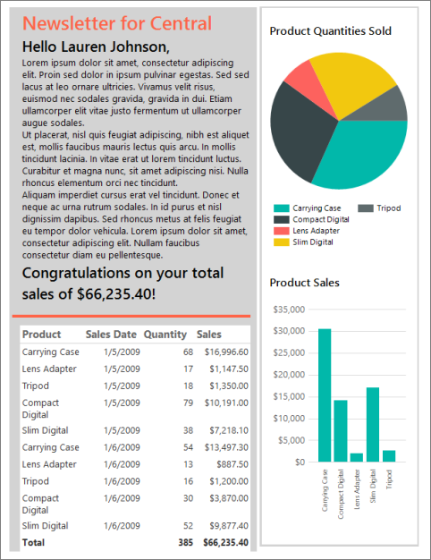

Le rapport regroupe les informations par secteur de vente et affiche le nom du directeur des ventes pour le secteur, ainsi que des informations détaillées et de synthèse sur les ventes. Vous commencez avec une région de données de liste comme base du rapport de forme libre, puis vous ajoutez un panneau décoratif avec une image, du texte statique avec des données insérées, un tableau pour afficher les informations détaillées, et éventuellement un graphique à secteurs et un histogramme pour afficher les informations de synthèse.  
  
Durée estimée pour effectuer le didacticiel : 20 minutes.  
  
## <a name="requirements"></a>Spécifications  
Pour plus d’informations sur les spécifications, consultez [Éléments requis pour les didacticiels &#40;Générateur de rapports&#41;](../reporting-services/prerequisites-for-tutorials-report-builder.md).  
  
## <a name="BlankReport"></a>1. Créer un rapport, une source de données et un dataset vides  
  
> [!NOTE]  
> Dans ce didacticiel, la requête contient les valeurs des données : elle n’a donc pas besoin d’une source de données externe. Cela rend la requête assez longue. Dans un environnement métier, une requête ne contient pas les données. C’est pour la formation uniquement.  
  
### <a name="to-create-a-blank-report"></a>Pour créer un rapport vierge  
  
1.  [Démarrez le Générateur de rapports](../reporting-services/report-builder/start-report-builder.md) depuis votre ordinateur, depuis le portail web [!INCLUDE[ssRSnoversion_md](../includes/ssrsnoversion-md.md)] ou depuis le mode intégré SharePoint.  
  
    La boîte de dialogue **Nouveau rapport ou dataset** s’ouvre.  
  
    Si vous ne voyez pas la boîte de dialogue **Nouveau rapport ou dataset**, dans le menu **Fichier**, choisissez **Nouveau**.  
  
2.  Dans le volet gauche, vérifiez que **Nouveau rapport** est sélectionné. 
 
3.  Dans le volet droit, cliquez sur **Rapport vierge**.  
  
### <a name="to-create-a-new-data-source"></a>Pour créer une source de données  
  
1.  Dans le volet Données du rapport, cliquez sur **Nouveau** > **Source de données**.  
  
2.  Dans la zone **Nom** , tapez **ListDataSource**.  
  
3.  Cliquez sur **Utiliser une connexion incorporée dans mon rapport**.  
  
4.  Vérifiez que le type de connexion est Microsoft SQL Server, puis, dans la zone **Chaîne de connexion**, tapez **Data Source = \<nom_serveur>**  
  
    **\<nom_serveur>**, par exemple Rapport001, spécifie un ordinateur sur lequel une instance du moteur de base de données SQL Server est installée. Dans la mesure où les données du rapport ne sont pas extraites d’une base de données SQL Server, vous n’avez pas besoin d’inclure le nom d’une base de données. La base de données par défaut sur le serveur spécifié est utilisée seulement pour analyser la requête.  
  
5.  Cliquez sur **Informations d'identification**, puis entrez les informations d'identification requises pour se connecter à l'instance du moteur de base de données SQL Server.  
  
6.  Cliquez sur **OK**.  
  
### <a name="to-create-a-new-dataset"></a>Pour créer un dataset  
  
1.  Dans le volet Données du rapport, cliquez sur **Nouveau** > **Dataset**.  
  
2.  Dans la zone **Nom** , tapez **ListDataset**.  
  
3.  Cliquez sur **Utiliser un dataset incorporé dans mon rapport**, puis vérifiez que la source de données est **ListDataSource**.  
  
4.  Vérifiez que le type de requête **Texte** est sélectionné, puis cliquez sur **Concepteur de requêtes**.  
  
5.  Cliquez sur **Modifier en tant que texte**.  
  
6.  Copiez et collez la requête suivante dans le volet de requête :  
  
    ```  
    SELECT CAST('2009-01-05' AS date) as SalesDate, 'Lauren Johnson' as FullName,'Central' as Territory, 'Accessories' as Subcategory,'Carrying Case' as Product, CAST(16996.60 AS money) AS Sales, 68 as Quantity  
    UNION SELECT CAST('2009-01-05' AS date) as SalesDate, 'Warren Pal' as FullName,'North' as Territory, 'Accessories' as Subcategory, 'Carrying Case' as Product, CAST(13747.25 AS money) AS Sales, 55 as Quantity  
    UNION SELECT CAST('2009-01-05' AS date) as SalesDate, 'Fernando Ross' as FullName,'South' as Territory, 'Accessories' as Subcategory,'Carrying Case' as Product, CAST(9248.15 AS money) As Sales, 37 as Quantity  
    UNION SELECT CAST('2009-01-05' AS date) as SalesDate, 'Lauren Johnson' as FullName,'Central' as Territory, 'Accessories' as Subcategory,'Tripod' as Product, CAST(1350.00 AS money) AS Sales, 18 as Quantity  
    UNION SELECT CAST('2009-01-05' AS date) as SalesDate, 'Warren Pal' as FullName,'North' as Territory, 'Accessories' as Subcategory,'Tripod' as Product, CAST(1800.00 AS money) AS Sales, 24 as Quantity  
    UNION SELECT CAST('2009-01-05' AS date) as SalesDate, 'Fernando Ross' as FullName,'South' as Territory, 'Accessories' as Subcategory,'Tripod' as Product, CAST(1125.00 AS money) AS Sales, 15 as Quantity  
    UNION SELECT CAST('2009-01-05' AS date) as SalesDate, 'Lauren Johnson' as FullName,'Central' as Territory, 'Accessories' as Subcategory,'Lens Adapter' as Product, CAST(1147.50 AS money) AS Sales, 17 as Quantity  
    UNION SELECT CAST('2009-01-05' AS date) as SalesDate, 'Warren Pal' as FullName,'North' as Territory, 'Accessories' as Subcategory,  'Lens Adapter' as Product, CAST(742.50 AS money) AS Sales, 11 as Quantity  
    UNION SELECT CAST('2009-01-05' AS date) as SalesDate, 'Fernando Ross' as FullName,'South' as Territory, 'Accessories' as Subcategory,'Lens Adapter' as Product, CAST(1417.50 AS money) AS Sales, 21 as Quantity  
    UNION SELECT CAST('2009-01-06' AS date) as SalesDate, 'Lauren Johnson' as FullName,'Central' as Territory, 'Accessories' as Subcategory, 'Carrying Case' as Product, CAST(13497.30 AS money) AS Sales, 54 as Quantity  
    UNION SELECT CAST('2009-01-06' AS date) as SalesDate, 'Warren Pal' as FullName,'North' as Territory, 'Accessories' as Subcategory, 'Carrying Case' as Product, CAST(11997.60 AS money) AS Sales, 48 as Quantity  
    UNION SELECT CAST('2009-01-06' AS date) as SalesDate, 'Fernando Ross' as FullName,'South' as Territory, 'Accessories' as Subcategory, 'Carrying Case' as Product, CAST(10247.95 AS money) As Sales, 41 as Quantity  
    UNION SELECT CAST('2009-01-06' AS date) as SalesDate, 'Lauren Johnson' as FullName,'Central' as Territory, 'Accessories' as Subcategory, 'Tripod' as Product, CAST(1200.00 AS money) AS Sales, 16 as Quantity  
    UNION SELECT CAST('2009-01-06' AS date) as SalesDate, 'Warren Pal' as FullName,'North' as Territory, 'Accessories' as Subcategory,'Tripod' as Product, CAST(2025.00 AS money) AS Sales, 27 as Quantity  
    UNION SELECT CAST('2009-01-06' AS date) as SalesDate, 'Fernando Ross' as FullName,'South' as Territory, 'Accessories' as Subcategory,'Tripod' as Product, CAST(1425.00 AS money) AS Sales, 19 as Quantity  
    UNION SELECT CAST('2009-01-06' AS date) as SalesDate, 'Lauren Johnson' as FullName,'Central' as Territory, 'Accessories' as Subcategory,'Lens Adapter' as Product, CAST(887.50 AS money) AS Sales, 13 as Quantity  
    UNION SELECT CAST('2009-01-06' AS date) as SalesDate, 'Warren Pal' as FullName,'North' as Territory, 'Accessories' as Subcategory, 'Lens Adapter' as Product, CAST(607.50 AS money) AS Sales, 9 as Quantity  
    UNION SELECT CAST('2009-01-06' AS date) as SalesDate, 'Fernando Ross' as FullName,'South' as Territory, 'Accessories' as Subcategory,'Lens Adapter' as Product, CAST(1215.00 AS money) AS Sales, 18 as Quantity  
    UNION SELECT CAST('2009-01-05' AS date) as SalesDate,  'Lauren Johnson' as FullName,'Central' as Territory, 'Digital' as Subcategory,'Compact Digital' as Product, CAST(10191.00 AS money) AS Sales, 79 as Quantity  
    UNION SELECT CAST('2009-01-05' AS date) as SalesDate,  'Warren Pal' as FullName,'North' as Territory, 'Digital' as Subcategory, 'Compact Digital' as Product, CAST(8772.00 AS money) AS Sales, 68 as Quantity  
    UNION SELECT CAST('2009-01-05' AS date) as SalesDate,  'Fernando Ross' as FullName,'South' as Territory, 'Digital' as Subcategory, 'Compact Digital' as Product, CAST(10578.00 AS money) AS Sales, 82 as Quantity  
    UNION SELECT CAST('2009-01-05' AS date) as SalesDate, 'Lauren Johnson' as FullName,'Central' as Territory,'Digital' as Subcategory, 'Slim Digital' as Product, CAST(7218.10 AS money) AS Sales, 38 as Quantity  
    UNION SELECT CAST('2009-01-05' AS date) as SalesDate, 'Warren Pal' as FullName,'North' as Territory,'Digital' as Subcategory, 'Slim Digital' as Product, CAST(8357.80 AS money) AS Sales, 44 as Quantity  
    UNION SELECT CAST('2009-01-05' AS date) as SalesDate, 'Fernando Ross' as FullName,'South' as Territory,'Digital' as Subcategory,'Slim Digital' as Product, CAST(9307.55 AS money) AS Sales, 49 as Quantity  
    UNION SELECT CAST('2009-01-06' AS date) as SalesDate,  'Lauren Johnson' as FullName,'Central' as Territory, 'Digital' as Subcategory,'Compact Digital' as Product, CAST(3870.00 AS money) AS Sales, 30 as Quantity  
    UNION SELECT CAST('2009-01-06' AS date) as SalesDate,  'Warren Pal' as FullName,'North' as Territory, 'Digital' as Subcategory,'Compact Digital' as Product, CAST(5805.00 AS money) AS Sales, 45 as Quantity  
    UNION SELECT CAST('2009-01-06' AS date) as SalesDate,  'Fernando Ross' as FullName,'South' as Territory, 'Digital' as Subcategory, 'Compact Digital' as Product, CAST(8643.00 AS money) AS Sales, 67 as Quantity  
    UNION SELECT CAST('2009-01-06' AS date) as SalesDate, 'Lauren Johnson' as FullName,'Central' as Territory, 'Digital' as Subcategory, 'Slim Digital' as Product, CAST(9877.40 AS money) AS Sales, 52 as Quantity  
    UNION SELECT CAST('2009-01-06' AS date) as SalesDate, 'Warren Pal' as FullName,'North' as Territory, 'Digital' as Subcategory, 'Slim Digital' as Product, CAST(12536.70 AS money) AS Sales, 66 as Quantity  
    UNION SELECT CAST('2009-01-06' AS date) as SalesDate, 'Fernando Ross' as FullName,'South' as Territory, 'Digital' as Subcategory, 'Slim Digital' as Product, CAST(6648.25 AS money) AS Sales, 35 as Quantity  
    ```  
  
7.  Cliquez sur l’icône **Exécuter** pour exécuter la requête.  
  
    Les résultats de la requête sont les données qui peuvent être affichées dans votre rapport.  
  
    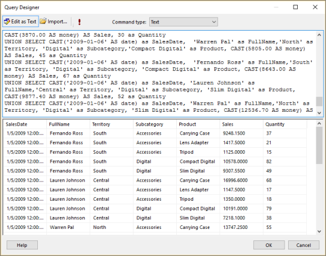 
  
8.  [!INCLUDE[clickOK](../includes/clickok-md.md)]  
  
## <a name="List"></a>2. Ajouter et configurer une liste  
Dans [!INCLUDE[ssRSnoversion](../includes/ssrsnoversion-md.md)] , la région de données de liste est idéale pour créer des rapports de forme libre. Elle est basée sur la région de données de *tableau matriciel* , comme le sont les tables et les matrices. Pour plus d’informations, consultez [Créer des factures et des formulaires avec des listes](../reporting-services/report-design/create-invoices-and-forms-with-lists-report-builder-and-ssrs.md).  
  
Vous allez utiliser une liste pour afficher les informations des ventes des secteurs de vente dans un rapport mis en forme comme une newsletter. Les informations sont regroupées par secteur. Vous allez ajouter un nouveau groupe de lignes qui regroupe les données par secteur, puis vous supprimerez le groupe de lignes Détails intégré.  
  
### <a name="to-add-a-list"></a>Pour ajouter une liste  
  
1.  Sous l’onglet **Insérer** > **Régions de données** > **Liste**. 

2. Cliquez dans le corps du rapport (entre les zones de titre et de pied de page) et faites glisser pour créer la zone de liste. Définissez la taille de la zone de liste sur 7 pouces de haut et 6,25 pouces de large. Pour obtenir la taille exacte, dans le volet **Propriétés** sous **Position**, entrez des valeurs pour les propriétés **Largeur** et **Hauteur** .
  
    > [!NOTE]  
    > Ce rapport utilise le format de papier Letter (8,5 X 11) et des marges de 1 pouce. Une page de rapport de plus de 9 pouces de haut ou de plus de 6,5 pouces de large peut générer des pages vierges.  
  
2.  Cliquez dans la zone de liste, cliquez avec le bouton droit sur la barre en haut de la liste, puis cliquez sur **Propriétés du tableau matriciel**.  
  
    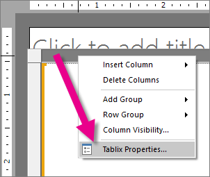 
  
3.  Dans la liste déroulante **Nom du dataset** , sélectionnez **ListDataset**.  
  
4.  [!INCLUDE[clickOK](../includes/clickok-md.md)]  
  
5.  Cliquez avec le bouton droit dans la liste, puis cliquez sur **Propriétés du rectangle**.  
  
6.  Sous l’onglet **Général** , cochez la case **Insérer un saut de page après** .  
  
7.  [!INCLUDE[clickOK](../includes/clickok-md.md)]  
  
### <a name="to-add-a-new-row-group-and-to-delete-the-details-group"></a>Pour ajouter un nouveau groupe de lignes et supprimer le groupe Détails  
  
1.  Dans le volet Groupes de lignes, cliquez avec le bouton droit sur le groupe Détails, pointez sur **Ajouter un groupe**, puis cliquez sur **Groupe parent**.  
  
    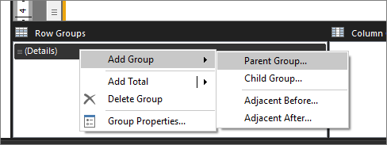  
  
2.  Dans la liste **Regrouper par** , sélectionnez `[Territory].`  
  
3.  [!INCLUDE[clickOK](../includes/clickok-md.md)]  
  
    Une colonne contenant la cellule `[Territory]` est ajoutée à la liste.
  
4.  Cliquez avec le bouton droit sur la colonne Territory dans la liste, puis cliquez sur **Supprimer les colonnes**.  
  
    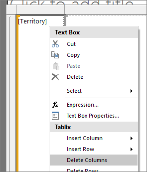
  
5.  Sélectionnez **Supprimer les colonnes uniquement**.  
  
6.  Dans le volet Groupes de lignes, cliquez avec le bouton droit sur le groupe **Détails** > **Supprimer le groupe**.  
   
7.  Cliquez sur **Supprimer le groupe uniquement**.  
  
8.  [!INCLUDE[clickOK](../includes/clickok-md.md)]  
  
## <a name="Graphics"></a>3. Ajouter des éléments graphiques  
Un des avantages des régions de données de liste est que vous pouvez ajouter des éléments de rapport comme des rectangles et des zones de texte n’importe où, sans être limité par une disposition tabulaire. Vous allez améliorer l'apparence du rapport en ajoutant un graphique (un rectangle rempli avec une couleur).  
  
### <a name="to-add-graphic-elements-to-the-report"></a>Pour ajouter des éléments graphiques au rapport  
  
1.  Sous l’onglet **Insérer** , sélectionnez **Rectangle**. 

2. Cliquez en haut à gauche de la liste et faites glisser pour créer le rectangle de 7 pouces de haut et 3,5 pouces de large. À nouveau, pour obtenir la taille exacte, dans le volet **Propriétés** sous **Position**, entrez des valeurs pour **Largeur** et pour **Hauteur**.
  
2.  Cliquez avec le bouton droit sur le rectangle > **Propriétés du rectangle**.  
  
3.  Cliquez sur l'onglet **Remplissage** .  
  
4.  Dans **Couleur de remplissage**, sélectionnez **Gris clair**.  
   
5.  [!INCLUDE[clickOK](../includes/clickok-md.md)]  
  
6.  Cliquez sur **Exécuter** pour afficher un aperçu du rapport.  
  
La partie gauche du rapport comprend maintenant un graphique vertical constitué d’un rectangle de couleur gris clair, comme le montre l’image suivante.  
  
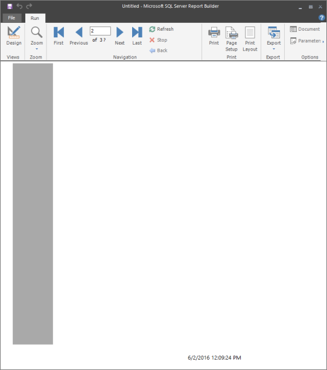
 
## <a name="Text"></a>4. Ajouter du texte de forme libre  
Vous pouvez ajouter des zones de texte pour afficher le texte statique qui est répété sur chaque page du rapport, ainsi que des champs de données.  
  
### <a name="to-add-text-to-the-report"></a>Pour ajouter du texte au rapport  
  
1.  Cliquez sur **Conception** pour repasser en mode Conception.  
  
2.  Sous l’onglet **Insérer** > **Zone de texte**. Cliquez en haut à gauche de la liste, à l’intérieur du rectangle que vous avez ajouté, et faites glisser pour dimensionner la zone de texte sur 3,45 pouces de large et 5 pouces de haut.  
  
3.  Placez le curseur dans la zone de texte et tapez **Newsletter for** . Ajoutez un espace après le mot « for », pour séparer le texte du champ que vous ajouterez à l’étape suivante.   
  
      
  
4.  Faites glisser le champ `[Territory]` de ListDataSet dans le volet Données du rapport vers la zone de texte et placez-le après « Newsletter for ».  
  
    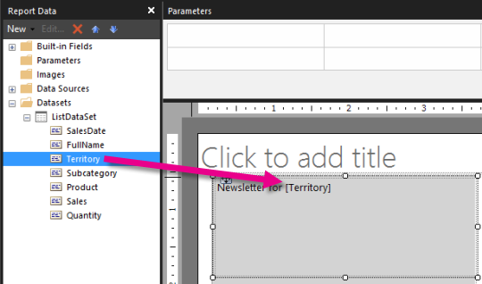
  
5.  Sélectionnez le texte et le champ `[Territory]` .  
  
6.  Sous l’onglet **Accueil** > **Police**, sélectionnez : 
  
    *  **Segoe Semibold**.
    *  **20 pt**.
    *  **Tomate**.  
  
9. Placez le curseur sous le texte que vous avez entré à l’étape 3 et tapez : **Bonjour** avec un espace après le mot, pour séparer le texte et le champ que vous ajouterez à l’étape suivante.  
 
10. Faites glisser le champ `[FullName]` de ListDataSet dans le volet Données du rapport vers la zone de texte et placez-le après « Hello », puis tapez une virgule (,).  
   
11. Sélectionnez le texte que vous avez ajouté aux étapes précédentes.
  
12. Sous l’onglet **Accueil** > **Police**, sélectionnez : 
  
    *  **Segoe Semibold**.
    *  **16 pt**.
    *  **Noir**.  
   
15. Placez le curseur sous le texte que vous avez ajouté aux étapes 9 à 13, puis copiez et collez le texte sans signification suivant :  
  
    ```  
    Lorem ipsum dolor sit amet, consectetur adipiscing elit. Proin sed dolor in ipsum pulvinar egestas. Sed sed lacus at leo ornare ultricies. Vivamus velit risus, euismod nec sodales gravida, gravida in dui. Etiam ullamcorper elit vitae justo fermentum ut ullamcorper augue sodales. 
    Ut placerat, nisl quis feugiat adipiscing, nibh est aliquet est, mollis faucibus mauris lectus quis arcu. In mollis tincidunt lacinia. In vitae erat ut lorem tincidunt luctus. Curabitur et magna nunc, sit amet adipiscing nisi. Nulla rhoncus elementum orci nec tincidunt. 
    Aliquam imperdiet cursus erat vel tincidunt. Donec et neque ac urna rutrum sodales. In id purus et nisl dignissim dapibus. Sed rhoncus metus at felis feugiat eu tempor dolor vehicula. Lorem ipsum dolor sit amet, consectetur adipiscing elit. Nullam faucibus consectetur diam eu pellentesque.   
 
    ```  
  
16. Sélectionnez le texte que vous venez d’ajouter.  
  
17.  Sous l’onglet **Accueil** > **Police**, sélectionnez : 
  
      *  **Segoe UI**.
      *  **10 pt**.
      *  **Noir**.  
 
20. Placez le curseur à l’intérieur de la zone de texte sous le texte sans signification et tapez : **Congratulations on your total sales of**, avec un espace après le mot pour séparer le texte et le champ que vous ajouterez à l’étape suivante. 
  
21. Faites glisser le champ Ventes dans la zone de texte, placez-le après le texte que vous avez tapé à l’étape précédente, puis tapez un point d’exclamation (!).  

25. Sélectionnez le texte et le champ que vous venez d’ajouter.  
  
17.  Sous l’onglet **Accueil** > **Police**, sélectionnez : 
  
      *  **Segoe Semibold**.
      *  **16 pt**.
      *  **Noir**.  
  
22. Sélectionnez simplement le champ `[Sales]`, cliquez avec le bouton droit sur le champ > **Expression**.  
  
23. Dans la zone **Expression** , modifiez l’expression pour inclure la fonction Sum comme suit :  
  
    ```  
    =Sum(Fields!Sales.value)  
    ```  
  
24. [!INCLUDE[clickOK](../includes/clickok-md.md)]  
  
    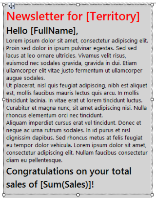
 
29. Avec `[Sum(Sales)]` toujours sélectionné, sous l’onglet **Accueil** > groupe **Nombre** > **Devise**.  
  
30. Cliquez avec le bouton droit sur la zone de texte contenant le texte « Cliquez pour ajouter un titre », puis cliquez sur **Supprimer**.  
  
31. Sélectionnez la zone de liste. Sélectionnez les deux flèches à deux pointes et déplacez-la en haut de la page.  

    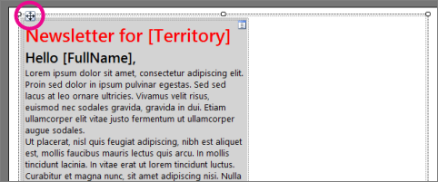
  
32. Cliquez sur **Exécuter** pour afficher un aperçu du rapport.  
  
Le rapport affiche le texte statique et chaque page du rapport inclut des données relatives à un secteur de vente. Les ventes sont mises en forme en tant que valeurs monétaires.  
  

  
## <a name="Table"></a>5. Ajouter un tableau pour afficher les détails des ventes  
Utilisez l'Assistant Nouveau tableau ou nouvelle matrice pour ajouter un tableau au rapport de forme libre. Après avoir terminé l'Assistant, vous ajouterez manuellement une ligne pour les totaux.  
  
### <a name="to-add-a-table"></a>Pour ajouter un tableau  
  
1.  Sous l’onglet **Insérer** > zone **Régions de données** > **Tableau** > **Assistant Tableau**.  
  
2.  Dans la page **Choisir un dataset** , cliquez sur **ListDataset** > **Suivant**.  
  
4.  Dans la page **Organiser les champs** , faites glisser le champ Product de **Champs disponibles** vers **Valeurs**.  
  
5.  Répétez l’étape 3 pour SalesDate, Quantity et Sales. Placez SalesDate sous Product, Quantity sous SalesDate et Sales sous SalesDate.  
  
6.  Cliquez sur **Suivant**.  
  
7.  Dans la page **Choisir la disposition** , observez la mise en page de la table.  
  
    Le tableau est simple : cinq colonnes sans groupes de lignes ou de colonnes. Dans la mesure où il ne comporte aucun groupe, les options de mise en page relatives aux groupes ne sont pas disponibles. Vous mettrez manuellement à jour le tableau ultérieurement de manière à inclure un total.  
  
8.  Cliquez sur **Suivant**.  
  
9. Cliquez sur **Terminer**.  
  
11. Faites glisser le tableau sous la zone de texte que vous avez ajoutée dans la leçon 4.  
  
    > [!NOTE]  
    > Vérifiez que le tableau est dans la zone de liste et à l’intérieur du rectangle gris.  
  
12. Avec la table sélectionnée, dans le volet **Groupe de lignes** , cliquez avec le bouton droit sur **Détails** > **Ajouter un total** > **Après**.  
  
    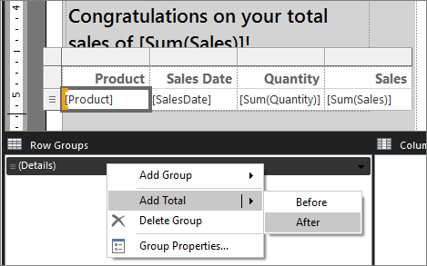
  
13. Sélectionnez la cellule dans la colonne Product et le type **Total**.

    

12. Sélectionnez le champ [SalesDate]. Sous l’onglet **Accueil** > **Nombre**, remplacez **Par défaut** par **Date**.

13. Sélectionnez les champs [Sum(Sales)]. Sous l’onglet **Accueil** > **Nombre**, remplacez **Par défaut** par **Devise**.

Cliquez sur **Exécuter** pour afficher un aperçu du rapport.  
  
Le rapport affiche un tableau avec les détails des ventes et les totaux.  
  
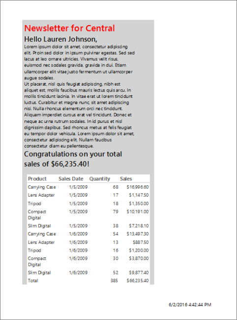
   
## <a name="Save"></a>6. Enregistrer le rapport  
Vous pouvez enregistrer les rapports sur un serveur de rapports, dans une bibliothèque SharePoint ou sur l'ordinateur.  
  
Dans ce didacticiel, enregistrez le rapport sur un serveur de rapports. Si vous n'avez pas accès à un serveur de rapports, enregistrez le rapport sur votre ordinateur.  
  
### <a name="to-save-the-report-on-a-report-server"></a>Pour enregistrer le rapport sur un serveur de rapports  
  
1.  À partir du bouton **Générateur de rapports** , cliquez sur **Enregistrer sous**.  
  
2.  Cliquez sur **Sites et serveurs récents**.  
  
3.  Sélectionnez ou tapez le nom du serveur de rapports sur lequel vous êtes autorisé à enregistrer des rapports.  
  
    Le message « Connexion au serveur de rapports » s'affiche. Une fois la connexion établie, le contenu du dossier de rapports spécifié par l'administrateur du serveur de rapports s'affiche comme emplacement par défaut des rapports.  
  
4.  Dans **Nom**, remplacez le nom par défaut par **SalesInformationByTerritory**.  
  
5.  Cliquez sur **Enregistrer**.  
  
Le rapport est enregistré sur le serveur de rapports. Le nom du serveur de rapports auquel vous êtes connecté est indiqué dans la barre d'état située au bas de la fenêtre.  
  
### <a name="to-save-the-report-on-your-computer"></a>Pour enregistrer le rapport sur votre ordinateur  
  
1.  À partir du bouton **Générateur de rapports** , cliquez sur **Enregistrer sous**.  
  
2.  Cliquez sur **Bureau**, **Mes documents**ou **Poste de travail**, puis naviguez jusqu'au dossier où vous souhaitez enregistrer le rapport.  
  
3.  Dans **Nom**, remplacez le nom par défaut par **SalesInformationByTerritory**.  
  
4.  Cliquez sur **Enregistrer**.  
  
## <a name="Line"></a>7. (Facultatif) Ajouter une ligne pour séparer les zones du rapport  
Ajoutez une ligne pour séparer la zone éditoriale de la zone de détails dans le rapport.  
  
### <a name="to-add-a-line"></a>Pour ajouter une ligne  
  
1.  Cliquez sur **Conception** pour repasser en mode Conception.  
  
2.  Sous l’onglet **Insérer** > **Éléments de rapport** > **Ligne**.  
  
3.  Dessinez une ligne sous la zone de texte que vous avez ajoutée dans la leçon 4.  
  
4.  Cliquez sur la ligne, puis, sous l’onglet **Accueil** > **Bordure**, sélectionnez :
     * **Largeur** : sélectionnez **3** pt.
     * **Couleur** : sélectionnez **Tomate**.  
  
## <a name="Visualization"></a>8. (Facultatif) Ajouter des visualisation de données de synthèse  
Les rectangles vous aident à contrôler le rendu du rapport. Placez un graphique à secteurs et un histogramme à l'intérieur d'un rectangle pour vérifier que le rendu du rapport est conforme à vos attentes  
  
### <a name="to-add-a-rectangle"></a>Pour ajouter un rectangle  
  
1.  Cliquez sur **Conception** pour repasser en mode Conception.  
  
2.  Sous l’onglet **Insérer** > **Éléments de rapport** >  **Rectangle**. Faites glisser le rectangle à l’intérieur de la zone de liste à droite du tableau pour créer un rectangle d’environ 2,25 pouces de large et 7,9 pouces de haut.  
  
3.  Avec le nouveau rectangle sélectionné, dans le volet Propriétés, choisissez **BorderColor LightGrey**, **BorderStyle Solide**et **BorderWidth 2 pt**. 

4. Alignez le haut du rectangle et le haut du tableau.  
  
## <a name="to-add-a-pie-chart"></a>Pour ajouter un graphique à secteurs  
  
1.  Sous l’onglet **Insérer** > **Visualisations de données** > **Graphique** > **Assistant graphique**.  
  
2.  Dans la page **Choisir un dataset** , cliquez sur **ListDataset** > **Suivant**.  
  
3.  Cliquez sur **Secteurs** > **Suivant**.  
  
4.  Sur la page Organiser les champs du graphique, faites glisser Product vers **Catégories**.  
  
5.  Faites glisser Quantity vers **Valeurs**, puis cliquez sur **Suivant**.  
  
6.  Cliquez sur **Terminer**.  
  
8.  Redimensionnez le graphique qui s’affiche en haut à gauche du rapport en 2,25 pouces de large et 3,6 pouces de haut.  
  
9. Faites glisser le graphique à l'intérieur du rectangle.  
   
10. Sélectionnez le titre du graphique et tapez : **Product Quantities Sold**.  
  
12. Sous l’onglet **Accueil** > **Police**, choisissez pour le titre :
    * **Police** **Segoe UI Semibold**.
    * **Taille** **12 pt**.
    * **Couleur** **Noir**.  

13. Cliquez avec le bouton droit sur la légende > **Propriétés de la légende**.

14. Sous l’onglet **Général** sous **Position de la légende**, sélectionnez le point central en bas. 
  
15. [!INCLUDE[clickOK](../includes/clickok-md.md)]  

16. Faites glisser si nécessaire pour rendre la région graphique plus haute.

     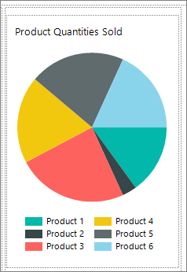
  
## <a name="to-add-a-column-chart"></a>Pour ajouter un histogramme  
  
1.  Sous l’onglet **Insérer** > **Visualisations de données** > **Graphique** > **Assistant graphique**.  
  
2.  Dans la page **Choisir un dataset** , cliquez sur **ListDataset**, puis sur **Suivant**.  
  
3.  Cliquez sur **Colonne**, puis sur **Suivant**.  
  
4.  Dans la page **Organiser les champs du graphique** , faites glisser le champ Product vers **Catégories**.  
  
5.  Faites glisser Sales vers **Valeurs** , puis cliquez sur **Suivant**.  
  
    Les valeurs s'affichent sur l'axe vertical.  
  
6.  Cliquez sur **Terminer**.  
  
    Un histogramme est ajouté dans le coin supérieur gauche du rapport.  
  
8.  Redimensionnez le graphique à environ 2,25 pouces de large et presque 4 pouces de haut.  
  
9. Faites glisser le graphique à l'intérieur du rectangle, sous le graphique à secteurs.  
   
10. Sélectionnez le titre du graphique et tapez : **Ventes de produits**.  
  
12. Sous l’onglet **Accueil** > **Police**, choisissez pour le titre :
    * **Police** **Segoe UI Semibold**.
    * **Taille** **12 pt**.
    * **Couleur** **Noir**.  
  
15. Cliquez avec le bouton droit sur la légende, puis cliquez sur **Supprimer la légende**.  
  
    > [!NOTE]  
    > La suppression de la légende rend le graphique plus lisible quand le graphique est petit.  
  
    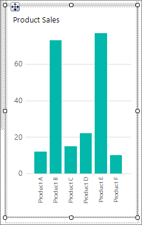

12. Sélectionnez l’axe du graphique, puis, sous l’onglet *Accueil** > **Nombre** > **Devise**.

13. Sélectionnez deux fois **Réduire les décimales** pour que le nombre montre simplement des dollars, sans cents.      
### <a name="to-verify-the-charts-are-inside-the-rectangle"></a>Pour vérifier que les graphiques sont à l'intérieur du rectangle  

Vous pouvez utiliser des rectangles comme conteneurs pour d’autres éléments sur une page de rapport. En savoir plus sur les [rectangles comme conteneurs](../reporting-services/report-design/rectangles-and-lines-report-builder-and-ssrs.md).
  
1.  Sélectionnez le rectangle que vous avez créé et auquel vous avez ajouté les graphiques plus haut dans cette leçon.  
  
    Dans le volet Propriétés, la propriété **Name** affiche le nom du rectangle.  
  
    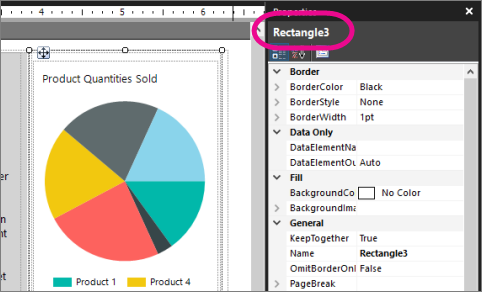 
  
2.  Cliquez sur le graphique à secteurs.  
  
3.  Dans le volet **Propriétés** , vérifiez que la propriété **Parent** contient le nom du rectangle.  
  
     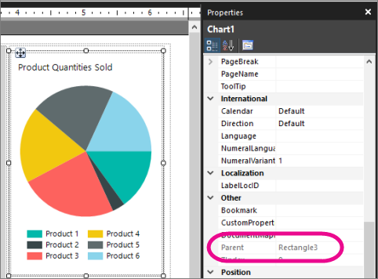 
  
4.  Cliquez sur l’histogramme et répétez l’étape 3.  
  
    > [!NOTE]  
    > Si les graphiques ne sont pas à l'intérieur du rectangle, le rapport rendu n'affiche pas les graphiques ensemble.  
  
### <a name="to-make-the-charts-the-same-size"></a>Pour donner la même taille aux graphiques  
  
1.  Cliquez sur le graphique à secteurs, appuyez sur la touche Ctrl, puis sélectionnez l’histogramme.  
  
2.  Avec les deux graphiques sélectionnés, cliquez sur > **Disposition** > **Uniformiser la largeur**.  
  
    > [!NOTE]  
    > L'élément sur lequel vous cliquez en premier détermine la largeur de tous les éléments sélectionnés.  
  
3.  Cliquez sur **Exécuter** pour afficher un aperçu du rapport.  
  
Le rapport affiche maintenant les données de synthèse des ventes dans un graphique à secteurs et un histogramme.  
  

  
## <a name="next-steps"></a>Étapes suivantes  
Ainsi s’achève le didacticiel de création d’un rapport de forme libre.  
  
Pour plus d’informations sur les listes, consultez : 
* [Tables, matrices et listes &#40;Générateur de rapports et SSRS&#41;](../reporting-services/report-design/tables-matrices-and-lists-report-builder-and-ssrs.md) 
* [Créer des factures et des formulaires avec des listes](../reporting-services/report-design/create-invoices-and-forms-with-lists-report-builder-and-ssrs.md)
* [Cellules, lignes et colonnes de région de données de tableau matriciel &#40;Générateur de rapports et SSRS&#41;](../reporting-services/report-design/tablix-data-region-cells-rows-and-columns-report-builder-and-ssrs.md).  
  
Pour plus d’informations sur les concepteurs de requêtes, consultez [Concepteurs de requêtes &#40;Générateur de rapports&#41;](http://msdn.microsoft.com/library/553f0d4e-8b1d-4148-9321-8b41a1e8e1b9) et [Interface utilisateur du concepteur de requêtes textuel &#40;Générateur de rapports&#41;](../reporting-services/report-data/text-based-query-designer-user-interface-report-builder.md).  
  
## <a name="see-also"></a>Voir aussi  
[Didacticiels du Générateur de rapports](../reporting-services/report-builder-tutorials.md) 
  

