# <a name="tutorial-map-report-report-builder"></a>Didacticiel : Rapport cartographique (Générateur de rapports)
Dans ce didacticiel [!INCLUDE[ssRBnoversion_md](../includes/ssrbnoversion-md.md)] , vous allez découvrir les fonctionnalités cartographiques que vous pouvez utiliser pour afficher des données sur un arrière-plan géographique d’un rapport paginé [!INCLUDE[ssRSnoversion_md](../includes/ssrsnoversion-md.md)] . 
  
Les cartes sont basées sur des données spatiales qui comportent en général des points, des lignes et des polygones. Par exemple, un polygone peut représenter le contour d'un comté, une ligne peut représenter une route, et un point peut représenter l'emplacement d'une ville. Chaque type de données spatiales est affiché sur une couche séparée sous la forme d'un jeu d'éléments cartographiques.  
  
Pour faire varier l'apparence des éléments cartographiques, vous devez spécifier un champ dont les valeurs font correspondre les éléments cartographiques aux données analytiques d'un dataset. Vous pouvez également définir des règles qui font varier la couleur, la taille ou d'autres propriétés en fonction des plages de données.  

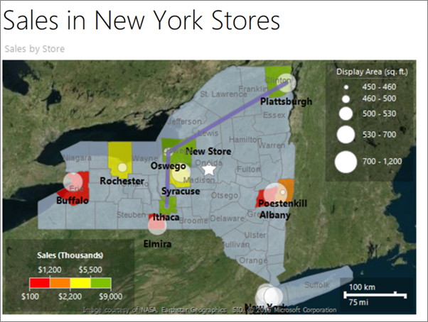
  
Dans ce didacticiel, vous créez un rapport cartographique qui affiche les emplacements des magasins dans les comtés de l’État de New York.  
   
> [!NOTE]  
> Dans ce didacticiel, les étapes de l'Assistant sont consolidées sous forme de deux procédures : l'une pour créer le dataset, et l'autre pour créer une table. Pour obtenir des instructions pas à pas sur l’accès à un serveur de rapports, le choix d’une source de données, la création d’un dataset et l’exécution de l’Assistant, consultez le premier didacticiel de cette série : [Didacticiel : création d’un rapport de tableau de base &#40;Générateur de rapports&#41;](../reporting-services/tutorial-creating-a-basic-table-report-report-builder.md).  
  
Durée estimée pour effectuer ce didacticiel : 30 minutes.  
  
## <a name="requirements"></a>Spécifications  
Pour ce didacticiel, le serveur de rapports doit être configuré pour prendre en charge les cartes Bing comme arrière-plan. Pour plus d’informations, consultez [Planifier la prise en charge de rapport cartographique](http://msdn.microsoft.com/en-us/5ddc97a7-7ee5-475d-bc49-3b814dce7e19). 

Pour plus d’informations sur les autres spécifications, consultez [Éléments requis pour les didacticiels &#40;Générateur de rapports&#41;](../reporting-services/prerequisites-for-tutorials-report-builder.md).  
  
## <a name="Map"></a>1. Créer une carte avec une couche de polygones à partir de l'Assistant Carte  
Dans cette section, vous ajoutez une carte à votre rapport à partir de la bibliothèque de cartes. La carte a une couche qui affiche les comtés de l'État de New York. La forme de chaque comté est un polygone basé sur les données spatiales incorporées dans la carte de la bibliothèque de cartes.  
  
### <a name="to-add-a-map-with-the-map-wizard-in-a-new-report"></a>Pour ajouter une carte dans un nouveau rapport à l'aide de l'Assistant Carte  
  
1.  [Démarrez le Générateur de rapports](../reporting-services/report-builder/start-report-builder.md) depuis votre ordinateur, depuis le portail web [!INCLUDE[ssRSnoversion_md](../includes/ssrsnoversion-md.md)] ou depuis le mode intégré SharePoint.  
  
    La boîte de dialogue **Nouveau rapport ou dataset** s’ouvre.  
  
    Si vous ne voyez pas la boîte de dialogue **Nouveau rapport ou Dataset**, dans le menu **Fichier**, choisissez **Nouveau**.  
  
2.  Dans le volet gauche, assurez-vous que **Nouveau rapport** est sélectionné.  
  
3.  Dans le volet droit, cliquez sur **Assistant Carte**.  
  
4.  Dans la page **Choisir une source de données spatiales** , vérifiez que **Bibliothèque de cartes** est sélectionné.  
  
6.  Dans la zone Bibliothèque de cartes, développez **States by County** sous **USA**, puis cliquez sur **New York**.  
  
    Le volet Aperçu de la carte affiche la carte des comtés de New York.  
    
    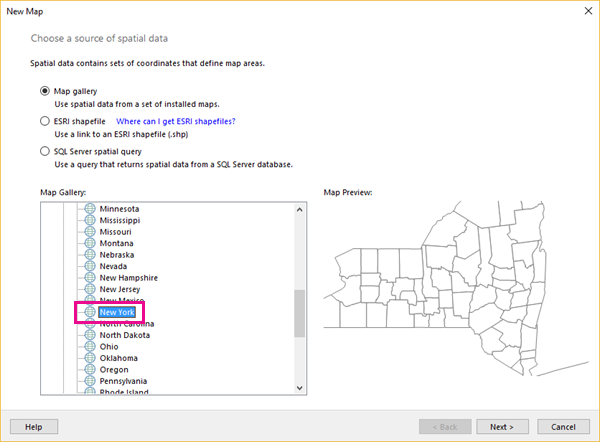
  
7.  Cliquez sur **Suivant**.  
  
8.  Dans la page **Choisir des options de vue cartographique et de données spatiales** , acceptez les valeurs par défaut et cliquez sur **Suivant**. 
 
    Par défaut, les éléments cartographiques d’une bibliothèque de cartes sont incorporés automatiquement dans la définition de rapport.  
  
9. Dans la page **Choisir la visualisation de la carte** , vérifiez que l'option **Carte simple** est sélectionnée et cliquez sur **Suivant**.  
  
11. Dans la page **Choisir le thème de couleurs et la visualisation des données** , sélectionnez l'option **Afficher les étiquettes** .  
  
12. Si elle est activée, désactivez l'option **Carte unicolore** .  
  
13. Dans la liste déroulante **Champ de données** , cliquez sur **#COUNTYNAME**. Le volet Aperçu de la carte de l'Assistant affiche les éléments suivants :  
  
    -   un titre avec le texte **Titre de la carte**;  
  
    -   une carte qui affiche les comtés de l'État de New York, avec chaque comté dans une couleur différente et les noms des comtés affichés à un endroit quelconque sur la zone du comté ;  
  
    -   une légende contenant un titre et une liste d'éléments de 1 à 5 ;  
  
    -   une échelle de couleurs contenant les valeurs de 0 à 160 et la valeur Aucune couleur ;  
  
    -   une échelle des distances qui affiche les kilomètres (km) et les miles (mi).  
    
    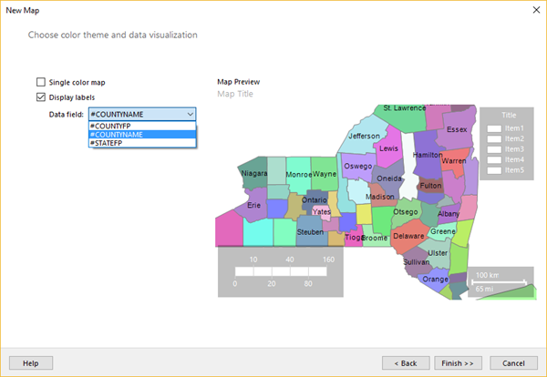
  
14. Cliquez sur **Terminer**.  
  
    La carte est ajoutée à l'aire de conception.  
  
13. Sélectionnez le texte « Map Title » et le type **Sales by Store** > Entrée.  

15. Double-cliquez sur la carte pour afficher le volet **Couches**. Le volet **Couches** affiche une seule couche de polygones, PolygonLayer1, du type de couche **Incorporé**. Chaque comté est un élément cartographique incorporé sur cette couche.  
  
    > [!NOTE]  
    > Si vous ne voyez pas le volet **Couches** , celui-ci se trouve peut-être à l’extérieur de votre vue actuelle. Utilisez la barre de défilement au bas de la fenêtre du mode Conception pour changer votre vue. Sinon, sous l’onglet **Affichage**, désactivez l’option **Données du rapport** pour disposer d’une plus grande aire de conception.   

15. Cliquez sur la flèche en regard de PolygonLayer1 > **Propriétés des polygones**.

16. Sous l’onglet **Police**, changez la couleur en **Gris mat**.

17. Sous l’onglet **Accueil** > **Exécuter** pour afficher l’aperçu du rapport.  
  
    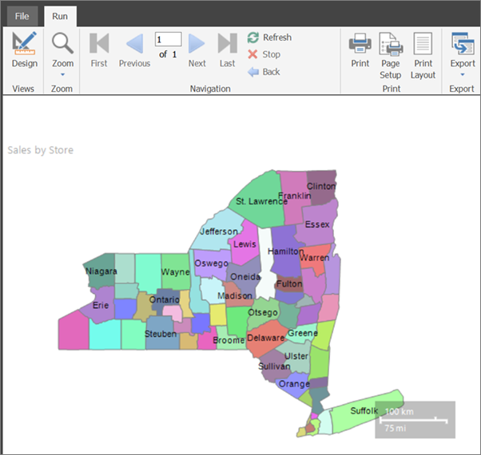
  
Le rapport rendu affiche le titre de la carte, la carte et l'échelle des distances. Les comtés sont sur une couche de polygones de la carte. Chaque comté est un polygone dont la couleur varie à partir d'une palette de couleurs, mais les couleurs ne sont pas associées à des données. L'échelle des distances affiche les distances en kilomètres et en miles.  
  
La légende de la carte et l'échelle de couleurs n'apparaissent pas encore, car il n'y a pas de données analytiques associées à chaque comté. Vous ajouterez ultérieurement des données analytiques dans ce didacticiel.  
  
## <a name="PointLayer"></a>2. Ajouter une couche de points pour afficher des emplacements de magasins  
Dans cette section, vous utilisez l’Assistant Couche pour ajouter une couche de points qui affiche les emplacements des magasins.  
  
> [!NOTE]  
> Dans ce didacticiel, la requête contient les valeurs des données : elle n’a donc pas besoin d’une source de données externe. Cela rend la requête assez longue. Dans un environnement métier, une requête ne contient pas les données. Ceci est nécessaire à des fins de formation uniquement.  
  
### <a name="to-add-a-point-layer-based-on-a-sql-server-spatial-query"></a>Pour ajouter une couche de points basée sur une requête spatiale SQL Server  
  
1.  Sous l’onglet **Exécuter** > **Conception** pour rebasculer en mode Conception.  
  
2.  Double-cliquez sur la carte pour afficher le volet **Couches** . Dans la barre d’outils, cliquez sur le **Assistant Nouvelle couche** bouton . 

    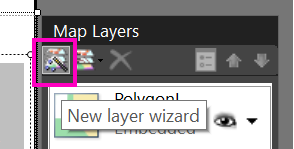 
  
3.  Dans la page **Choisir une source de données spatiales** , sélectionnez **Requête spatiale SQL Server**et cliquez sur **Suivant**.  
  
4.  Dans la page **Choisir un dataset avec des données spatiales SQL Server** , cliquez sur **Ajouter un nouveau dataset avec des données spatiales SQL Server** > **Suivant**.  
  
5.  Dans la page **Choisir une connexion à une source de données spatiales SQL Server** , sélectionnez une source de données existante ou naviguez jusqu'au serveur de rapports, puis sélectionnez une source de données.  

    > [!NOTE]  
    > La source de données que vous choisissez n'a pas d'importance, tant que vous disposez des autorisations appropriées. Vous n'allez pas récupérer de données à partir de la source de données. Pour plus d’informations, consultez [Autres manières d’obtenir une connexion de données &#40;Générateur de rapports&#41;](../reporting-services/alternative-ways-to-get-a-data-connection-report-builder.md).  
  
6.  Cliquez sur **Suivant**.  
  
7.  Dans la page **Créer une requête** , cliquez sur **Modifier en tant que texte**.  
  
8.  Copiez le texte ci-après et collez-le dans le volet Requête :  
  
    ```  
    Select 114 as StoreKey, 'Contoso Albany Store' as StoreName, 1125 as SellingArea, 'Albany' as City, 'Albany' as County,   
     CAST(1000000 as money) as Sales, CAST('POINT(-73.7472924218681 42.6564617079878)' as geography) AS SpatialLocation  
    UNION ALL SELECT 115 AS StoreKey, 'Contoso New York No.1 Store' AS  StoreName, 500 as SellingArea, 'New York' AS City, 'New York City' as County,  
     CAST('2000000' as money) as Sales, CAST('POINT(-73.9922069374483 40.7549638237402)' as geography) AS SpatialLocation  
    UNION ALL Select 116 as StoreKey, 'Contoso Rochester No.1 Store' as StoreName, 462 as SellingArea, 'Rochester' as City,  'Monroe' as County,    
     CAST(3000000 as money) as Sales, CAST('POINT(-77.624041566786 43.1547066024338)' as geography)  AS SpatialLocation  
    UNION ALL Select 117 as StoreKey, 'Contoso New York No.2 Store' as StoreName, 700 as SellingArea, 'New York' as City,'New York City' as County,    
      CAST(4000000 as money) as Sales, CAST('POINT(-73.9712488 40.7830603)' as geography) AS SpatialLocation  
    UNION ALL Select 118 as StoreKey, 'Contoso Syracuse Store' as StoreName, 680 as SellingArea, 'Syracuse' as City, 'Onondaga' as County,  
     CAST(5000000 as money) as Sales, CAST('POINT(-76.1349120532546 43.0610223535974)' as geography) AS SpatialLocation  
    UNION ALL Select 120 as StoreKey, 'Contoso Plattsburgh Store' as StoreName, 560 as SellingArea, 'Plattsburgh' as City,  'Clinton' as County,  
     CAST(6000000 as money) as Sales, CAST('POINT(-73.4728622833178 44.7028831413324)' as geography) AS SpatialLocation  
    UNION ALL Select 121 as StoreKey, 'Contoso Brooklyn Store' as StoreName, 1125 as SellingArea, 'Brooklyn' as City, 'New York City' as County,  
     CAST(7000000 as money) as Sales, CAST('POINT (-73.9638533447143 40.6785123489351)' as geography) AS SpatialLocation  
    UNION ALL Select 122 as StoreKey, 'Contoso Oswego Store' as StoreName, 500 as SellingArea, 'Oswego' as City, 'Oswego' as County,    
     CAST(8000000 as money) as Sales, CAST('POINT(-76.4602850815536 43.4353224527794)' as geography) AS SpatialLocation  
    UNION ALL Select 123 as StoreKey, 'Contoso Ithaca Store' as StoreName, 460 as SellingArea, 'Ithaca' as City, 'Tompkins' as County,  
     CAST(9000000 as money) as Sales, CAST('POINT(-76.5001866085881 42.4310489934743)' as geography) AS SpatialLocation  
    UNION ALL Select 124 as StoreKey, 'Contoso Buffalo Store' as StoreName, 700 as SellingArea, 'Buffalo' as City, 'Erie' as County,    
     CAST(100000 as money) as Sales, CAST('POINT(-78.8784 42.8864)' as geography) AS SpatialLocation  
    UNION ALL Select 125 as StoreKey, 'Contoso Queens Store' as StoreName, 700 as SellingArea,'Queens' as City, 'New York City' as County,  
     CAST(500000 as money) as Sales, CAST('POINT(-73.7930979029883 40.7152781765927)' as geography) AS SpatialLocation  
    UNION ALL Select 126 as StoreKey, 'Contoso Elmira Store' as StoreName, 680 as SellingArea, 'Elmira' as City, 'Chemung' as County,  
     CAST(800000 as money) as Sales, CAST('POINT(-76.7397414783301 42.0736492742663)' as geography) AS SpatialLocation  
    UNION ALL Select 127 as StoreKey, 'Contoso Poestenkill Store' as StoreName, 455 as SellingArea, 'Poestenkill' as City, 'Rensselaer' as County,    
    CAST(1500000 as money) as Sales, CAST('POINT(-73.5626737425063 42.6940551238618)' as geography) AS SpatialLocation  
    ```  
  
9. Dans la barre d’outils du Concepteur de requêtes, cliquez sur **Exécuter** (**!**).  
  
    Le jeu de résultats contient sept colonnes représentant un ensemble de magasins dans l’état de New York qui vendent des biens de consommation. Voici une liste, avec des explications pour les éléments qui ne sont peut-être pas évidents : 
    *   **StoreKey**: identificateur de magasin.  
    *   **StoreName**.
    *   **SellingArea**: zone disponible pour l’affichage des produits, comprise entre 455 pieds carrés et 1125 pieds carrés.
    *   **City**.
    *   **County**.
    *   **Sales**: total des ventes. 
    *   **SpatialLocation**: emplacement en longitude et latitude. 

    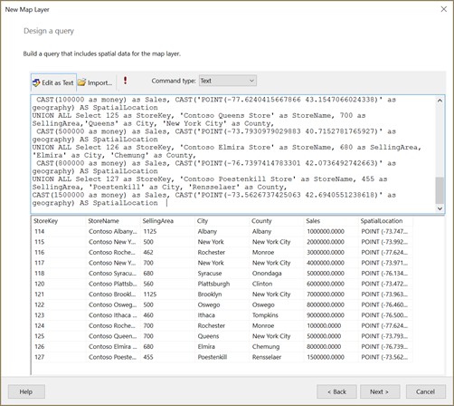 
  
10. Cliquez sur **Suivant**.  
  
    Le dataset de rapport nommé DataSet1 est créé automatiquement. Après avoir terminé l’Assistant, vous pouvez voir sa collection de champs dans le volet Données du rapport.  
  
11. Dans la page **Choisir des options de vue cartographique et de données spatiales** , vérifiez que le **Champ spatial** est **SpatialLocation** et que le **Type de couche** est **Point**. Acceptez les autres valeurs par défaut dans cette page.  
  
    La vue cartographique affiche des cercles pour marquer l’emplacement de chaque magasin.  
  
12. Cliquez sur **Suivant**.  
  
13. Dans la page Choisir la visualisation de la carte, cliquez sur **Carte à bulles** pour un type de carte affichant des marqueurs dont la taille varie en fonction des données. Cliquez sur **Suivant**.  
  
14. Dans la page **Choisir le dataset analytique** , cliquez sur DataSet1, puis sur **Suivant**. Ce dataset contient à la fois les données analytiques et les données spatiales à afficher sur la nouvelle couche de points.   
  
16. Dans la page **Choisir le thème de couleurs et la visualisation des données** , sélectionnez **Utiliser les tailles de bulle pour visualiser les données**.  
  
17. Dans **Champ de données**, sélectionnez `[Sum(SellingArea)]` pour adapter la taille des bulles en fonction de la taille qu’un magasin réserve à l’affichage des produits.  
  
18. Sélectionnez **Afficher les étiquettes**et dans **Champ de données**, sélectionnez `[City]`.

18. Cliquez sur **Terminer**.  
  
    La couche est ajoutée au rapport. La légende affiche les tailles des bulles en fonction des valeurs de SellingArea.  
  
 19. Double-cliquez sur la carte pour afficher le volet **Couches** . Le volet **Couche** affiche une nouvelle couche, PointLayer1, avec comme type de source de données spatiales **DataRegion**.  
  
19. Ajoutez un titre de légende. Dans la légende, sélectionnez le texte **Title**, tapez **Display Area (sq. ft.)** et appuyez sur Entrée.  
  
21. Dans le **volet Couches**, cliquez sur la flèche en regard de PointLayer1, puis cliquez sur **Propriétés des points**.  

    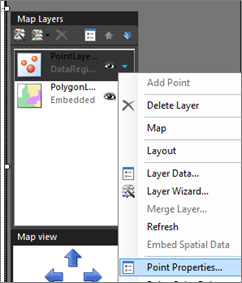
  
22. Sous l’onglet **Police** , changez le style en **Gras** et la taille en **10pt**.

    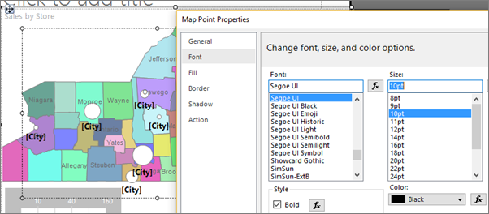
  
23. Sous l’onglet **Général** , sélectionnez **Bas** pour **Placement**.

24. [!INCLUDE[clickOK](../includes/clickok-md.md)]  
  
24. Cliquez sur **Exécuter** pour afficher un aperçu du rapport.  

    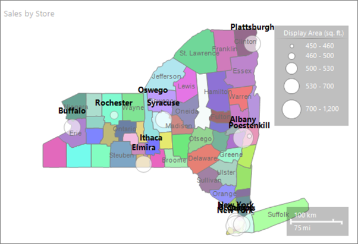
  
    La carte affiche les emplacements des magasins dans l'État de New York. La taille du marqueur de chaque magasin est basé sur la surface d’exposition. Cinq plages de surface d'exposition ont été calculées automatiquement.


  
## <a name="LineLayer"></a>3. Ajouter une couche de lignes pour afficher un itinéraire  
Utilisez l'Assistant Couche pour ajouter une couche qui affiche un itinéraire entre deux magasins. Dans ce didacticiel, l'itinéraire est créé à partir de trois emplacements de magasin. Dans une application d'entreprise, l'itinéraire choisi peut être le meilleur itinéraire entre des magasins.  
  
### <a name="to-add-a-line-layer-to-map"></a>Pour ajouter une couche de lignes à une carte  
  
1.  Basculez en mode Conception.  
  
2.  Double-cliquez sur la carte pour afficher le volet **Couches** . Dans la barre d’outils, cliquez sur le **Assistant Nouvelle couche** bouton .  
  
3.  Dans la page **Choisir une source de données spatiales** , sélectionnez **Requête spatiale SQL Server** et cliquez sur **Suivant**.  
  
4.  Dans la page **Choisir un dataset avec des données spatiales SQL Server** , cliquez sur **Ajouter un nouveau dataset avec des données spatiales SQL Server** , puis sur **Suivant**.  
  
5.  Dans **Choisir une connexion à une source de données spatiales SQL Server**, sélectionnez la source de données que vous avez utilisée dans la première procédure.  
  
6.  Cliquez sur **Suivant**.  
  
7.  Dans la page **Créer une requête** , cliquez sur **Modifier en tant que texte**. Le concepteur de requêtes bascule en mode texte.  
  
8.  Collez le texte ci-après dans le volet Requête :  
  
    ```  
    SELECT N'Path' AS Name, CAST('LINESTRING(  
       -76.5001866085881 42.4310489934743,  
       -76.4602850815536 43.4353224527794,  
       -73.4728622833178 44.7028831413324)' AS geography) as Route  
    ```  
  
9. Cliquez sur **Suivant**.  
  
    Un itinéraire qui relie les trois magasins apparaît sur la carte.  
  
10. Dans la page **Choisir des options de vue cartographique et de données spatiales** , vérifiez que le **Champ spatial** est **Route** et que le **Type de couche** est **Ligne**. Acceptez les autres valeurs par défaut.  
  
    La vue cartographique affiche un itinéraire allant d'un magasin situé dans la partie nord de l'État de New York à un magasin situé dans la partie sud de l'État de New York.  
  
11. Cliquez sur **Suivant**.  
  
12. Dans la page **Choisir la visualisation de la carte** , cliquez sur l'option **Carte linéaire simple**, puis sur **Suivant**.  
  
13. Dans la page **Choisir le thème de couleurs et la visualisation des données**, sélectionnez l'option **Carte unicolore**. L'itinéraire s'affiche dans une couleur unique selon le thème sélectionné.  
  
14. Cliquez sur **Terminer**.  

    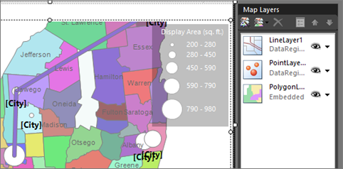
  
     La carte affiche une nouvelle couche de lignes avec **DataRegion**comme type de source de données spatiales. Dans cet exemple, les données spatiales proviennent d'un dataset mais aucune donnée analytique n'est associée à la ligne.  

## <a name="adjust-the-zoom"></a>Ajuster le zoom
1. Si vous ne voyez pas entièrement l’État de New York, vous pouvez ajuster le zoom. Avec le mappage sélectionné, dans le volet Propriétés, vous voyez les propriétés de **MapViewport** . 

15. Développez la section **Affichage** , puis développez **Affichage** pour voir la propriété **Zoom** . Définissez-la sur **125**. 

    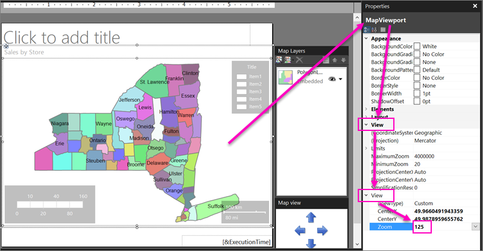

      Il s’agit du pourcentage de zoom. À 125 %, vous devez normalement voir l’État en entier.
  
## <a name="TileLayer"></a>4. Ajouter un arrière-plan de mosaïques Bing  
Dans cette section, vous ajoutez une couche qui affiche un arrière-plan de mosaïques Bing Maps.  
  
1.  Basculez en mode Conception.  
  
2.  Double-cliquez sur la carte pour afficher le volet **Couches** . Dans la barre d’outils, cliquez sur **ajouter une couche** .  
  
3.  Dans la liste déroulante, cliquez sur **Couche de mosaïques**.  
  
    La dernière couche du volet **Couche** est TileLayer1. Par défaut, la couche de mosaïques affiche le style de carte routière.  
  
    > [!NOTE]  
    > Dans l'Assistant, vous pouvez également ajouter une couche de mosaïques dans la page **Choisir des options de vue cartographique et de données spatiales** . Pour ce faire, sélectionnez **Ajouter un arrière-plan Bing Maps pour cette vue cartographique**. Dans un rapport rendu, l'arrière-plan de mosaïques affiche des mosaïques Bing Maps pour le centre et le niveau de zoom du point de vue de la carte actuels.  
  
4.  Cliquez sur la flèche en regard de TileLayer1 > **Propriétés des mosaïques**.  
  
5.  Sous l’onglet **Général**, sous **Type**, sélectionnez **Aérien**. La vue aérienne ne contient pas de texte.  

    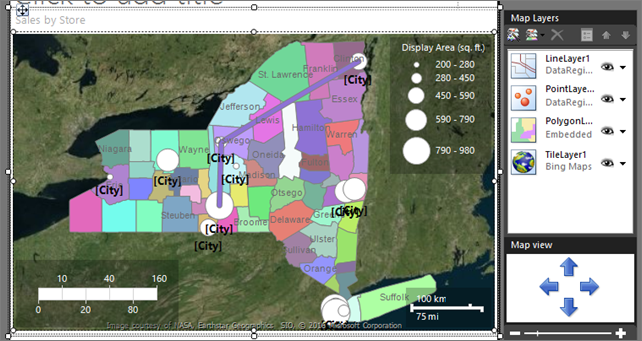
  
6.  [!INCLUDE[clickOK](../includes/clickok-md.md)]  
  
## <a name="Transparent"></a>5. Rendre une couche transparente  
Dans cette section, pour permettre aux éléments d’une couche de laisser transparaître une autre couche, vous ajustez l’ordre et la transparence des couches pour obtenir l’effet souhaité. Vous commencez avec la première couche que vous avez créée, PolygonLayer1. 
  
1.  Double-cliquez sur la carte pour afficher le volet **Couches**.  
  
3.  Cliquez sur la flèche en regard de PolygonLayer1 > **Données de couche**. La boîte de dialogue **Propriétés des couches de polygones de la carte** s'ouvre.  
  
4.  Sous l’onglet **Visibilité** , sous **Transparence (pourcentage)**, tapez **30**.  
  
6.  [!INCLUDE[clickOK](../includes/clickok-md.md)]  
  
     L'aire de conception affiche les comtés en couleurs translucides.  

    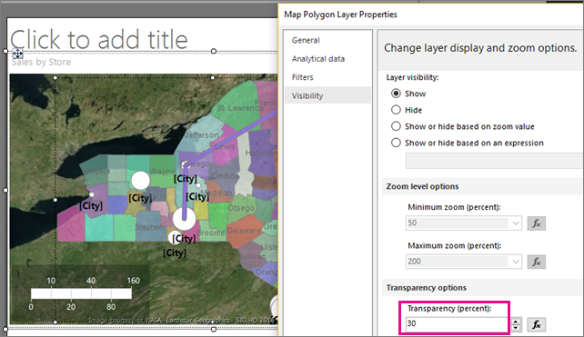
  
## <a name="Vary"></a>6. Faire varier la couleur du comté selon les ventes  
Chaque comté de la couche de polygones a une couleur différente car le processeur de rapports attribue automatiquement une valeur de couleur de la palette de couleurs selon le thème que vous avez choisi dans la dernière page de l'Assistant Carte.  
  
Dans cette section, vous spécifiez une règle de couleur pour associer des couleurs spécifiques à une plage de ventes des magasins pour chaque comté. Les couleurs rouge-jaune-vert indiquent des chiffres d'affaires relatifs élevés-moyens-bas. Mettez en forme l'échelle de couleurs pour afficher la devise. Affichez les plages de chiffres d'affaires annuels dans une nouvelle légende. Pour les comtés qui ne contiennent pas de magasins, utilisez la valeur Aucune couleur pour indiquer qu'il n'existe pas de données associées.  
  
### <a name="Relationship"></a>6a. Créer une relation entre des données spatiales et des données analytiques  
Pour faire varier les formes de comté par couleur en fonction des données analytiques, vous devez d’abord associer des données analytiques aux données spatiales. Dans ce didacticiel, vous utiliserez une correspondance basée sur le nom du comté. 
  
1.  Basculez en mode Conception.  
  
2.  Double-cliquez sur la carte pour afficher le volet **Couches** .  
  
3.  Cliquez sur la flèche en regard de PolygonLayer1, puis cliquez sur **Données de couche**. La boîte de dialogue **Propriétés des couches de polygones de la carte** s'ouvre.  
  
4.  Sous l’onglet **Données analytiques** , sous **Dataset analytique**, sélectionnez DataSet1. Ce dataset a été créé par l’Assistant quand vous avez créé la requête de données spatiales pour les comtés.  
  
6.  Sous **Champs à mettre en correspondance**, cliquez sur **Ajouter**. Une nouvelle ligne est ajoutée.  
  
7.  Sous **Depuis un dataset spatial**, cliquez sur COUNTYNAME.  
  
8.  Sous **Depuis un dataset analytique**, cliquez sur [County].  

    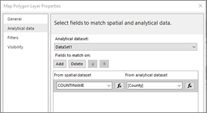
  
9. [!INCLUDE[clickOK](../includes/clickok-md.md)]  
  
10. Affichez l'aperçu du rapport.  

    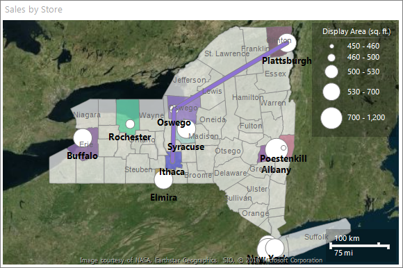
  
En spécifiant un champ de correspondance de la source de données spatiales et du dataset analytique, vous permettez au processeur de regrouper les données analytiques en fonction des éléments cartographiques. Un élément cartographique lié aux données a une correspondance valide pour les valeurs que vous avez spécifiées.  
  
Chaque comté qui contient un magasin a une couleur basée sur la palette de couleurs du style que vous avez choisi dans l'Assistant. Les autres comtés sont en gris.  
  
### <a name="ColorRules"></a>6b. Spécifier des règles de couleur pour les polygones  
Pour créer une règle qui fait varier la couleur de chaque comté en fonction des ventes des magasins, vous devez spécifier les valeurs de plage, le nombre de divisions dans la plage que vous souhaitez afficher, ainsi que les couleurs à utiliser.  
  
#### <a name="to-specify-color-rules-for-all-polygons-that-have-associated-data"></a>Pour spécifier des règles de couleur pour tous les polygones ayant des données associées  
  
1.  Basculez en mode Conception.  
  
2.  Cliquez sur la flèche en regard de PolygonLayer1, puis cliquez sur **Règle de couleur de polygone**. La boîte de dialogue **Propriétés des règles de couleur de la carte** s'ouvre. Remarquez que l'option de la règle de couleur **Visualiser les données à l'aide de la palette de couleurs** est sélectionnée. Cette option a été définie par l'Assistant.  
  
3.  Sélectionnez **Visualiser les données à l'aide de plages de couleurs**. L'option de palette est remplacée par les options de couleur de début, intermédiaire et de fin.  
  
4.  Définissez des valeurs de plage pour le chiffre d'affaires par comté. Dans **Champ de données**, dans la liste déroulante, sélectionnez `[Sum(Sales)]`.  
  
5.  Pour modifier le format afin d'afficher la devise en milliers, remplacez l'expression par ce qui suit : `=Sum(Fields!Sales.Value)/1000`  
  
6.  Modifiez **Couleur de début** en choisissant la valeur **Rouge**.  
  
7.  Modifiez **Couleur de fin** en choisissant la valeur **Vert**.  
  
    **Rouge** représente les chiffres de ventes bas, **Jaune** les chiffres de ventes moyens et **Vert** les chiffres de ventes élevés. Le processeur de rapports calcule une plage de couleurs en fonction de ces valeurs et des options sélectionnées dans la page **Distribution** .  
    
    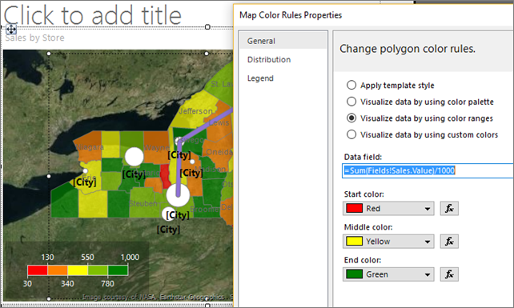
  
8.  Cliquez sur **Distribution**.  
  
9. Vérifiez que le type de distribution est **Optimal**. Pour l'expression de l'étape 5, la distribution optimale divise les valeurs en sous-plages présentant un équilibre entre le nombre d'éléments dans chaque plage et l'étendue de chaque plage.  
  
10. Acceptez les valeurs par défaut pour les autres options de cette page. Lorsque vous sélectionnez le type de distribution optimal, le nombre de sous-plages est calculé lors de l'exécution du rapport.  
  
11. Cliquez sur **Légende**.  
  
12. Dans **Options d'échelle de couleurs**, vérifiez que l'option **Afficher dans l'échelle de couleurs** est sélectionnée.  
  
13. Dans **Afficher dans cette légende**, dans la liste déroulante, sélectionnez la ligne vierge. Pour le moment, vous afficherez uniquement les plages de couleurs dans l'échelle de couleurs.  
  
14. [!INCLUDE[clickOK](../includes/clickok-md.md)]  

15. Affichez l'aperçu du rapport.

    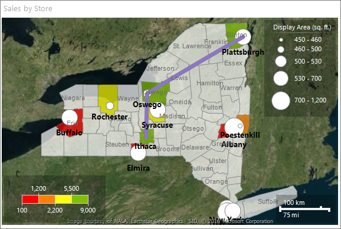
  
    L’échelle de couleurs affiche quatre couleurs : rouge, orange, jaune, et vert. Chaque couleur représente une plage de ventes calculée automatiquement selon les ventes par comté.  
  
### <a name="ColorScale"></a>6c. Mettre en forme les données de l'échelle de couleurs en tant que devises  
Par défaut, les données ont un format général. Dans cette section, vous appliquez des formats personnalisés.  
  
1. Basculez en mode Conception.  

2. Sélectionnez l’échelle de couleurs. Sous l’onglet **Accueil** > Section **Nombre**, cliquez sur **Devise**.  
  
4.  Toujours dans la section **Nombre** cliquez deux fois sur le bouton **Réduire les décimales**.  
  
    L'échelle de couleurs affiche les chiffres d'affaires annuels au format monétaire pour chaque plage.  
  
### <a name="NewLegend"></a>6d. Ajouter un titre de légende   
  
1.  Avec l’échelle de couleurs toujours sélectionnée, dans le volet Propriétés, vous voyez des propriétés pour **MapColorScale**. 
  
2. Développez la section Titre et, dans la propriété Légende, tapez **Sales (Thousands)**.

3. Changez la propriété TextColor en **Blanc**.  

    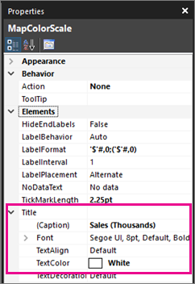
  
8.  Affichez l'aperçu du rapport.  
  
Les comtés qui ont des magasins et des ventes associés s'affichent en fonction des règles de couleur. Les comtés qui n'ont pas de ventes n'ont aucune couleur.  
  
### <a name="NoData"></a>6f. Modifier la couleur des comtés sans données  
Vous pouvez définir les options d'affichage par défaut pour tous les éléments cartographiques d'une couche. Les règles de couleur ont priorité sur ces options d'affichage.  
  
#### <a name="to-set-the-display-properties-for-all-elements-on-a-layer"></a>Pour définir les propriétés d'affichage de tous les éléments d'une couche  
  
1.  Basculez en mode Conception.  
  
2.  Double-cliquez sur la carte pour afficher le volet **Couches** .  
  
3.  Cliquez sur la flèche bas sur PolygonLayer1, puis sur **Propriétés des polygones**. 

     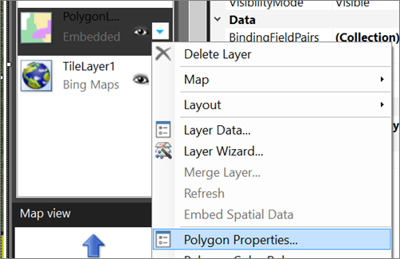

     La boîte de dialogue **Propriétés des polygones de la carte** s'ouvre. Les options d'affichage définies dans cette boîte de dialogue s'appliquent à tous les polygones de la couche avant les options d'affichage basées sur les règles.  
  
4.  Sous l’onglet **Remplissage****Plein**. Les dégradés et les motifs s'appliquent à toutes les couleurs.  
  
6.  Dans **Couleur**, sélectionnez **Bleu acier clair**.  
  
7.  [!INCLUDE[clickOK](../includes/clickok-md.md)]  
  
8.  Affichez l'aperçu du rapport.  
  
Les comtés sans données associées s’affichent en gris-bleu. Seuls les comtés qui ont des données analytiques associées ont des couleurs allant du **Rouge** au **Vert** en fonction des règles de couleur que vous avez spécifiées.  
  
## <a name="CustomPoint"></a>7. Ajouter un point personnalisé  
Pour représenter un nouveau magasin qui n’a pas encore été mis en place, dans cette section, vous spécifiez un point avec le type de marqueur **Étoile**.  
  
1.  Basculez en mode Conception.  
  
2.  Double-cliquez sur la carte pour afficher le volet **Couches** . Dans la barre d’outils, cliquez sur **ajouter une couche**, puis cliquez sur **couche de points**.    
  
    Une nouvelle couche de points est ajoutée à la carte. Par défaut, le type de données spatiales de la couche de points est **Incorporé**.  
  
3.  Cliquez sur la flèche sur PointLayer2 > **Ajouter un point**.  
  
4.  Déplacez le pointeur sur le point de vue de la carte. Le curseur se transforme en croix.  
  
5.  Cliquez sur l'emplacement de la carte où vous souhaitez ajouter un point. Dans ce didacticiel, cliquez sur un emplacement dans le comté Oneida. Un point marqué par un cercle est ajouté à la couche à l’emplacement où vous avez cliqué. Par défaut, le point est sélectionné.  

    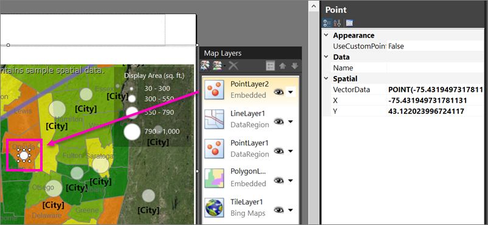
  
6.  Cliquez avec le bouton droit sur le point que vous avez ajouté, puis cliquez sur **Propriétés des points incorporés**.  
  
7.  Sélectionnez **Remplacer les options de point pour cette couche**. Des pages supplémentaires s'affichent dans la boîte de dialogue. Les valeurs que vous définissez ici ont priorité sur les options d'affichage de la couche et sur les règles de couleur.  

    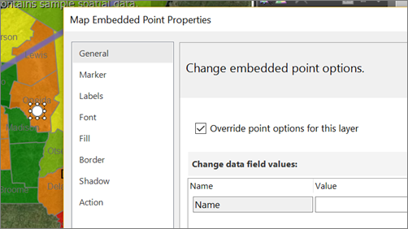
  
8.  Sous l’onglet **Marqueur** , pour **Type de marqueur**, sélectionnez **Étoile**.  

10. Changez **Taille du marqueur** en **18pt**.
  
3.  Sous l’onglet **Étiquettes** , dans **Texte de l’étiquette**, tapez **New Store**.  
  
5.  Dans **Emplacement**, cliquez sur **Haut**.  

13. Sous l’onglet **Police** , changez la taille de la police en **10pt** et en **Gras**.

    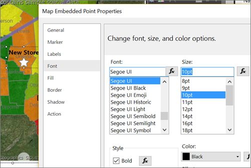
  
6.  [!INCLUDE[clickOK](../includes/clickok-md.md)]  
  
7.  Affichez l'aperçu du rapport.  
  
L'étiquette s'affiche au-dessus de l'emplacement du magasin.  

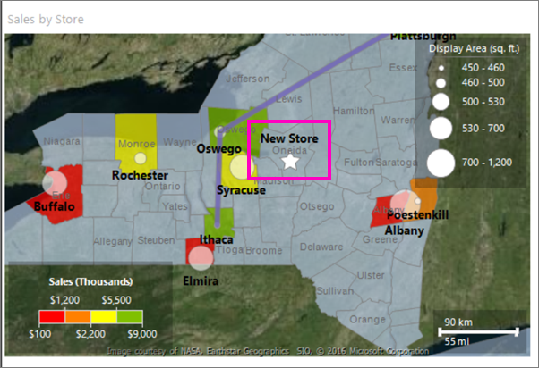
  
## <a name="CenterView"></a>8. Centrer et redimensionner la carte   
Dans cette section, vous changez le centre de la carte et vous utilisez une autre façon de modifier le niveau de zoom.  
 
1.  Basculez en mode Conception.  

1.  Sélectionnez la carte, puis cliquez avec le bouton droit et cliquez sur **Propriétés de la fenêtre d’affichage**.  
  
2.  Sous l’onglet **Centrer et zoomer** , vérifiez que **Définir un centre d’affichage et un niveau de zoom** est sélectionné.  

4. Définissez **Niveau de zoom (pourcentage)** sur **125**.
  
4.  [!INCLUDE[clickOK](../includes/clickok-md.md)]  
  
5.  Cliquez sur la carte et faites glisser pour la centrer où vous le souhaitez.  
  
6.  Vous pouvez aussi utiliser la roulette de la souris pour changer le niveau de zoom.  
  
7.  Affichez l'aperçu du rapport.  
  
En mode Conception, la carte apparaît sur la surface d'affichage et la vue est basée sur les exemples de données. Dans le rapport rendu, la vue cartographique est centrée dans la vue que vous avez spécifiée.  
  
## <a name="Title"></a>9. Ajouter un titre de rapport  
  
1.  Basculez en mode Conception.
  
1.  Dans l'aire de conception, cliquez sur **Cliquez pour ajouter un titre**.  
  
2.  Tapez **Ventes des magasins de New York** , puis cliquez à l'extérieur de la zone de texte.  
  
Ce titre s'affiche alors dans la partie supérieure du rapport. En l'absence d'en-tête de page défini, les éléments situés au-dessus du corps du rapport font office d'en-tête de rapport.  
  
## <a name="Save"></a>10. Enregistrer le rapport  
  
1.  En mode Création ou Aperçu, dans le menu **Fichier** > **Enregistrer sous**.
 
3.  Dans **Nom**, tapez **Ventes des magasins de New York**.  

3. Enregistrez-le sur votre ordinateur local ou sur un serveur [!INCLUDE[ssRSnoversion_md](../includes/ssrsnoversion-md.md)] .
  
4. Cliquez sur **Enregistrer**. 

Si vous l’enregistrez sur un serveur de rapports, vous pouvez le voir ici.

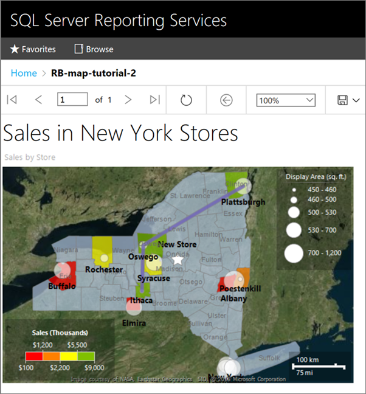 
  
## <a name="next-steps"></a>Étapes suivantes  
Ceci conclut la procédure pas à pas décrivant comment ajouter une carte à votre rapport.  
  
Pour plus d’informations, consultez [Cartes &#40;Générateur de rapports et SSRS&#41;](../reporting-services/report-design/maps-report-builder-and-ssrs.md).  
  
## <a name="see-also"></a>Voir aussi  
[Didacticiels du Générateur de rapports](../reporting-services/report-builder-tutorials.md)  
[Générateur de rapports dans SQL Server 2016](../reporting-services/report-builder/report-builder-in-sql-server-2016.md)  
[Assistant Carte et Assistant Couche &#40;Générateur de rapports et SSRS&#41;](../reporting-services/report-design/map-wizard-and-map-layer-wizard-report-builder-and-ssrs.md)  
[Modifier l’affichage des polygones, des lignes et des points à l’aide de règles et de données analytiques &#40;Générateur de rapports et SSRS&#41;](../reporting-services/report-design/vary-polygon-line-and-point-display-by-rules-and-analytical-data.md)  
  


