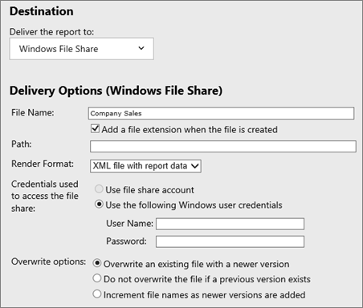
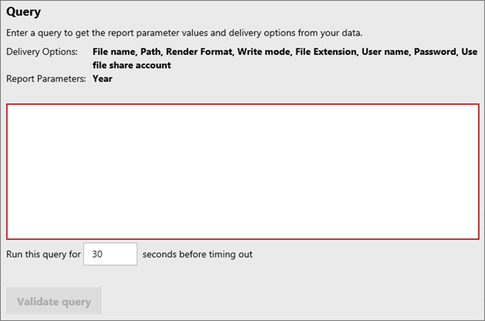

# Utilisation des abonnements (portail web)

[!INCLUDE[ssrs-appliesto](../includes/ssrs-appliesto.md)] [!INCLUDE[ssrs-appliesto-2016-and-later](../includes/ssrs-appliesto-2016-and-later.md)] [!INCLUDE[ssrs-appliesto-pbirsi](../includes/ssrs-appliesto-pbirs.md)])

La page Abonnements vous permet de répertorier tous les abonnements du rapport actif. Si vous disposez d'une autorisation suffisante (accordée par la tâche « Gérer tous les abonnements », par exemple), vous pouvez afficher les abonnements de tous les utilisateurs. Si ce n'est pas le cas, cette page affiche uniquement les abonnements dont vous être propriétaire.  
  
Avant de créer un abonnement, vous devez vérifier que la source de données du rapport utilise des informations d'identification stockées. Utilisez la page des propriétés des sources de données pour stocker des informations d'identification.  
  
> [!NOTE]
> Le service SQL Server Agent doit être démarré.   
  
  
   
Vous pouvez accéder à la page Abonnements en sélectionnant les **points de suspension (...)** correspondant à un rapport, en sélectionnant **Gérer**, puis en sélectionnant **Abonnements**.  
  
À partir de la page Abonnements, vous pouvez créer des abonnements en sélectionnant **Nouvel abonnement**. Vous pouvez également modifier des abonnements existants, ou supprimer des abonnements que vous avez sélectionnés.  
  
Cette page fournit également l’état du résultat des exécutions d’abonnement dans la colonne **Résultat** . Si une erreur s’est produite pour un abonnement, vous devez d’abord vérifier la colonne de résultat pour voir le message correspondant.  
  
## Création ou modification d’un abonnement  
La page Nouvel abonnement ou Modifier l'abonnement permet de créer un abonnement ou de modifier un abonnement existant à un rapport. Les options de cette page varient selon votre attribution de rôle. Les utilisateurs qui possèdent des autorisations avancées peuvent utiliser des options supplémentaires.  
  
Les abonnements sont pris en charge pour les rapports qui peuvent s'exécuter sans assistance. Les rapports doivent utiliser au minimum des informations d'identification stockées ou aucune information d'identification. Si le rapport utilise des paramètres, une valeur par défaut doit être spécifiée. Les abonnements peuvent devenir inactifs si vous modifiez les paramètres d'exécution de rapport ou que vous supprimez les valeurs par défaut utilisées par les propriétés de paramètres. Pour plus d’informations, consultez [Créer et gérer des abonnements pour les serveurs de rapports en mode natif].  
  
### Type d’abonnement  
Vous avez le choix entre un **abonnement standard** et un **abonnement piloté par les données**.  
  
  
   
Un abonnement piloté par les données est un abonnement qui interroge une base de données d’abonnés pour obtenir des informations sur l’abonnement chaque fois que l’abonnement est exécuté. Les abonnements pilotés par les données utilisent les résultats de la requête pour identifier les destinataires de l'abonnement, paramètres de remise et valeurs des paramètres de rapport. Lors de l'exécution, le serveur de rapports exécute une requête pour obtenir les valeurs utilisées pour les paramètres de l'abonnement.   
  
Pour créer un abonnement piloté par les données, vous devez savoir comment écrire une requête ou une commande qui permet d'obtenir les données pour l'abonnement. Vous devez également avoir une banque de données qui contient les données d'abonné (par exemple, les noms et adresses de messagerie des abonnés) à utiliser pour l'abonnement.  
  
Cette option est disponible pour les utilisateurs qui disposent d’autorisations avancées. Si vous utilisez la sécurité par défaut, les abonnements pilotés par les données ne peuvent pas être utilisés pour les rapports contenus dans le dossier Mes rapports.  
  
### Destination  
Sélectionnez l'extension de remise à utiliser pour distribuer le rapport.   
  
La disponibilité d'une extension de remise varie selon qu'elle est installée et configurée sur le serveur de rapports. La messagerie Report Server est l'extension de remise par défaut, mais elle doit être configurée avant de pouvoir être utilisée. La remise de partage de fichiers ne requiert aucune configuration, mais vous devez définir un dossier partagé pour pouvoir l'utiliser.  
  
  
  
Selon l'extension de remise choisie, les paramètres suivants s'affichent :  
  
-   Les abonnements par courrier électronique contiennent des champs qui sont familiers aux utilisateurs de messagerie électronique (par exemple, les champs À, Objet et Priorité). Spécifiez **Inclure un rapport** pour incorporer ou joindre le rapport, ou **Inclure un lien** pour inclure une URL dans le rapport. Sélectionnez **Format du rendu** pour choisir un format de présentation pour le rapport joint ou incorporé.  
  
-   Les abonnements aux partages de fichiers fournissent des champs qui vous permettent de spécifier un emplacement cible. Vous pouvez remettre n'importe quel rapport dans un partage de fichiers. Toutefois, les rapports qui prennent en charge des fonctionnalités interactives (notamment les rapports de matrice qui prennent en charge l'extraction vers le bas pour les lignes et les colonnes) sont rendus sous forme de fichiers statiques. Vous ne pouvez pas afficher les lignes et les colonnes extraites d'un fichier statique. Le nom du partage de fichiers doit être spécifié au format UNC (Uniform Naming Convention) (par exemple, \\mycomputer\public\myreportfiles). N'incluez pas de barre oblique inverse à la fin du chemin d'accès. Le fichier de rapport est remis dans un format de fichier qui est basé sur le format de rendu (par exemple, si vous choisissez Excel, le fichier est remis en tant que fichier .xls).  
  
### Dataset d’abonnement piloté par les données  
Pour un abonnement piloté par les données, vous devez définir le dataset utilisé pour l’abonnement. Sélectionnez **Modifier le dataset** pour fournir ces informations.  
  
  
  
Vous devez d’abord fournir une **source de données** à utiliser pour la requête. Cela peut être une source de données partagée, ou vous pouvez fournir une source de données personnalisée.  
  
Vous devez ensuite fournir une **requête** qui répertorie les différentes options nécessaires pour l’exécution de l’abonnement. L’écran fournit les champs qui doivent être retournés. Ces champs varient en fonction de votre méthode de remise et des paramètres du rapport.  
  
Pour un résultat optimal, exécutez d'abord la requête dans SQL Server Management Studio avant de l'utiliser dans l'abonnement piloté par les données. Vous pouvez ensuite examiner les résultats pour vérifier qu'ils contiennent les informations requises. Les points importants à noter sur les résultats de la requête sont les suivants :  
  
-   Les colonnes dans le jeu de résultats déterminent les valeurs que vous pouvez spécifier pour les options de remise et les paramètres de rapport. Par exemple, si vous créez un abonnement piloté par les données pour la remise par messagerie électronique, vous devez avoir une colonne d'adresses de messagerie.  
  
-   Les lignes dans le jeu de résultats déterminent le nombre de remises de rapports générées. Si vous avez 10 000 lignes, le serveur de rapports générera 10 000 notifications et remises.  
  
  
  
Vous pouvez ensuite valider la requête. Vous pouvez également définir un **délai de requête**.  
  
Une fois la requête créée, vous pouvez affecter des valeurs aux champs obligatoires. Vous pouvez entrer manuellement vos données ou sélectionner un champ dans le dataset que vous avez créé.

[Portail Web](../reporting-services/web-portal-ssrs-native-mode.md)  
[Utilisation des rapports paginés](working-with-paginated-reports-web-portal.md)  
[Utiliser des datasets partagés](../reporting-services/work-with-shared-datasets-web-portal.md)

D’autres questions ? [Essayez de poser une question dans le forum Reporting Services](http://go.microsoft.com/fwlink/?LinkId=620231)
