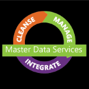
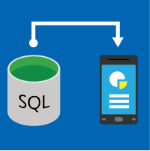

# Documentation technique de SQL Server
[!INCLUDE[tsql-appliesto-ss2008-all_md](../includes/tsql-appliesto-ss2008-all-md.md)]

 Documentation d’aide à l’installation, à la configuration et à l’utilisation de SQL Server. Le contenu inclut des exemples de bout en bout, des exemples de code et des vidéos. Pour connaître les rubriques relatives au langage [!INCLUDE[ssNoVersion_md](../includes/ssnoversion-md.md)], consultez l’article [Référence du langage](../t-sql/language-reference.md).

**SQL Server vNext**

Pour obtenir les dernières notes de publication, consultez [Notes de publication de SQL Server VNext](../sql-server/sql-server-vnext-release-notes.md).

Pour plus d’informations sur les nouveautés, consultez [Nouveautés de SQL Server vNext](../sql-server/what-s-new-in-sql-server-vnext.md).
 
**SQL Server 2016 :**
 
 [Notes de publication de SQL Server 2016](../sql-server/sql-server-2016-release-notes.md)

[Nouveautés de SQL Server 2016](../sql-server/what-s-new-in-sql-server-2016.md)
    
 **Essayer SQL Server**    
    
 - [**Télécharger SQL Server 2016 à partir du Centre d’évaluation**](https://www.microsoft.com/en-us/evalcenter/evaluate-sql-server-2016)    
    
- **[Lancer une machine virtuelle sur laquelle SQL Server 2016 est déjà installé](https://azure.microsoft.com/en-us/marketplace/partners/microsoft/sqlserver2016rtmenterprisewindowsserver2012r2/?wt.mc_id=sqL16_vm)**    
    
-  **[Télécharger la dernière version de SQL Server Management Studio](https://msdn.microsoft.com/library/mt238290.aspx)**   
    
  
    
## Technologies SQL Server    
    
|||    
|-|-|    
||**[Moteur de base de données](../database-engine/configure-windows/sql-server-database-engine.md)**   Le moteur de base de données est un service central qui permet de stocker, traiter et sécuriser les données. Il fournit des accès contrôlés et des traitements de transactions rapides pour répondre aux besoins des applications les plus gourmandes en données utilisées au sein des entreprises. Il offre également les fonctions nécessaires pour faire face à des besoins de haute disponibilité.|    
||**[R Services](../advanced-analytics/r-services/r-services.md)**   Microsoft R Services fournit plusieurs moyens d’intégrer le langage R populaire dans les workflows d’entreprise.   [!INCLUDE[rsql_productname](../includes/rsql-productname-md.md)] intègre le langage R avec [!INCLUDE[ssNoVersion](../includes/ssnoversion-md.md)] pour simplifier la génération, le recyclage et l’évaluation des modèles en appelant des procédures stockées [!INCLUDE[tsql](../includes/tsql-md.md)].   Microsoft R Server assure une prise en charge multi-plateforme et évolutive pour R à l’échelle de l’entreprise et prend en charge les sources de données telles que Hadoop et Teradata.|    
||**[Data Quality Services](../data-quality-services/data-quality-services.md)**   SQL Server Data Quality Services (DQS) fournit une solution de nettoyage de données reposant sur des connaissances. DQS vous permet de générer une base de connaissances, puis utilise cette dernière pour effectuer la correction des données et la déduplication de vos données, à l'aide de moyens assistés par ordinateur et interactifs. Vous pouvez utiliser des services de données de référence en nuage, et vous pouvez générer une solution de gestion de données qui intègre DQS avec SQL Server Integration Services et Master Data Services.|    
||**[Integration Services](../integration-services/sql-server-integration-services.md)**   [!INCLUDE[ssISnoversion](../includes/ssisnoversion-md.md)] est une plateforme permettant de créer des solutions d’intégration de données à hautes performances, y compris des packages qui autorisent les processus d’extraction, de transformation et de chargement (ETL) pour l’entreposage de données.|    
||**[Master Data Services](../master-data-services/master-data-services-installation-and-configuration.md)**   [!INCLUDE[ssMDSshort](../includes/ssmdsshort-md.md)] est la solution [!INCLUDE[ssNoVersion](../includes/ssnoversion-md.md)] de gestion des données de référence. Une solution reposant sur [!INCLUDE[ssMDSshort](../includes/ssmdsshort-md.md)] garantit que la création de rapports et l'analyse sont basées sur les informations adéquates. [!INCLUDE[ssMDSshort](../includes/ssmdsshort-md.md)]vous permet de créer un référentiel central pour vos données de référence et de conserver un enregistrement vérifiable et sécurisable de ces données au fur et à mesure de leur modification.|    
||**[Analysis Services](../analysis-services/analysis-services.md)**   [!INCLUDE[ssASnoversion_md](../includes/ssasnoversion-md.md)] est une plateforme de données analytiques et un ensemble d'outils dédié au décisionnel personnel, en équipe et en entreprise. Les serveurs et concepteurs de clients prennent en charge des solutions OLAP traditionnelles, de nouvelles solutions de modélisation tabulaire, ainsi que des fonctionnalités d’analyse et de collaboration en libre-service grâce à [!INCLUDE[ssGemini](../includes/ssgemini-md.md)], à Excel et à un environnement de serveur SharePoint. [!INCLUDE[ssASnoversion](../includes/ssasnoversion-md.md)] propose également l’exploration des données pour que vous puissiez découvrir les modèles et relations masqués à l’intérieur de grands volumes de données.|    
||**[Réplication](../relational-databases/replication/sql-server-replication.md)**   La réplication repose sur un ensemble de technologies qui permettent de copier et de distribuer des données et des objets de base de données d'une base de données vers une autre, puis de synchroniser les bases de données afin de maintenir leur cohérence. Avec la réplication, vous pouvez distribuer des données vers différents emplacements et à des utilisateurs distants ou mobiles par l'intermédiaire de réseaux locaux ou étendus, de connexions d'accès à distance, de connexions sans fil et d'Internet.|    
||**[Reporting Services](../reporting-services/reporting-services-ssrs.md)**   Reporting Services fournit des fonctionnalités Web de création de rapports d'entreprise qui permettent d'extraire du contenu d'une large gamme de sources de données, de publier des rapports dans différents formats et de gérer de façon centralisée la sécurité et les abonnements.|    
     
   
 ## Informations complémentaires   
+ [Gestionnaire de configuration SQL Server](../relational-databases/sql-server-configuration-manager.md)
+ Liens du [Centre de mise à jour SQL Server](https://msdn.microsoft.com/library/ff803383.aspx) et informations concernant toutes les versions prises en charge 
+ [Installer le moteur de base de données SQL Server](../database-engine/install-windows/install-sql-server-database-engine.md) 
+ [Installer les Outils d’administration SQL Server avec SSMS](https://msdn.microsoft.com/library/bb500441.aspx) 
+ [SQL Server Data Tools dans Visual Studio 2015](https://msdn.microsoft.com/mt186501.aspx)
+ [Vidéos, exemples et ressources communautaires](https://msdn.microsoft.com/library/dn237258.aspx)
+ [Présentation de SQL Server 2016](https://www.microsoft.com/en-us/server-cloud/products/sql-server/default.aspx?WT.srch=1&WT.mc_id=SEM_%5B_uniqid%5D&utm_source=Bing&utm_medium=CPC&utm_term=SQL%20Server%202016&utm_campaign=Data_Management)  
  
[!INCLUDE[feedback_stackoverflow_msdn_connect-md](../includes/feedback-stackoverflow-msdn-connect-md.md)]
